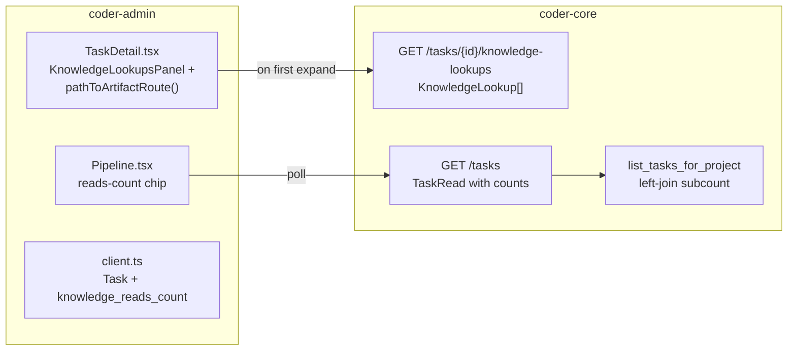

# Worker Knowledge Reads Inline on Task Detail

## What it does today

The admin panel task detail page (`/projects/:id/pipeline/:taskId`) renders a collapsible `KnowledgeLookupsPanel` that lazy-loads from `GET /v1/projects/{id}/tasks/{task_id}/knowledge-lookups` and shows each artifact path, a cache-hit badge, and byte count in chronological order. Two gaps remain: artifact paths are plain text (not linked to the in-app knowledge browser), and the Pipeline list task rows carry no reads-count chip. This design closes both via a pure path-routing helper on the frontend and two nullable count fields on `TaskRead` populated server-side.

## Architecture

### Parts

- **`pathToArtifactRoute(path, projectId)`** — pure TypeScript helper in `coder-admin/src/lib/knowledgeRoutes.ts`; maps `system/designs/active/<slug>.md` → `/projects/:id/knowledge/designs/<slug>`, `system/product-specs/active/<slug>.md` → `/projects/:id/knowledge/specs/<slug>`, falls back to `null` for unroutable paths (ADRs, registries)
- **`KnowledgeLookupsPanel`** — updated in `TaskDetail.tsx` to wrap each path in a `<Link>` when `pathToArtifactRoute` returns non-null; plain `` otherwise
- **`knowledge_reads_count` / `knowledge_live_reads_count`** — two nullable `int` columns added to `TaskRead` schema (`coder-core/app/schemas/tasks.py`) and populated via left-join subcount in `list_tasks_for_project` (`tasks.py`)
- **Reads-count chip** — `Pipeline.tsx` task row renders a `BookOpen` icon + count badge when `knowledge_reads_count > 0`; hidden when null or zero
- **`knowledge_lookups` table** — already exists (migration 0025); no schema change needed

### Data flow

On task-detail expand the frontend calls `GET /v1/projects/{id}/tasks/{task_id}/knowledge-lookups` (already implemented in `tasks.py` lines 322–349) and receives an ordered `KnowledgeLookup[]`. Each entry's `artifact_path` is passed through `pathToArtifactRoute`; matching paths render as `<Link to={route}>` anchors. On the Pipeline list, `list_tasks_for_project` executes a left-join `SELECT count(*) FROM knowledge_lookups WHERE task_id = tasks.id` subquery and attaches the result as `knowledge_reads_count` on every `TaskRead`; the chip renders only when the count is positive.

### Invariants

- `pathToArtifactRoute` never throws; unknown path shapes return `null` and degrade to plain text
- `knowledge_reads_count` is nullable on `TaskRead`; consumers treat `null` as zero — no chip shown
- The left-join subcount adds one subquery per task row; callers with >500 tasks use the existing pagination so the subcount stays bounded
- Cache-hit badge logic in `KnowledgeLookupsPanel` is unchanged; this design only adds the link wrapper
- Paths under `system/adrs/` and `system/roles/` are explicitly unmapped (return `null`) — they have no in-app browser route

## Interfaces

| Surface | Effect |
|---|---|
| `GET /v1/projects/{id}/tasks/{task_id}/knowledge-lookups` | Unchanged — returns `KnowledgeLookup[]` with `artifact_path`, `cache_hit`, `bytes_read` |
| `GET /v1/projects/{id}/tasks` | `TaskRead` gains optional `knowledge_reads_count: int \| null` and `knowledge_live_reads_count: int \| null` |
| `pathToArtifactRoute(path, projectId)` | Pure helper; returns `/projects/:id/knowledge/{type}/{slug}` or `null` |
| `KnowledgeLookupsPanel` | Artifact paths render as `<Link>` when routable, `` otherwise |
| `Pipeline.tsx` task row | Adds `<BookOpen size={12}/>` + count badge when `knowledge_reads_count > 0` |

## Where in code

- `coder-core/app/routers/tasks.py` — `get_knowledge_lookups` (existing endpoint, lines 322–349)
- `coder-core/app/schemas/tasks.py` — `TaskRead` (add `knowledge_reads_count`, `knowledge_live_reads_count`)
- `coder-core/app/crud/tasks.py` — `list_tasks_for_project` (add left-join subcount)
- `coder-admin/src/components/TaskDetail.tsx` — `KnowledgeLookupsPanel` (wrap paths in `<Link>`)
- `coder-admin/src/components/Pipeline.tsx` — task row chip render
- `coder-admin/src/lib/knowledgeRoutes.ts` — `pathToArtifactRoute` (new helper)

## Evolution

Builds on designs 0097 (table/endpoint stub), 0098 (base panel), and 0099 (Bash-tool-parse variant). No ADR warranted — routing logic is deterministic and path-pattern-based.

## Links

- Spec: 0100
- Designs: [admin-panel](../knowledge/admin-panel.md), [knowledge-stack](../knowledge/knowledge-stack.md), [observability-and-cost-tracking](../pipeline/observability-and-cost-tracking.md)
- Repos: coder-core, coder-admin
