# Roadmap

> Human-readable progress view. `active/` holds subject-named logical
> components (the system as it is today). `wip/` holds numbered,
> roadmap-aligned work in flight. When a WIP ships, its content merges
> into `active/` and the numbered WIP file disappears.
>
> **Phase** reflects sequencing, not a calendar. A WIP starts only when
> its prerequisites are represented in `active/`.

**North star:** Coder manages its own development end-to-end. The human
is in an approval/override role, not a task-authoring role.

**16 active components** describe the shipped system.

**Pipeline proven end-to-end (2026-04-13):** PM draft → spec file in repo →
pipeline run advances to `spec_approval` → ready for human approval →
chain auto-creates architect task.

**Next 9 months (May 2026–Feb 2027).** Six sequenced phases, 25
planned items: Scale & Reliability → Cost & Token Efficiency → Admin
Panel v2 → Security & Compliance → Trusted Autonomy → Knowledge Depth.
The through-line is: *make the pipeline fast, cheap, visible, safe to
trust with less human intervention, and make the knowledge it runs on
compound in value.*

Last updated: 2026-04-19 — **Phase 4 LIVE in prod.** All four specs
(0029/0030/0031/0032) phase-1 deployed + flags flipped on. Fleet:
`PROMPT_CACHING_ENABLED=true`, `REGRESSION_ALERTS_ENABLED=true`.
Per-project: `coder` runs with `pin_top_tier=false` (tier routing
routes reviewer tasks to Haiku). Migrations 0022, 0032-0038 all
applied. Prod image `072323d6d71f` on revision `coder-core-00115-vhp`.
Remaining Phase 4 work is deferred increments (yaml policy table
for 0030, rollup pre-aggregation for 0031/0032, admin UI surfaces)
— each has an explicit phase-2 note on its WIP spec. 2026-04-18:
0044 (write-through enforcement) and 0043 (freshness signals)
shipped into `active/`. Phase 3 complete: 0023, 0025, 0026, 0027,
0028 all shipped.

---

## Active components

The system today, by logical component. Each links to its active spec
(product view) and active design (technical view) where both exist.

| Component | Spec | Design |
|---|---|---|
| Multi-tenancy | [multi-tenancy](./active/multi-tenancy.md) | (covered in [system-overview](../designs/active/system-overview.md)) |
| Knowledge API (read + write) | [knowledge-api](./active/knowledge-api.md) | [knowledge-write-api](../designs/active/knowledge-write-api.md), [knowledge-repo-model](../designs/active/knowledge-repo-model.md) |
| Admin Panel | [admin-panel](./active/admin-panel.md) | (covered in [system-overview](../designs/active/system-overview.md)) |
| Developer Worker | [developer-worker](./active/developer-worker.md) | [worker-roles](../designs/active/worker-roles.md) |
| Reviewer Worker | [reviewer-worker](./active/reviewer-worker.md) | [worker-roles](../designs/active/worker-roles.md) |
| PM Worker | [pm-worker](./active/pm-worker.md) | [pm-worker](../designs/active/pm-worker.md) |
| Architect Worker | [architect-worker](./active/architect-worker.md) | [architect-worker](../designs/active/architect-worker.md) |
| Team Manager Worker | [team-manager-worker](./active/team-manager-worker.md) | [team-manager-worker](../designs/active/team-manager-worker.md) |
| Service Accounts | [service-accounts](./active/service-accounts.md) | [worker-roles](../designs/active/worker-roles.md) |
| Impersonation | [impersonation](./active/impersonation.md) | [impersonation](../designs/active/impersonation.md) |
| Onboarding | [onboarding](./active/onboarding.md) | (covered in [system-overview](../designs/active/system-overview.md)) |
| Task Orchestration | [task-orchestration](./active/task-orchestration.md) | [worker-communication](../designs/active/worker-communication.md) |
| Continuous Deployment | [continuous-deployment](./active/continuous-deployment.md) | (covered in [system-overview](../designs/active/system-overview.md)) |
| Observability | [observability](./active/observability.md) | [observability-and-cost-tracking](../designs/active/observability-and-cost-tracking.md) |
| Branch cleanup | [branch-cleanup](./active/branch-cleanup.md) | [branch-cleanup](../designs/active/branch-cleanup.md) |

---

## In flight (`wip/`)

| ID | Title | Status |
|---|---|---|
| [0029](./wip/0029-prompt-caching.md) | Prompt caching & shared context reuse | drafting |
| [0030](./wip/0030-model-tier-routing.md) | Model tier routing | drafting |
| [0031](./wip/0031-token-budgets.md) | Per-project token budgets & cost gates | drafting |
| [0032](./wip/0032-cost-regression-alerts.md) | Prompt & cost regression alerts | drafting |
| [0041](./wip/0041-escalation-policies.md) | Escalation policies & on-call routing | drafting |
| [0042](./wip/0042-self-healing.md) | Self-healing stuck pipelines | drafting |
| [0038](./wip/0038-secret-rotation.md) | Automated secret rotation | drafting |
| [0039](./wip/0039-tenant-isolation-tests.md) | Tenant isolation test harness | drafting |
| [0040](./wip/0040-confidence-auto-approve.md) | Confidence-scored auto-approval | drafting |
| [0045](./wip/0045-cold-start-ingestion.md) | Cold-start knowledge ingestion | drafting |
| [0046](./wip/0046-graph-aware-retrieval.md) | Graph-aware knowledge retrieval | drafting |
| [0047](./wip/0047-template-schema-migration.md) | Template schema migration | drafting |
| [0048](./wip/0048-cross-project-patterns.md) | Cross-project pattern surfacing | drafting |

---

## Dependency graph

```mermaid
flowchart TB
  subgraph active [Active components]
    mt[multi-tenancy]
    ka[knowledge-api]
    ap[admin-panel]
    dev[developer-worker]
    rev[reviewer-worker]
    pm[pm-worker]
    arch[architect-worker]
    tm[team-manager-worker]
    sa[service-accounts]
    imp[impersonation]
    onb[onboarding]
    to[task-orchestration]
    cd[continuous-deployment]
    obs[observability]
  end

  subgraph scale ["Phase 3 — Scale & Reliability"]
    s23["Branch GC (shipped)"]
    s24["Worker output compliance (shipped)"]
    s25["Pipeline run dashboard (shipped)"]
    s26["Transient retry (shipped)"]
    s27["Concurrent pipelines (shipped)"]
  end

  subgraph cost ["Phase 4 — Cost & Efficiency"]
    s28["Prompt caching"]
    s29["Model tier routing"]
    s30["Budget gates"]
    s31["Cost regression alerts"]
  end

  subgraph adminv2 ["Phase 5 — Admin v2"]
    s32["Live timeline"]
    s33["Diff & PR viewer"]
    s34["Knowledge editor"]
    s35["Command palette"]
  end

  subgraph sec ["Phase 6 — Security"]
    s36["Audit log"]
    s37["Secret rotation"]
    s38["Tenant isolation tests"]
  end

  subgraph auto ["Phase 7 — Trusted Autonomy"]
    s39["Confidence auto-approve"]
    s40["Escalation & on-call"]
    s41["Self-healing"]
  end

  subgraph know ["Phase 8 — Knowledge Depth"]
    s43["Freshness signals (shipped)"]
    s44["Write-through enforcement"]
    s45["Cold-start ingestion"]
    s46["Graph-aware retrieval"]
    s47["Template schema migration"]
    s48["Cross-project patterns"]
  end

  to --> s23
  dev --> s23
  pm --> s24
  arch --> s24
  tm --> s24
  to --> s25
  ap --> s25
  to --> s26
  dev --> s27
  to --> s27
  obs --> s27

  ka --> s28
  obs --> s28
  to --> s28
  to --> s29
  obs --> s29
  obs --> s30
  s29 --> s30
  obs --> s31
  s28 --> s31

  to --> s32
  s25 --> s32
  ap --> s32
  dev --> s33
  ap --> s33
  ka --> s34
  ap --> s34
  ap --> s35

  imp --> s36
  ap --> s36
  sa --> s37
  cd --> s37
  mt --> s38
  sa --> s38
  s36 --> s38

  to --> s39
  obs --> s39
  to --> s40
  obs --> s40
  s26 --> s40
  to --> s41
  s26 --> s41
  s40 --> s41

  ka --> s43
  obs --> s43
  arch --> s43
  ka --> s44
  rev --> s44
  tm --> s44
  arch --> s44
  onb --> s45
  ka --> s45
  ka --> s46
  s43 --> s46
  ka --> s47
  s44 --> s48
  s43 --> s48

  classDef activeStyle fill:#c8e6c9,stroke:#1b5e20,stroke-width:2px
  classDef scaleStyle fill:#ffe0b2,stroke:#e65100,stroke-width:2px
  classDef costStyle fill:#fff9c4,stroke:#f57f17,stroke-width:2px
  classDef adminStyle fill:#bbdefb,stroke:#1565c0,stroke-width:2px
  classDef secStyle fill:#f8bbd0,stroke:#ad1457,stroke-width:2px
  classDef autoStyle fill:#d1c4e9,stroke:#4527a0,stroke-width:2px
  classDef knowStyle fill:#b2dfdb,stroke:#004d40,stroke-width:2px

  class mt,ka,ap,dev,rev,pm,arch,tm,sa,imp,onb,to,cd,obs,s23,s24,s25,s26,s27 activeStyle
  class s28,s29,s30,s31 costStyle
  class s32,s33,s34,s35 adminStyle
  class s36,s37,s38 secStyle
  class s39,s40,s41 autoStyle
  class s43,s44,s45,s46,s47,s48 knowStyle
```

---

## Phase 3 — Scale & Reliability (May–Jun 2026)

> Make the pipeline robust, self-healing, and observable at scale.
> Success criteria: zero manual cleanup, <1% task loss from transient
> failures, 3+ pipelines running concurrently without queue starvation.

### 0023 — Branch cleanup GC job (shipped 2026-04-15)

Hourly job deletes stale `task/*` branches older than 24h with no open PR.
Prevents branch proliferation from failed developer tasks.

- **Status:** shipped → [`active/branch-cleanup`](./active/branch-cleanup.md) /
  [`designs/active/branch-cleanup`](../designs/active/branch-cleanup.md)
- **Extends:** `task-orchestration`, `developer-worker`, `observability`

### 0024 — Task Stage Runs API (shipped 2026-04-15)

`GET /v1/projects/{project_id}/tasks/{task_id}/stage-runs` endpoint
returning the archived `TaskStageRunRow` rows for a task, ordered by
`recorded_at` ascending. Debugging-oriented, no admin UI.

- **Status:** shipped → merged into
  [`task-orchestration`](./active/task-orchestration.md) /
  [`worker-communication`](../designs/active/worker-communication.md)
- **Extends:** `task-orchestration`, `observability`

### 0025 — Worker output compliance (shipped 2026-04-17)

Per-worker JSON schemas gate Phase 4 for PM (draft + accept),
Architect, and Team Manager. `validate_and_retry` re-prompts Claude on
schema failure up to a budget; exhaustion lands
`failure_kind="schema"` with zero side effects. Enforcement enabled
after a 48 h shadow soak from the 2026-04-15 deploy.

- **Status:** shipped → merged into
  [`pm-worker`](./active/pm-worker.md),
  [`architect-worker`](./active/architect-worker.md),
  [`team-manager-worker`](./active/team-manager-worker.md),
  [`task-orchestration`](./active/task-orchestration.md) /
  [`pm-worker`](../designs/active/pm-worker.md),
  [`architect-worker`](../designs/active/architect-worker.md),
  [`team-manager-worker`](../designs/active/team-manager-worker.md),
  [`worker-communication`](../designs/active/worker-communication.md).
- **ADR:** [0012 — re-prompt only, no programmatic repair](../adrs/0012-re-prompt-only-worker-output-remediation.md).

### 0026 — Pipeline run dashboard (shipped 2026-04-17)

Admin panel view showing pipeline runs end-to-end: inline Gate card
on `RunDetail` for spec / design / plan approvals without leaving
the run view, sort-by-blocked-longest-first on the Runs list with a
red `blocked Nm` badge per row. Two new timestamp columns on
`pipeline_runs` (`step_started_at` + `blocked_since`), a
`pipeline_step_stats` rollup table, and two new SSE event types
(`pipeline_run.changed` + `.gate_blocked`) back the UX.

- **Status:** shipped → merged into
  [`task-orchestration`](./active/task-orchestration.md),
  [`admin-panel`](./active/admin-panel.md) /
  [`worker-communication`](../designs/active/worker-communication.md).
- **Runbook:** [pipeline-run-blocked](../runbooks/pipeline-run-blocked.md).

### 0027 — Automatic retry on transient failures (shipped 2026-04-17)

Per-worker classify-and-retry loop wraps every role worker's `claude`
spawn. Transient-class failures (429/529/timeout/DNS) retry with
full-jitter exponential backoff inside the worker; budget exhaustion
lands `failure_kind="transient"` with a structured detail, recovered
runs populate `tasks.transient_retry_history` for the admin chip. The
pre-0027 dispatcher-level retry was removed on ship per ADR 0013.

Ship note: the worker internal-timeout signature was changed to
`exit_code=-9 + "coder task deadline exceeded"` so the classifier
doesn't retry our own task-deadline hits as transient (collision
found during the 2026-04-17 trial flip).

- **Status:** shipped → merged into
  [`pm-worker`](./active/pm-worker.md),
  [`architect-worker`](./active/architect-worker.md),
  [`team-manager-worker`](./active/team-manager-worker.md),
  [`developer-worker`](./active/developer-worker.md),
  [`reviewer-worker`](./active/reviewer-worker.md),
  [`task-orchestration`](./active/task-orchestration.md) /
  [`pm-worker`](../designs/active/pm-worker.md),
  [`architect-worker`](../designs/active/architect-worker.md),
  [`team-manager-worker`](../designs/active/team-manager-worker.md),
  [`worker-roles`](../designs/active/worker-roles.md),
  [`worker-communication`](../designs/active/worker-communication.md).
- **ADR:** [0013 — worker-level transient retry](../adrs/0013-worker-level-transient-retry.md).

### 0028 — Concurrent pipeline execution & queue fairness (shipped 2026-04-17)

`DispatcherQueue` sits in front of the global `worker_concurrency`
cap: waiters are queued per-project and admission round-robins across
contending projects so one tenant can't monopolise every slot.
Migration 0027 added the optional `projects.worker_concurrency_soft`
soft cap (yield on contention). Two new queue-depth endpoints
(`/v1/projects/{id}/ops/queue-depth`, `/v1/_admin/ops/queue-depth`)
and two admin surfaces (per-project Queue strip + Fleet queue
widget) surface the dispatcher state.

- **Status:** shipped → merged into
  [`task-orchestration`](./active/task-orchestration.md) /
  [`worker-communication`](../designs/active/worker-communication.md).
- **Runbook:** [concurrency-overflow](../runbooks/concurrency-overflow.md).

---

## Phase 4 — Cost & Token Efficiency (Jun–Jul 2026)

> Cut per-pipeline token spend by ~50% without hurting quality. Today
> every worker re-sends the same context; every task runs on the most
> expensive model regardless of complexity. Fix both.

### 0029 — Prompt caching & shared context reuse (phase-1 LIVE, fleet-enabled)

Populate + link + read + gate + per-project override + Slack cache-hit
floor + runbook all live in prod with `PROMPT_CACHING_ENABLED=true`
fleet-wide. Every task now prepends the shared per-run context block
to the system prompt. Validation moves from canary soak to live
measurement: watch `/metrics` `cache_stats` on the admin panel for
hit-rate climb across roles over the next pipeline cycle.
Migrations 0022, 0032-0034.

- **Status:** LIVE (flag on fleet-wide)
- **WIP:** [0029](./wip/0029-prompt-caching.md) · **Design:** [0029](../designs/wip/0029-prompt-caching.md)
- **Extends:** `knowledge-api`, `observability`, `task-orchestration`
- **Next:** ship WIP → active once the input-token-reduction numbers
  stabilise for 24-48 h at the measured rate. That also unblocks
  0030/0031/0032 cross-references from WIP to active docs.

### 0030 — Model tier routing (phase-1 LIVE on canary)

`resolve_tier_model` in the dispatcher + per-role low-tier config
(`worker_model_low_tier_reviewer=claude-haiku-4-5-20251001`) +
per-project pin (`projects.pin_top_tier` tri-state) + `/metrics`
`by_tier` rollup. `tier_routing_enabled=False` fleet-wide; `coder`
project opted in with `pin_top_tier=false`. Reviewer tasks on `coder`
route to Haiku; other projects stay on Sonnet. Migrations 0036, 0037.

- **Status:** LIVE on `coder` canary; fleet flag off
- **WIP:** [0030](./wip/0030-model-tier-routing.md) · **Design:** [0030](../designs/wip/0030-model-tier-routing.md)
- **Extends:** `task-orchestration`, `observability`
- **Next:** watch `coder` reviewer approval rate in the `by_tier`
  rollup for 48-72 h. If approval rate holds within 1 pp of baseline,
  flip the fleet flag and opt more roles' low-tier configs. Phase 2
  adds the yaml policy table + per-task-kind routing + schema-retry
  escalation.

### 0031 — Per-project token budgets & cost gates (phase-1 LIVE, per-project)

Per-project `budget_{soft,hard}_tokens` tri-state overrides +
`resolve_budget_limits` + dispatcher hard gate + soft-breach Slack
alert with per-month dedupe + `PATCH /v1/projects/{id}` support live.
No project currently sets a limit (every `budget_*_tokens=None`;
fleet defaults also 0 = disabled), so no task is gated yet — the
machinery is ready when ops decides where to set caps. Migration 0035.

- **Status:** LIVE (ready to configure per project)
- **WIP:** [0031](./wip/0031-token-budgets.md) · **Design:** [0031](../designs/wip/0031-token-budgets.md)
- **Extends:** `observability`
- **Next:** set realistic soft caps on `coder` (`PATCH
  /v1/projects/coder budget_soft_tokens=<X>`) once the first full
  month of post-caching spend defines a baseline. Phase 2 adds
  rollup table + `status=budget_blocked` + admin override UI +
  monthly reset cron.

### 0032 — Prompt & cost regression alerts (phase-1 LIVE, alerts on)

Detector + `regression_events` persistence + dedupe + acknowledge
flow + `GET|ack` endpoints live with
`REGRESSION_ALERTS_ENABLED=true`. Nightly Cloud Scheduler hook fires
the detector at 04:00 UTC; findings persist to the table and post to
the existing Slack webhook. Acknowledged events stop re-firing.
Migration 0038.

- **Status:** LIVE (flag on fleet-wide)
- **WIP:** [0032](./wip/0032-cost-regression-alerts.md) · **Design:** [0032](../designs/wip/0032-cost-regression-alerts.md)
- **Extends:** `observability`
- **Next:** calibrate the +25% threshold against the first week of
  real alerts. Phase 2 adds `stage_cost_baseline` pre-aggregation +
  commit-range attribution from the continuous-deployment log +
  admin `/metrics/regressions` tab.

---

## Phase 5 — Admin Panel v2: Interactive & Live (Jul–Sep 2026)

> Make the admin panel the thing you keep open all day. Today it's a
> list of rows; it should be a live view of what the system is doing,
> with every common action one keystroke away.

### 0033 — Live pipeline timeline (planned)

Replace the flat task list with a timeline view per pipeline run:
horizontal swim-lanes per role, stage durations as bars, SSE-driven
progress tick, hover for logs, click for detail.

- **Status:** planned
- **Extends:** `admin-panel`, `task-orchestration`

### 0034 — In-panel diff & PR viewer (planned)

View PR diffs, reviewer comments, and commit history directly in the
admin panel. Approve/request-changes buttons call through to `coder-core`.

- **Status:** planned
- **Extends:** `admin-panel`, `developer-worker`

### 0035 — Inline knowledge editor with approvals (planned)

Edit spec/design markdown in-browser with frontmatter form + body
editor + live preview. Approve/reject buttons adjacent.

- **Status:** planned
- **Extends:** `admin-panel`, `knowledge-api`

### 0036 — Command palette & keyboard-first navigation (planned)

`⌘K` palette: jump to project, task, spec, run; trigger common actions
(approve, retry, override); fuzzy-search knowledge. Full keyboard
navigation of tables and forms.

- **Status:** planned
- **Extends:** `admin-panel`

---

## Phase 6 — Security & Compliance (Sep–Oct 2026)

> Close the gap between "it works" and "it's safe to let a customer
> near it." Preparation for external pilots.

### 0037 — Centralized audit log service (planned)

Every mutation (approve, reject, override, retry, merge, knowledge
write, impersonation) lands in an append-only audit log with actor,
project, target, before/after, and correlation ID. Queryable by admin,
retained 1 year.

- **Status:** planned
- **Extends:** `impersonation`, `admin-panel`, `task-orchestration`

### 0038 — Automated secret rotation (drafting)

Scheduled rotation of per-project API keys, per-project Anthropic
keys, the admin JWT signing secret, and the shared GitHub App private
key. Zero-downtime rollover via a dual-value window per secret: new
value accepted immediately; old value accepted until a per-kind TTL
elapses, then closed. New `secret_rotations` registry table
(migration 0042) stores canonical name + kind + cadence + dual-value
window + last/next times + last error. New
`projects.api_key_hash_previous` column (migration 0043) backs the
two-key accept window for project API keys. A Cloud Run Job
`coder-core-rotate-secrets` ticks every 15 min via Cloud Scheduler,
rotates anything due, and closes any expired dual-value windows.
Every rotation emits an `audit_events` row (`action=secret.rotate`,
`target_type=secret`). Break-glass endpoint
`POST /v1/_admin/secrets/{canonical_name}/rotate-now` for incident
response. Admin `/admin/secrets` page behind
`VITE_SECRET_ROTATION_ENABLED`. Flag-gated fleet-wide on
`CODER_SECRET_ROTATION_ENABLED` (default off on first deploy; flip
per-kind after a shadow soak).

- **Status:** drafting
- **WIP:** [0038](./wip/0038-secret-rotation.md) · **Design:** [0038](../designs/wip/0038-secret-rotation.md)
- **Extends:** `service-accounts`, `continuous-deployment`, `admin-panel`, `impersonation`, `audit-log`

### 0039 — Tenant isolation test harness (drafting)

A CI-enforced pytest suite that provisions two projects, then
exercises every isolation boundary as a parametric matrix:
(endpoint × token type × project) for every project-scoped API
route, direct-DB row-visibility asserts for every
`project_id`-bearing table, worker-path reads/writes driven through
the real impersonation broker, and GCP Secret Manager asserts
(cross-project reads must 403). Single source of truth is
`tests/isolation/isolation_manifest.yaml`; a drift check
(`scripts/check_isolation_manifest.py`) fails the build when a new
endpoint with `Depends(require_project_auth)` is added without a
manifest entry — so authorial intent to add an isolation boundary is
what gets merged, not a silent miss. Coverage report emits
`isolation_coverage.json` consumed by a new `/admin/isolation`
trust-badge page (behind `VITE_ISOLATION_VIEW_ENABLED`). Rollout is
a 4-stage ramp: manifest + API matrix non-blocking → add row/worker
tests → wire GCP nightly + admin surface → flip
`CI_ISOLATION_SUITE_BLOCKING=true` after 7 days of green.

- **Status:** drafting
- **WIP:** [0039](./wip/0039-tenant-isolation-tests.md) · **Design:** [0039](../designs/wip/0039-tenant-isolation-tests.md)
- **Extends:** `multi-tenancy`, `service-accounts`, `impersonation`, `audit-log`, `knowledge-api`, `task-orchestration`

---

## Phase 7 — Trusted Autonomy (Oct–Nov 2026)

> Today three gates (spec / design / plan) require human approval
> every run. Many are low-risk rubber-stamps. Let the system earn
> auto-approval on the easy cases so humans focus on the hard ones.

### 0040 — Confidence-scored auto-approval (drafting)

PM, Architect, and TM outputs gain a required `self_confidence`
envelope (score, justification, risk_flags from a fixed vocabulary).
An evaluator at each approval gate returns `EligibleForAuto` only
when four predicates hold: project opted in, score ≥ per-gate
threshold (spec 85, design 90, plan 80), last-20 audit-based
historical approval rate ≥ 95% (< 5 prior approvals = insufficient),
and zero risk flags (worker-reported ∪ handler-computed static
flags). On eligibility the handler writes an `auto_approvals` row
(migration 0044) with `status='pending'` and a 10-minute
`window_expires_at`; `knowledge_approved` and chain dispatch are
withheld until a 1-minute Cloud Scheduler tick finalises
(`SELECT FOR UPDATE SKIP LOCKED`) or an operator clicks
`accept-now`. Undo within the window reverts + spawns a revision
task. Per-project tri-state opt-in on three new
`projects.auto_approve_{spec,design,plan}_enabled` columns
(migration 0045). Every transition writes an `audit_events` row
(four new actions). Admin surfaces a pending-auto-approval card
adjacent to the existing Gate card on RunDetail + on knowledge
artifact views behind `VITE_AUTO_APPROVE_ENABLED`. Fleet flag
`CODER_AUTO_APPROVE_ENABLED` starts off; 4-stage ramp (shadow →
enable pending writes → `coder` spec only → expand).

- **Status:** drafting
- **WIP:** [0040](./wip/0040-confidence-auto-approve.md) · **Design:** [0040](../designs/wip/0040-confidence-auto-approve.md)
- **Extends:** `task-orchestration`, `observability`, `pm-worker`, `architect-worker`, `team-manager-worker`, `audit-log`, `admin-panel`

### 0041 — Escalation policies & on-call routing (drafting)

A 1-minute Cloud Run Job `coder-core-escalation-watch` scans three
pipeline-run-shaped trigger conditions — **stall** (`blocked_since`
older than per-project `sla_stall_minutes`, default 60), **failure
streak** (≥`failure_streak_n`=3 consecutive `tasks.status='failed'`
in `failure_streak_window_minutes`=30), **SLA wall-clock breach**
(run open longer than `sla_wall_clock_minutes`=720 = 12h) — and
opens rows in a new `escalations` table (migration 0046). Dedupe
enforced by a partial unique index on (project_id, trigger_kind,
run_id) `WHERE status='open'`. Each escalation advances through a
3-rung ladder per the project's `escalation_policy` (`off` /
`standard` = L0 Slack channel → L1 DM on-call → L2 PagerDuty /
`aggressive` = L0 → L2), with per-rung wait timers advanced by the
same tick via `SELECT FOR UPDATE SKIP LOCKED`. Per-project on-call
rotation in a new `on_call_schedules` table (migration 0047); new
`projects` columns hold SLA thresholds + policy name + Slack channel
+ PagerDuty routing key (migration 0048). Acknowledge endpoint (API
+ Slack interactive button via `/v1/_hooks/slack/escalation_ack`
with signing-secret verification) stops further rungs; resolve
endpoint closes, reusable by 0042 self-healing as `actor='system'`.
Every state change writes an `audit_events` row (five new
`escalation.*` actions). Admin `/admin/escalations` + per-project
`/projects/:id/escalations` tab behind `VITE_ESCALATIONS_ENABLED`.
Fleet flag `CODER_ESCALATIONS_ENABLED` default off; 3-stage rollout
(shadow → L0-only fleet → per-project full ladder opt-in).

- **Status:** drafting
- **WIP:** [0041](./wip/0041-escalation-policies.md) · **Design:** [0041](../designs/wip/0041-escalation-policies.md)
- **Extends:** `task-orchestration`, `observability`, `audit-log`, `admin-panel`, `multi-tenancy`

### 0042 — Self-healing stuck pipelines (drafting)

A 5-minute Cloud Run Job `coder-core-self-heal-watch` ticks per
project, runs a small registry of `Remediator`s with a uniform
`detect + remediate` interface, and each remediation is _provably
safe_ (worst case = no change, never wrong change). v1 ships three
patterns: **`stuck_queued`** (`tasks.status='queued'` >
`stuck_queued_min_minutes`=15 with project DispatcherQueue depth 0
and `worker_concurrency` not pinned → re-enqueue via existing
override path; safe because re-enqueue is idempotent on task id),
**`zombie_executing`** (`tasks.heartbeat_at` (new column, migration
0049) older than `zombie_heartbeat_staleness_seconds`=180 + deadline
elapsed + Cloud Run revision still alive → fail with
`failure_kind='zombie'` then call existing `/tasks/{id}/retry` clone;
safe because it's the manual-recovery flow), **`orphan_chain_hook`**
(pipeline_runs step-advanced but next-role task absent + close-cycle
backstop logged failure within 1h → idempotent
`POST /v1/_admin/pipeline-runs/{id}/replay-chain`; safe because hook
early-returns when next task exists). Each pattern gates on a
per-target-per-pattern-per-day cap (lookup into `self_heal_attempts`,
migration 0050) — second hit logs `outcome='skipped_cap'` and lets
0041 escalate normally. Per-pattern mode `off`/`dry_run`/`apply` plus
fleet kill switch `CODER_SELF_HEALING_ENABLED`. Workers update
`tasks.heartbeat_at` every 30 s via a supervisor wrapper
`with_heartbeat` in `coder_core/workers/_runtime.py` + new
`PATCH /tasks/{id}/heartbeat` endpoint. Every remediation writes an
`audit_events` row (`self_heal.remediated` / `.failed`); on success
the watchdog enumerates open `escalations` matching the target and
calls `/escalations/{id}/resolve` with
`resolved_by_id='self-healing-watchdog'` (peer-consumer integration
with 0041). Admin `/admin/self-heal` page lists fleet attempts behind
`VITE_SELF_HEAL_ENABLED`. Headline KPI: count of escalations
prevented per week, target ≥ 30% drop in 0041 L1+L2 fires after
30 days. Rollout: 1-week shadow (every pattern in `dry_run`) →
flip `stuck_queued` to `apply` → soak → expand.

- **Status:** drafting
- **WIP:** [0042](./wip/0042-self-healing.md) · **Design:** [0042](../designs/wip/0042-self-healing.md)
- **Extends:** `task-orchestration`, `observability`, `audit-log`, `admin-panel`, `0041`

---

## Phase 8 — Knowledge Depth (Nov 2026–Feb 2027)

> Make the knowledge repo compound in value. Today it's structured,
> validated (ADR 0008), and atomically written via the Knowledge API.
> It is not yet *fresh*, *auto-captured on ship*, *auto-populated at
> onboarding*, *graph-served*, *migratable across template revisions*,
> or *cross-project-aware*. Each of those is a specific, observable
> gap — not a vague "make it smarter" — and each unlocks a real
> behaviour we want from the system.
>
> Success criteria: `active/` is never more than 48 h behind shipped
> reality; median fleet freshness score trends non-decreasing;
> onboarding a new project produces a populated knowledge repo in a
> single afternoon; Knowledge API can return a traversed subgraph in
> one call; template schema bumps apply across every project without
> hand-editing. Items 0043 and 0044 were small enough to pull forward
> into Phase 3 capacity; both shipped 2026-04-18. Everything else waits
> for this phase.

### 0043 — Knowledge freshness signals (shipped 2026-04-18)

Shipped into `active/` as
[knowledge-freshness](./active/knowledge-freshness.md). Every non-ADR
artifact now carries `last_verified_at`; the Knowledge API envelope
includes `freshness: {score, reasons, …}` on every read;
`min_freshness=N` returns 409 STALE with the body; `POST .../verify`
bumps the date atomically; a nightly audit dispatches the lowest-scored
artifacts to the Architect worker, which emits verified / needs_rewrite
/ uncertain and the consumer calls `.../verify` or files a structured
report. The admin Freshness tab renders the score histogram and
Needs-attention table with one-click Verify.

- **Status:** shipped → [`active/knowledge-freshness`](./active/knowledge-freshness.md)
- **Design:** [`designs/active/knowledge-freshness`](../designs/active/knowledge-freshness.md)

### 0044 — Write-through enforcement on ship (shipped 2026-04-18)

Operationalised AGENTS.md rule 5. The Reviewer worker's output schema
gained a required `ship_attestation`: every AC of the shipping WIP
either names an `active/` artifact + section that now covers it, or
is explicitly dropped with a reason. Team Manager's close-cycle step
now refuses to close while shipped-but-unmerged WIPs exist (fails open
on GitHub errors). `POST /v1/knowledge/ship` performs the full fold
(active updates + WIP delete + both registries) in one atomic Git
Trees commit. Admin panel renders a two-column Ship gate (merges ↔
attestation) on RunDetail. Architect worker ships a
`knowledge-ship-draft` mode that auto-populates the merges column
when `settings.ship_draft_dispatch_enabled` is on.
`scripts/find_orphan_wips.py` supports both report and
`--open-audit` dispatch modes for the one-time fleet sweep.

- **Status:** shipped → folded into
  [`knowledge-api`](./active/knowledge-api.md),
  [`reviewer-worker`](./active/reviewer-worker.md),
  [`team-manager-worker`](./active/team-manager-worker.md),
  [`architect-worker`](./active/architect-worker.md),
  [`admin-panel`](./active/admin-panel.md), and
  [`task-orchestration`](./active/task-orchestration.md)
- **Design:** [`knowledge-write-api`](../designs/active/knowledge-write-api.md)
  (ship endpoint + orphan-WIP query),
  [`team-manager-worker`](../designs/active/team-manager-worker.md)
  (close-cycle backstop),
  [`architect-worker`](../designs/active/architect-worker.md)
  (ship-draft mode)
- **ADR:** [`0015 — ship gate lives in the Coder pipeline`](../adrs/0015-ship-gate-in-coder-pipeline.md)

### 0045 — Cold-start knowledge ingestion (drafting)

A oneshot Cloud Run Job `coder-core-cold-start-ingest` takes
`(project_id, code_repo_url, code_repo_ref)` and produces a single
PR titled `cold-start: <project>` against the new project's
knowledge repo. The job clones, scans (directory tree, READMEs,
language manifests, top-N module docstrings, last 500 commit
messages), buckets into per-scope batches each ≤ 80k input tokens,
dispatches one architect task per batch in a new **`cold-start`
mode** (header `# Knowledge cold start` + new
`architect_cold_start.json` schema emitting `artifacts[]` of
`{artifact_type, artifact_id, body, ingestion_provenance,
confidence}`), then aggregates returns, drops `confidence < 60`,
skips artifacts whose `ingestion_provenance.human_edited == true`
(or absent = human-authored), commits everything via Git Trees on
a `cold-start/<date>-<sha>` branch, and opens the PR. Cross-batch
context-passing (sequential batches; later batches see earlier
artifacts' frontmatter + ids only) keeps an inferred design
referencing an inferred service coherent. **Re-run safety** rests
on a per-knowledge-repo GitHub Action
`flip-cold-start-provenance.yml` (distributed via `template/` for
new projects + a one-time `seed_cold_start_action.py` sweep for
existing) that flips `human_edited: true` on any cold-started
artifact a human commit edits — re-runs then skip those artifacts.
Hard cost ceiling `cold_start_max_tokens` (default 2M+200k); ≥ 40
sub-batches fails fast. Tri-state per-project flags
`cold_start_enabled` + `cold_start_min_confidence` (migration
0053); run-tracking table `cold_start_runs` (migration 0052).
CLI `coder project ingest <slug> --from <url> [--ref <git_ref>]
[--wait]` enqueues + optionally polls; `--status` prints the
latest run. Onboarding runbook gains Step 11 + a new
`cold-start-review.md` runbook walks the operator through PR
review (categories to check, how to read provenance, when to drop
vs edit ADRs). **Specs and runbooks are out of scope** — both
encode intent or operator procedure that can't be inferred from
code; the PM worker authors specs the normal way after onboarding.
Cold-start PRs are never auto-approved (0040 disabled regardless
of project policy). Target: < 50 kLoC repo from
`coder project ingest` to PR open in ≤ 90 min. Rollout:
schemas+templates land first (no behaviour) → driver+endpoint
behind `CODER_COLD_START_ENABLED`=false fleet, `coder` opt-in
true → dry run on `coder` for calibration → Action sweep across
existing repos → fleet flip → admin `/admin/cold-start` UI
behind `VITE_COLD_START_ENABLED`.

- **Status:** drafting
- **WIP:** [0045](./wip/0045-cold-start-ingestion.md) · **Design:** [0045](../designs/wip/0045-cold-start-ingestion.md)
- **Extends:** `onboarding`, `knowledge-api`, `architect-worker`, `knowledge-freshness`

### 0046 — Graph-aware knowledge retrieval (drafting)

New endpoint `GET /v1/projects/{id}/knowledge/graph` returns the
subgraph reachable from a starting artifact (`?start=<type/id>`)
in a single round-trip, replacing the N+1 walk every authoring
worker does today (architect's pre-claude assembly currently
~30–50 sequential GETs). Bounded BFS with three caps: `depth`
(default 2, hard cap 3), `max_nodes` (default 200, hard cap
500), per-node fan-out cap (50, server-enforced); over-cap
edges land in `truncated_at[]` annotated with reason rather than
5xx-erroring. **Cache-coherence invariant:** the handler resolves
the project's `main` to a commit SHA at request entry and uses
that SHA for every subsequent fetch in the response — two
artifacts in one response can never disagree about each other's
content. **Freshness gating** via `min_freshness=N` (semantics
inherited from 0043): below-floor nodes return as `stub_nodes`
with no body and no out-edge traversal, so workers see "this
branch is stale, I'm seeing it blind" rather than silent
exclusion. Same typed envelope as the existing single-`GET`
shape — workers convert by replacing one helper call, no new
model code. Per-worker conversions: architect (depth=2,
`served_by_designs+related_designs+decided_by`), TM (depth=2,
`decided_by+related_designs+affects_services`), reviewer
(depth=1, `served_by_designs`), PM accept (depth=1,
`related_specs`); each keeps a runtime-flag-gated fallback to
the legacy serial walk for one-week soak before removal.
**Pure logic** in `coder_core/knowledge/graph.py` — `GraphExpander`
takes a fetch callback so it's unit-testable; no I/O. Reuses the
existing TTL cache + parsers + freshness machinery — no new
storage, no precomputed graph, no background indexer.
Tri-state per-project flag `projects.knowledge_graph_enabled`
(migration 0054) + fleet kill switch
`CODER_KNOWLEDGE_GRAPH_ENABLED`. Admin per-artifact "Graph" tab
renders Mermaid via the 0034 PR-viewer's shared renderer behind
`VITE_KNOWLEDGE_GRAPH_ENABLED`. Headline KPI: pre-claude
assembly p50 latency drop from ~6 s to ≤ 1.5 s on `coder` seed
(architect task), ≥ 4× across all four converted workers; secondary:
GitHub Contents calls per task drop from 30+ to ≤ 5. Rollout: ship
endpoint + expander dark → `coder` opt-in → architect conversion
trial-flip → TM/reviewer/PM trial-flips one per day → fleet
flip → admin tab → fallback removal after 1-week soak.

- **Status:** drafting
- **WIP:** [0046](./wip/0046-graph-aware-retrieval.md) · **Design:** [0046](../designs/wip/0046-graph-aware-retrieval.md)
- **Extends:** `knowledge-api`, `knowledge-freshness`, `architect-worker`, `reviewer-worker`, `team-manager-worker`, `pm-worker`

### 0047 — Template schema migration (drafting)

A schema author writes one migration file in
`coder-system/migrations/knowledge/00NN-<slug>.py` (or `.yaml` for
declarative cases — `rename_frontmatter_key`,
`add_frontmatter_key_with_default`, `remove_frontmatter_key`,
`move_folder`, `rename_folder`); a Cloud Run Job
`coder-core-template-migrate` (oneshot + weekly Cloud Scheduler)
applies any pending migration to every managed project as a
**reviewed PR** titled `template-migration: 00NN-<slug>`.
**Per-project `template_version`** at the top of `system/repos.yaml`
records what's applied; a migration with `NUMBER > version`
applies, others skip. **Idempotent** at the row level
(`template_migrations` table, migration 0055, unique on
`(project_id, migration_number, batch_index)`). **Strict
per-project ordering** via Postgres advisory lock keyed on
`hash(project_id)` — migration N's PR must merge before N+1's
opens; failure of N blocks N+1 on that project but not on
other projects. **Pure SDK:** migration files import only
`KnowledgeRepoView` (read-only snapshot) + intent dataclasses
(`FileChange`, `MoveFile`, `DeleteFile`, `RegistryRewrite`),
return `list[change]`; the runner owns Git Trees commit
construction (sharing the helper with 0044's `/ship` endpoint),
PR open via existing helpers, and DB tracking. Per-PR file cap
(`template_migration_max_files_per_pr`=50) + `ALLOW_BATCHING=True`
auto-splits into `-1`, `-2` PRs; only the final batch carries the
`repos.yaml` version bump. **No-op for project** (e.g. migration
touches `services/` and project has no services) opens a
one-line `repos.yaml`-only PR explaining inapplicability —
preserves "every change goes through review" symmetry. **Knowledge
API integration:** `?min_schema_version=N` returns
`409 SCHEMA_DRIFT` with `pending_migrations[]` if project's
version is behind; new `GET /v1/projects/{id}/template/version`;
admin matrix `GET /v1/_admin/template/migrations`. **Per-repo
GitHub Action** `record-template-migration.yml` (distributed
via `template/.github/workflows/` for new + one-time
`seed_template_migration_action.py` sweep for existing) POSTs on
PR merge to flip the row to `merged`. **`coder-system` is
self-hosted** — the schema author updates `template/` + bumps
`coder-system/system/repos.yaml.template_version` in the same PR
as the migration file; the runner only operates on managed
projects (same boundary as ADR 0008's CI validator). **CLI**
`coder migrate test --against ./fixture-repo --migration <path>`
runs a migration against a local fixture repo for the dev loop;
`coder migrate status` prints the matrix. Tri-state
`projects.template_migrations_enabled` (migration 0056) +
`CODER_TEMPLATE_MIGRATIONS_ENABLED` fleet flag. Admin
`/admin/template-migrations` matrix behind
`VITE_TEMPLATE_MIGRATIONS_ENABLED`. **Out of scope:** rewriting
artifact bodies, ADR migrations (append-only by contract), live
read-time transformations (we want explicit drift signal not
silent masking), auto-merging migration PRs (always reviewed).
Headline KPI: median time from migration merged-to-coder-system →
all-projects-merged ≤ 1 week. Rollout: SDK+runner+endpoints land
no migrations → `0001-baseline.py` no-op proves the path → `coder`
opt-in synthetic test → Action distribution sweep → fleet flip →
first real schema change → admin UI on.

- **Status:** drafting
- **WIP:** [0047](./wip/0047-template-schema-migration.md) · **Design:** [0047](../designs/wip/0047-template-schema-migration.md)
- **Extends:** `knowledge-api`, `onboarding`, `admin-panel`, `audit-log`

### 0048 — Cross-project pattern surfacing (drafting)

A read-only fleet-scoped pattern index produced by a daily Cloud
Run Job `coder-core-pattern-indexer` (03:00 UTC + manual
`POST /v1/_admin/patterns/index/run`). Five v1 pattern kinds:
**`adr`** (Jaccard ≥ 0.5 on tokenised ADR titles across ≥ 2
projects), **`spec_problem`** (Jaccard ≥ 0.4 on `## Problem`
first-paragraph tokens across projects), **`failure_taxonomy`**
(SQL aggregate on `tasks.failure_kind` over 30 days where
`count_distinct(project_id) ≥ 2`), **`role_prompt_delta`** (per
project per role, pre/post approval-rate window 3d/7d around the
latest commit touching the role file, keep where `|Δ| ≥ 3 pp`
and `n ≥ 20`), **`template_drift`** (frontmatter keys present in
a project's `system/<type>/_TEMPLATE.md` but absent centrally).
**Stable `pattern_id` across runs** via a matcher that reuses the
prior id when member-key Jaccard ≥ 0.6, falls back to a
deterministic hash for first-appearance — keeps
`informed_by_patterns` citations resolvable. **Pure structural
similarity in v1**, no embeddings, no LLM (consistent with ADR
0014's freshness rejection of semantic similarity).

**Admin endpoints** at `/v1/_admin/patterns/...` (admin token):
list, detail, index runs, manual run trigger. **Worker consult
endpoint** `GET /v1/projects/{id}/patterns/consult?topic=&kinds=
&max_results=5` is project-token-callable through the
impersonation broker, which attaches a special read-only
`fleet:patterns:consult` scope (whitelisted to this one
endpoint) on outbound. Per-project per-minute rate cap
(`patterns_consult_per_project_per_minute`=30; over → 429
`Retry-After`). Every consult writes a `consultations` row
(migration 0058) plus an `audit_events` row
(`action='pattern.consulted'`).

**Isolation invariant:** the consult endpoint's response model
forbids extra fields and exposes only `(project_id, artifact_id,
decision_pill_or_summary, pattern_id)` per member — no body, no
freshness, no raw frontmatter. To read another project's actual
content, the operator must click through to the admin panel with
their own admin scope. Schema test enforces the invariant on the
Pydantic model. **`informed_by_patterns: [pattern_id]`**
frontmatter (added to design / ADR / spec `_TEMPLATE.md` via a
0047 migration) records what a worker cited; ADR 0008 validator
soft-checks each id resolves against the latest indexer run.

Architect worker's pre-claude assembly gains an opt-in
consultation step (gated on
`architect_pattern_consult_enabled`, default off) when the spec
implies an ADR-warranting decision; cited patterns land as a
`# Cross-project precedent` block in prompt context. PM and
reviewer get the same shape in subsequent phases (ACs deferred).
Admin `/admin/patterns` page (behind
`VITE_FLEET_PATTERNS_ENABLED`) lists the latest run's groups,
sortable by member count, with a `template_drift`-row
"Propose template promotion" button that opens a pre-filled
0047 migration scaffold (the 0048 ↔ 0047 handoff). Tri-state
`projects.fleet_patterns_enabled` (migration 0058) +
`projects.fleet_patterns_index_opt_in` (default true; per-tenant
opt-out) + `CODER_FLEET_PATTERNS_ENABLED` fleet flag. Migrations
0057 (`pattern_groups` + `pattern_index_runs`) + 0058
(`consultations` + projects flags). Headline KPIs: ≥ 30% of
architect tasks producing an ADR call consult; citation rate
(non-empty `informed_by_patterns` among consulted tasks); indexer
wall-clock < 10 min. Rollout: schemas + endpoints behind 404
flag → manual `coder`-only indexer run → second project added →
architect consult flip on `coder` → fleet flip → PM/reviewer
consult → first `template_drift`-driven 0047 promotion.

- **Status:** drafting
- **WIP:** [0048](./wip/0048-cross-project-patterns.md) · **Design:** [0048](../designs/wip/0048-cross-project-patterns.md)
- **Extends:** `knowledge-api`, `admin-panel`, `architect-worker`, `pm-worker`, `team-manager-worker`, `reviewer-worker`, `developer-worker`, `multi-tenancy`, `knowledge-freshness`

---

## How to update this file

1. **Adding a WIP:** create `wip/00NN-kebab-title.md` + design counterpart
   if needed, register in both `registry.yaml`s, add an entry under the
   relevant phase here.
2. **Shipping a WIP:** merge its content into one or more subject-named
   files under `active/` (update existing and/or add new component files),
   delete the numbered WIP file, update both registries, remove its entry
   from the phase section here and add/update a row in "Active components"
   if a new component was introduced.
3. **Deprecating an active component:** move its file to `deprecated/`
   with `status: deprecated`, `deprecated_at:`, `reason:`; remove the
   "Active components" row here.

See [`../../AGENTS.md`](../../AGENTS.md) rule 5 for the canonical rule.
