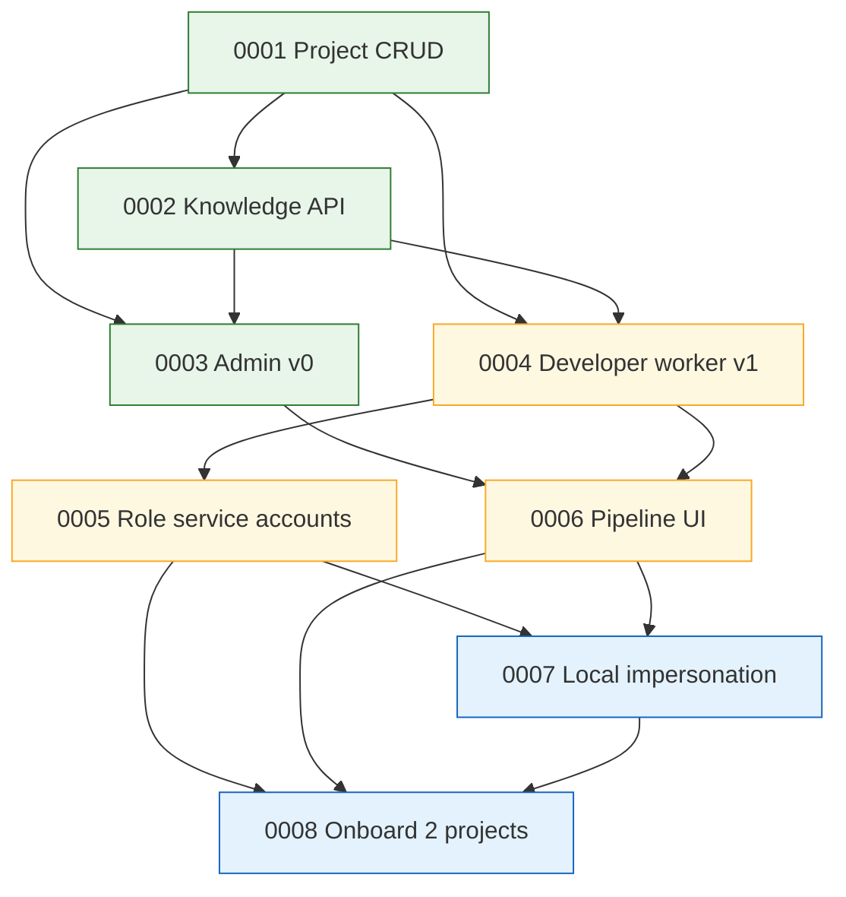

# Roadmap

> Human-readable progress view over [`registry.yaml`](./registry.yaml) and
> the acceptance-criteria checkboxes in each spec file. Grouped by phase
> and traced to the design that justifies each item.
>
> **Phase** reflects sequencing, not a calendar. A spec moves forward
> only when its prerequisites are `active`.

**All current specs trace to design [`0004 — Clean rebuild: coder-core + coder-admin`](../designs/wip/0001-generalize-coder-from-vibetrade.md).**
Updating a spec's acceptance-criteria checkboxes is what moves its
progress bar here — keep the two in sync when you edit.

Last updated: 2026-04-09 (post GitHub-App migration)

---

## Progress summary

| Phase | Specs | AC done | AC total | Progress |
|---|---|---|---|---|
| Now — foundation | 3 | 6 | 19 | `███░░░░░░░` 32% |
| Next — first real work | 3 | 4 | 19 | `██░░░░░░░░` 21% |
| Later — humans, local agents, scale | 2 | 0 | 13 | `░░░░░░░░░░` 0% |
| **Total** | **8** | **10** | **51** | `██░░░░░░░░` **20%** |

---

## Now — foundation

> Unblocks everything else. Core exists, knowledge is readable, humans can see it.

### [0001 — Multi-tenant project CRUD](./wip/0001-multi-tenant-project-crud.md)

`project_id` becomes a first-class dimension on every call. Create,
list, fetch, archive.

- **Status:** wip
- **Progress:** `███████░░░` 4 / 6 AC
- **Blocks:** 0002, 0003, 0004, 0005, 0006, 0007, 0008
- **Remaining:** structured per-request logging carrying `project_id`;
  `POST /projects/{id}:archive` endpoint (column + read-side filter
  already exist).

### [0002 — Knowledge repo read API](./wip/0002-knowledge-repo-read-api.md)

Single authoritative `GET` surface for a project's knowledge artifacts
with parsed frontmatter and resolvable cross-links.

- **Status:** wip
- **Progress:** `█░░░░░░░░░` 1 / 7 AC
- **Depends on:** 0001
- **Blocks:** 0003, 0004, 0008
- **Reality check:** what shipped is a raw-bytes `GET /v1/projects/{id}/knowledge/{path}`
  proxy used by the dispatcher (`system/repos.yaml`, system prompts).
  The parsed-registry / typed-frontmatter / cross-link-resolution
  surface this spec describes does **not** exist yet — only the
  per-project isolation AC is satisfied.

### [0003 — Admin Panel v0 (read-only)](./wip/0003-admin-panel-read-only.md)

React/Vite SPA. Project switcher, project list, knowledge browser.
Zero mutations.

- **Status:** wip
- **Progress:** `██░░░░░░░░` 1 / 6 AC
- **Depends on:** 0001, 0002
- **Blocks:** 0006
- **Reality check:** `coder-admin` is a walking skeleton — Vite/React/TS
  app deployed to Cloud Run that calls `GET /v1/health` and renders the
  response. No project list, switcher, knowledge browser, or markdown
  rendering yet. Only "zero direct GitHub calls" is satisfied (by
  construction).

---

## Next — first real work gets done

> The developer worker actually runs, workers carry least-privilege
> identities, and humans can watch runs in the UI.

### [0004 — Developer worker v1](./wip/0004-developer-worker-v1.md)

In-process `developer` worker running `enrich → execute → fix → test`
against a project's real repos.

- **Status:** wip
- **Progress:** `██████░░░░` 4 / 7 AC
- **Depends on:** 0001, 0002
- **Blocks:** 0005, 0006, 0008
- **Reality check:** the dispatcher runs `claude` against a real
  workspace clone with a GitHub-App-scoped token, opens PRs, and
  records success/failure into the `tasks` row. End-to-end proven by
  PR #3 on `coder-devx/coder-system`. **Remaining:** contention test
  for the leasing path (no polling loop yet — the dispatcher is
  fire-and-forget from POST), a `task_logs` API for streamed logs,
  and a real `TIMED_OUT` state distinct from `FAILED`.

### [0005 — Per-role service accounts](./wip/0005-per-role-service-accounts.md)

Each role gets a GCP SA per project. SysAdmin broker issues
short-lived tokens. Developer worker stops using stub creds.

- **Status:** wip
- **Progress:** `░░░░░░░░░░` 0 / 6 AC
- **Depends on:** 0001, 0004
- **Blocks:** 0007, 0008
- **Linked ADR:** [0006 — Per-role service accounts](../adrs/0006-per-role-service-accounts.md)

### [0006 — Pipeline UI in admin](./wip/0006-pipeline-ui-in-admin.md)

Pipeline tab in `coder-admin`. Live task list, streamed logs, status
filters. Still read-only.

- **Status:** wip
- **Progress:** `░░░░░░░░░░` 0 / 6 AC
- **Depends on:** 0003, 0004
- **Blocks:** 0007 (labels), 0008

---

## Later — humans, local agents, and scale

> Local agents become first-class actors, then we prove the whole
> system works with two projects in parallel.

### [0007 — Local agent impersonation](./wip/0007-local-agent-impersonation.md)

Short-lived role-scoped tokens so Claude Code / Cursor can act as a
role for a project. Audit trail tied to the authorising human.

- **Status:** wip
- **Progress:** `░░░░░░░░░░` 0 / 6 AC
- **Depends on:** 0001, 0005, 0006
- **Blocks:** 0008 (final AC)

### [0008 — Onboard first two projects](./wip/0008-onboard-first-two-projects.md)

VibeTrade re-onboarded end-to-end + a second project running in
parallel. Satisfies design `0004`'s promotion criteria.

- **Status:** wip
- **Progress:** `░░░░░░░░░░` 0 / 7 AC
- **Depends on:** 0001, 0002, 0004, 0005, 0006, 0007
- **Promotes:** design [`0004`](../designs/wip/0001-generalize-coder-from-vibetrade.md) from `wip` to `active`

---

## Dependency graph

---

## How to update this file

1. Edit the acceptance-criteria checkboxes in the relevant
   `wip/00XX-*.md` spec.
2. Update that spec's **Progress** line at the top (`N / M`).
3. Update this file's spec section AND the summary table at the top.
4. If a spec ships: move the file from `wip/` to `active/`, update
   `status:` in its frontmatter, update `folder:` and `status:` in
   `registry.yaml`, regenerate `REGISTRY.md`, and move its section
   here under a new "Shipped" heading.
5. If a spec is dropped: move to `deprecated/` with `deprecated_at`
   and `reason` per `AGENTS.md` rule 5.
