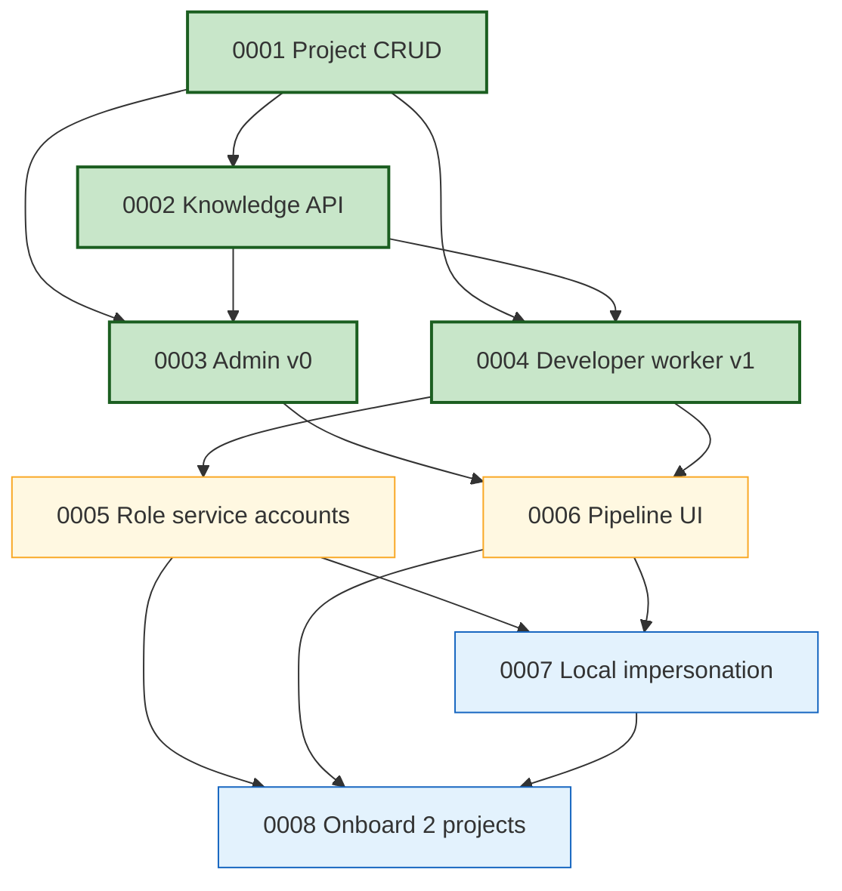

# Roadmap

> Human-readable progress view over [`registry.yaml`](./registry.yaml) and
> the acceptance-criteria checkboxes in each spec file. Grouped by phase
> and traced to the design that justifies each item.
>
> **Phase** reflects sequencing, not a calendar. A spec moves forward
> only when its prerequisites are `active`.

**All current specs trace to design [`0004 — Clean rebuild: coder-core + coder-admin`](../designs/wip/0001-generalize-coder-from-vibetrade.md).**
Updating a spec's acceptance-criteria checkboxes is what moves its
progress bar here — keep the two in sync when you edit.

Last updated: 2026-04-09 (spec 0004 shipped)

---

## Progress summary

| Phase | Specs | AC done | AC total | Progress |
|---|---|---|---|---|
| Shipped | 4 | 26 | 26 | `██████████` 100% |
| Next — first real work | 2 | 0 | 12 | `░░░░░░░░░░` 0% |
| Later — humans, local agents, scale | 2 | 0 | 13 | `░░░░░░░░░░` 0% |
| **Total** | **8** | **26** | **51** | `█████░░░░░` **51%** |

---

## Shipped

> Specs that have hit 100% AC and been promoted from `wip/` to `active/`.

### [0001 — Multi-tenant project CRUD](./active/0001-multi-tenant-project-crud.md)

`project_id` is a first-class dimension on every call. Create, list,
fetch, archive, structured per-request logging carrying `project_id`,
per-project API keys with rotate.

- **Status:** active
- **Progress:** `██████████` 6 / 6 AC ✅

### [0002 — Knowledge repo read API](./active/0002-knowledge-repo-read-api.md)

Single authoritative `GET` surface for a project's knowledge artifacts
with parsed frontmatter and resolvable cross-links.

- **Status:** active
- **Progress:** `██████████` 7 / 7 AC ✅
- **What shipped:** typed routes `GET /v1/projects/{id}/knowledge/{type}`
  and `GET /v1/projects/{id}/knowledge/{type}/{id}` returning parsed
  pydantic models, cross-link resolution with broken-link surfacing,
  in-memory TTL cache with `knowledge_cache_hit_total` metric exposed
  at `/v1/projects/{id}/knowledge/_metrics`. Bytes-passthrough relocated
  to `/knowledge/_files/{path}` as the escape hatch.

### [0003 — Admin Panel v0 (read-only)](./active/0003-admin-panel-read-only.md)

React/Vite SPA. Project switcher, project list, knowledge browser.
Zero mutations.

- **Status:** active
- **Progress:** `██████████` 6 / 6 AC ✅
- **What shipped:** `coder-admin` now has a typed API client over the
  full project + knowledge surface, per-project API-key prompt with
  `localStorage` persistence, project list (`/`) and project detail
  (`/projects/:id`) views, registry list (`/projects/:id/:type`), and
  artifact detail (`/projects/:id/:type/:artifactId`) with parsed
  frontmatter table, react-markdown body, lazy-loaded mermaid diagram
  rendering, and knowledge cross-links rewritten to in-app router
  navigation. Project switcher in the header. Vitest covers the
  cross-link rewriter, projects list + click-through, and the artifact
  page (frontmatter, mermaid placeholder, intra-app navigation, and
  the missing-API-key path).

### [0004 — Developer worker v1](./active/0004-developer-worker-v1.md)

In-process `developer` worker running `claude` against a project's
real repo clone, opening PRs and writing back outcome + logs.

- **Status:** active
- **Progress:** `██████████` 7 / 7 AC ✅
- **What shipped:** the dispatcher leases queued tasks with
  `SELECT ... FOR UPDATE SKIP LOCKED` (race-free even with concurrent
  workers), shells out to `claude` against a per-task workspace clone
  authed by a fresh GitHub-App installation token, captures the JSONL
  session transcript, and records success/failure/`timed_out`
  back onto the row. Logs emitted while the worker runs are buffered
  via a contextvar-aware logging handler and drained into a new
  `task_logs` table on completion (one transaction with the outcome
  write). New `GET /v1/projects/{id}/tasks/{task_id}/logs` endpoint
  surfaces them with `project_id`, `task_id`, and `role` on every line
  per AC5. Timeouts are a distinct `timed_out` lifecycle state with
  the per-task tempdir cleaned up via `try/finally`.

---

## Next — first real work gets done

> Workers carry least-privilege identities and humans can watch runs in
> the UI.

### [0005 — Per-role service accounts](./wip/0005-per-role-service-accounts.md)

Each role gets a GCP SA per project. SysAdmin broker issues
short-lived tokens. Developer worker stops using stub creds.

- **Status:** wip
- **Progress:** `░░░░░░░░░░` 0 / 6 AC
- **Depends on:** 0001, 0004
- **Blocks:** 0007, 0008
- **Linked ADR:** [0006 — Per-role service accounts](../adrs/0006-per-role-service-accounts.md)

### [0006 — Pipeline UI in admin](./wip/0006-pipeline-ui-in-admin.md)

Pipeline tab in `coder-admin`. Live task list, streamed logs, status
filters. Still read-only.

- **Status:** wip
- **Progress:** `░░░░░░░░░░` 0 / 6 AC
- **Depends on:** 0003, 0004
- **Blocks:** 0007 (labels), 0008

---

## Later — humans, local agents, and scale

> Local agents become first-class actors, then we prove the whole
> system works with two projects in parallel.

### [0007 — Local agent impersonation](./wip/0007-local-agent-impersonation.md)

Short-lived role-scoped tokens so Claude Code / Cursor can act as a
role for a project. Audit trail tied to the authorising human.

- **Status:** wip
- **Progress:** `░░░░░░░░░░` 0 / 6 AC
- **Depends on:** 0001, 0005, 0006
- **Blocks:** 0008 (final AC)

### [0008 — Onboard first two projects](./wip/0008-onboard-first-two-projects.md)

VibeTrade re-onboarded end-to-end + a second project running in
parallel. Satisfies design `0004`'s promotion criteria.

- **Status:** wip
- **Progress:** `░░░░░░░░░░` 0 / 7 AC
- **Depends on:** 0001, 0002, 0004, 0005, 0006, 0007
- **Promotes:** design [`0004`](../designs/wip/0001-generalize-coder-from-vibetrade.md) from `wip` to `active`

---

## Dependency graph

---

## How to update this file

1. Edit the acceptance-criteria checkboxes in the relevant
   `wip/00XX-*.md` spec.
2. Update that spec's **Progress** line at the top (`N / M`).
3. Update this file's spec section AND the summary table at the top.
4. If a spec ships: move the file from `wip/` to `active/`, update
   `status:` in its frontmatter, update `folder:` and `status:` in
   `registry.yaml`, regenerate `REGISTRY.md`, and move its section
   here under a new "Shipped" heading.
5. If a spec is dropped: move to `deprecated/` with `deprecated_at`
   and `reason` per `AGENTS.md` rule 5.
