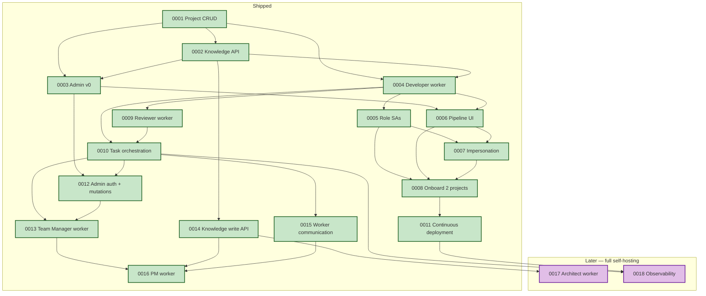

# Roadmap

> Human-readable progress view over [`registry.yaml`](./registry.yaml) and
> the acceptance-criteria checkboxes in each spec file. Grouped by phase
> and traced to the design that justifies each item.
>
> **Phase** reflects sequencing, not a calendar. A spec moves forward
> only when its prerequisites are `active`.

**North star:** Coder manages its own development end-to-end. The human
is in an approval/override role, not a task-authoring role.

**Shipped specs** (0001–0016) all trace to design [`0004 — Clean rebuild: coder-core + coder-admin`](../designs/active/0001-generalize-coder-from-vibetrade.md).
**Planned specs** (0017–0018) extend the system toward full self-hosting.

Last updated: 2026-04-12 (6–12 month roadmap: self-hosting vision)

---

## Progress summary

| Phase | Specs | AC done | AC total | Progress |
|---|---|---|---|---|
| Shipped | 16 | 104 | 104 | `██████████` 100% |
| Later — full self-hosting | 2 | 0 | 14 | `░░░░░░░░░░` 0% |
| **Total** | **18** | **104** | **118** | `████████░░` **88%** |

---

## Later — full self-hosting

> The final two specs complete the product lifecycle: Architect designs
> solutions and the system monitors its own health and costs. When these
> ship, Coder manages Coder.

### [0017 — Architect worker v1](./wip/0017-architect-worker-v1.md)

Given an approved spec, produce a design document with components,
data flow, Mermaid diagrams, and rollout plan. Draft ADRs for
non-obvious decisions. Maintain architectural consistency with
existing decisions.

- **Status:** wip
- **Progress:** `░░░░░░░░░░` 0 / 7 AC
- **Depends on:** [`0014`](./active/0014-knowledge-write-api.md)
- **Unlocks:** higher-quality TM planning (designs give better task context)

### [0018 — Observability and cost tracking](./wip/0018-observability-and-cost-tracking.md)

Per-project cost attribution (Anthropic tokens, compute, API calls).
Pipeline health metrics (success rate, stage durations). Threshold
alerts via Slack. Dashboard in admin panel.

- **Status:** wip
- **Progress:** `░░░░░░░░░░` 0 / 7 AC
- **Depends on:** [`0010`](./active/0010-task-orchestration-v1.md) ✅, [`0011`](./active/0011-continuous-deployment.md) ✅
- **Unlocks:** Consultant worker (needs metrics to observe)

---

## Shipped

> Specs that have hit 100% AC and been promoted from `wip/` to `active/`.

### [0001 — Multi-tenant project CRUD](./active/0001-multi-tenant-project-crud.md)

`project_id` is a first-class dimension on every call. Create, list,
fetch, archive, structured per-request logging carrying `project_id`,
per-project API keys with rotate.

- **Status:** active
- **Progress:** `██████████` 6 / 6 AC ✅

### [0002 — Knowledge repo read API](./active/0002-knowledge-repo-read-api.md)

Single authoritative `GET` surface for a project's knowledge artifacts
with parsed frontmatter and resolvable cross-links.

- **Status:** active
- **Progress:** `██████████` 7 / 7 AC ✅
- **What shipped:** typed routes `GET /v1/projects/{id}/knowledge/{type}`
  and `GET /v1/projects/{id}/knowledge/{type}/{id}` returning parsed
  pydantic models, cross-link resolution with broken-link surfacing,
  in-memory TTL cache with `knowledge_cache_hit_total` metric exposed
  at `/v1/projects/{id}/knowledge/_metrics`. Bytes-passthrough relocated
  to `/knowledge/_files/{path}` as the escape hatch.

### [0003 — Admin Panel v0 (read-only)](./active/0003-admin-panel-read-only.md)

React/Vite SPA. Project switcher, project list, knowledge browser.
Zero mutations.

- **Status:** active
- **Progress:** `██████████` 6 / 6 AC ✅
- **What shipped:** `coder-admin` now has a typed API client over the
  full project + knowledge surface, per-project API-key prompt with
  `localStorage` persistence, project list (`/`) and project detail
  (`/projects/:id`) views, registry list (`/projects/:id/:type`), and
  artifact detail (`/projects/:id/:type/:artifactId`) with parsed
  frontmatter table, react-markdown body, lazy-loaded mermaid diagram
  rendering, and knowledge cross-links rewritten to in-app router
  navigation. Project switcher in the header. Vitest covers the
  cross-link rewriter, projects list + click-through, and the artifact
  page (frontmatter, mermaid placeholder, intra-app navigation, and
  the missing-API-key path).

### [0004 — Developer worker v1](./active/0004-developer-worker-v1.md)

In-process `developer` worker running `claude` against a project's
real repo clone, opening PRs and writing back outcome + logs.

- **Status:** active
- **Progress:** `██████████` 7 / 7 AC ✅
- **What shipped:** the dispatcher leases queued tasks with
  `SELECT ... FOR UPDATE SKIP LOCKED` (race-free even with concurrent
  workers), shells out to `claude` against a per-task workspace clone
  authed by a fresh GitHub-App installation token, captures the JSONL
  session transcript, and records success/failure/`timed_out`
  back onto the row. Logs emitted while the worker runs are buffered
  via a contextvar-aware logging handler and drained into a new
  `task_logs` table on completion (one transaction with the outcome
  write). New `GET /v1/projects/{id}/tasks/{task_id}/logs` endpoint
  surfaces them with `project_id`, `task_id`, and `role` on every line
  per AC5. Timeouts are a distinct `timed_out` lifecycle state with
  the per-task tempdir cleaned up via `try/finally`.

### [0005 — Per-role service accounts](./active/0005-per-role-service-accounts.md)

Every role has a dedicated GCP service account. Dispatcher fetches
per-project Anthropic keys through a broker-downscoped token instead
of a single process-wide env var.

- **Status:** active
- **Progress:** `██████████` 6 / 6 AC ✅
- **What shipped:** seven `coder-{role}@vibedevx.iam.gserviceaccount.com`
  service accounts provisioned by `coder-core/infra/terraform` with
  state in `gs://vibedevx-coder-core-tfstate`. `roles.yaml` is the
  single source of truth; both `roles.tf` (`yamldecode(file(...))`)
  and `capability_matrix.py` read it so the IAM surface and the
  human-readable `CAPABILITY_MATRIX.md` cannot drift. CI runs
  `capability_matrix.py --check` + `tofu fmt -check` + `tofu validate`
  on every PR (AC6).

### [0006 — Pipeline UI in admin](./active/0006-pipeline-ui-in-admin.md)

Pipeline tab in `coder-admin`. Live task list, captured logs, status
filters. Still read-only.

- **Status:** active
- **Progress:** `██████████` 6 / 6 AC ✅
- **What shipped:** `coder-core` `GET /v1/projects/{id}/tasks` now
  accepts `?role=` and `?status=` filters. `coder-admin`
  ships a typed `listTasks` / `getTask` / `getTaskLogs` client and a
  shared `StatusChip` component, plus pipeline list and detail routes.

### [0007 — Local agent impersonation](./active/0007-local-agent-impersonation.md)

Short-lived role-scoped tokens so Claude Code / Cursor can act as a
role for a project. Audit trail tied to the authorising human.

- **Status:** active
- **Progress:** `██████████` 6 / 6 AC ✅
- **What shipped:** dual auth (`X-Api-Key` + `Authorization: Bearer`)
  in `require_project_auth`, actor tracking on tasks, `coder` CLI with
  `impersonate` / `token` / `status` commands, violet impersonation
  badges in `coder-admin`. 181 tests.

### [0008 — Onboard first two projects](./active/0008-onboard-first-two-projects.md)

VibeTrade + Coder (dog-fooding) onboarded end-to-end, running in
parallel with demonstrable isolation.

- **Status:** active
- **Progress:** `██████████` 7 / 7 AC ✅
- **What shipped:** VibeTrade (`vibetrade`) and Coder (`coder`) both
  running developer tasks with per-secret IAM isolation.
- **Promotes:** design [`0004`](../designs/active/0001-generalize-coder-from-vibetrade.md) from `wip` to `active`

### [0009 — Reviewer worker v1](./active/0009-reviewer-worker-v1.md)

Automated code review on PRs. Fetches the diff, loads project knowledge
(conventions, ADRs, designs), posts structured review comments on
GitHub, submits approve/request-changes.

- **Status:** active
- **Progress:** `██████████` 7 / 7 AC ✅
- **What shipped:** `workers/reviewer.py` following the developer
  subprocess pattern. System prompt instructs claude to `gh pr diff`,
  load conventions, analyze, and `gh pr review`. New `review_verdict`
  and `review_url` columns on tasks (migration 0009). Live review on
  [coder-devx/coder-core#2](https://github.com/coder-devx/coder-core/pull/2)
  caught a real convention violation. 12 new tests.

### [0010 — Task orchestration v1](./active/0010-task-orchestration-v1.md)

End-to-end pipeline: enrich → execute → test → review → accept, with
fix loops on failure. State machine in Postgres. Human override at
any stage.

- **Status:** active
- **Progress:** `██████████` 7 / 7 AC ✅
- **What shipped:** Migration 0010 adds `stage`, `fix_attempts`, and
  `fix_context` columns plus `ix_tasks_stage` index. `TaskStage` enum
  covers the full lifecycle. `workers/orchestrator.py` implements the
  `orchestrate_task` loop with stage transitions, fix loops (max 3),
  and structured logging. Dispatcher prepends `fix_context` to prompt
  for fix attempts. API: `stage=queued` on create, `?stage=` filter on
  list, `POST /{task_id}/override` (pause/resume/retry/skip_to_stage/
  reject). 19 new tests, 214 total passing.

### [0011 — Continuous deployment](./active/0011-continuous-deployment.md)

Push-to-main deploys for `coder-core` and `coder-admin` with canary
pattern, automated migrations, and Slack notifications.

- **Status:** active
- **Progress:** `██████████` 6 / 6 AC ✅
- **What shipped:** Canary deploy pattern for both repos: deploy with
  `--no-traffic --tag=canary`, health-check the canary URL, shift
  traffic only on success. `coder-core-migrate` Cloud Run Job runs
  Alembic migrations before traffic shift. Slack webhook notifications
  on success/failure (graceful degradation if not configured). Runbooks
  updated for both services.

### [0012 — Admin panel auth and mutations](./active/0012-admin-auth-and-mutations.md)

Google OAuth for the admin panel. Write operations: create tasks,
override pipeline decisions, approve merges, edit knowledge artifacts.
Real-time pipeline updates via SSE.

- **Status:** active
- **Progress:** `██████████` 7 / 7 AC ✅
- **What shipped:** Google OAuth login with email allowlist, admin JWT (HS256, `coder-core/admin` audience) with cross-project access, `admin_sessions` audit table, SSE event bus for real-time pipeline updates, task merge endpoint (squash merge via GitHub API), knowledge checkbox editing via GitHub Contents API. Frontend: login page, auth guard, Bearer auth on all API calls, create task form, override buttons, approve-merge action, SSE hook, interactive checkboxes. 227 backend tests, 19 frontend tests.

### [0013 — Team Manager worker v1](./active/0013-team-manager-worker-v1.md)

Given a spec and its designs, break it into sequenced developer tasks
with clear prompts, dependency ordering, and complexity estimates.
Plans are reviewable before execution.

- **Status:** active
- **Progress:** `██████████` 7 / 7 AC ✅
- **What shipped:** `team-manager` role in dispatcher with built-in
  system prompt. Worker shells out to `claude` CLI, parses plan JSON
  from output, creates draft `task_plan` row in Postgres. New
  `task_plans` table (migration 0012) with `plan_json` JSONB, status
  lifecycle (draft/approved/rejected), feedback field. 6 REST endpoints
  for plan CRUD + approve/reject. Approve creates tasks with `blocked`
  stage for dependency ordering; orchestrator `_unblock_dependents`
  promotes blocked→queued when deps reach accepted. Admin panel: plan
  list with status filter, plan detail with inline task editing,
  approve/reject buttons. `StatusChip` extended for plan statuses.
  245 backend tests, 18 new.

### [0014 — Knowledge write API](./active/0014-knowledge-write-api.md)

Workers can create and update knowledge artifacts (specs, designs, ADRs)
via the API. Changes committed to the Git-backed repo with frontmatter
validation and audit trail.

- **Status:** active
- **Progress:** `██████████` 6 / 6 AC ✅
- **What shipped:** `POST` and `PUT` endpoints on
  `/v1/projects/{id}/knowledge/{type}` wrapping the GitHub Contents API.
  Frontmatter validation against per-type required fields, cross-link
  validation with self-reference exemption, structured commit messages
  with actor attribution. Status changes trigger file moves (create at
  new path + delete old + registry update). `GitHubClient` extended
  with `create_file` and `delete_file` methods. 259 backend tests,
  14 new.

### [0015 — Worker-to-worker communication](./active/0015-worker-communication.md)

Structured message passing between workers on a task: review feedback,
clarification requests, acceptance decisions, human overrides. Full
conversation visible in admin panel with real-time SSE updates.

- **Status:** active
- **Progress:** `██████████` 6 / 6 AC ✅
- **What shipped:** `task_messages` table (migration 0013) with
  `from_role`, `to_role`, `msg_type` (feedback/question/decision/
  override), optional `verdict` (approve/request_changes/reject), and
  `body`. POST + GET endpoints with tenant isolation and validation.
  Orchestrator reads verdict messages as fallback for stage transitions;
  `_build_fix_context` includes recent messages so the developer sees
  reviewer feedback. SSE `message_created` events. Admin panel message
  thread with color-coded type and verdict chips. 271 backend tests,
  12 new.

### [0016 — PM worker v1 (spec and acceptance)](./active/0016-pm-worker-v1.md)

PM drafts product specs from problem statements and runs acceptance
testing on delivered work. Specs require human approval before entering
the pipeline. Acceptance produces per-AC verdicts with evidence.

- **Status:** active
- **Progress:** `██████████` 7 / 7 AC ✅
- **What shipped:** `workers/pm.py` with two modes: `draft:` creates
  product specs from problem statements via claude CLI, `accept:`
  evaluates acceptance criteria and produces verdict reports. Dispatcher
  Phase 4 writes draft specs to `wip/` via GitHub Contents API and posts
  verdict messages for acceptance reports. Built-in system prompts for
  both modes. Design [`0009`](../designs/active/0009-pm-worker.md).
  285 backend tests, 14 new.

---

## Dependency graph

---

## Self-hosting milestone

When specs 0009–0018 are all `active`, the following loop runs without
human authoring:

1. **PM** drafts a spec from a problem statement → human approves.
2. **Architect** produces a design → human approves.
3. **Team Manager** breaks the design into tasks → human reviews plan.
4. **Developer** executes each task (code + tests + PR).
5. **Reviewer** reviews each PR (approve or request changes).
6. **Orchestrator** manages the pipeline (fix loops, retries, escalation).
7. **CD** ships merged code to production.
8. **PM** runs acceptance against the ACs → spec moves to `active`.
9. **Observability** tracks cost, health, and trends throughout.

The human's role becomes: approve specs, approve designs, review task
plans, and intervene when the system gets stuck. Everything else is
autonomous.

---

## How to update this file

1. Edit the acceptance-criteria checkboxes in the relevant
   `wip/00XX-*.md` spec.
2. Update that spec's **Progress** line at the top (`N / M`).
3. Update this file's spec section AND the summary table at the top.
4. If a spec ships: move the file from `wip/` to `active/`, update
   `status:` in its frontmatter, update `folder:` and `status:` in
   `registry.yaml`, regenerate `REGISTRY.md`, and move its section
   here under "Shipped".
5. If a spec is dropped: move to `deprecated/` with `deprecated_at`
   and `reason` per `AGENTS.md` rule 5.
