# Roadmap

> Human-readable progress view. `active/` holds subject-named logical
> components (the system as it is today). `wip/` holds numbered,
> roadmap-aligned work in flight. When a WIP ships, its content merges
> into `active/` and the numbered WIP file disappears.
>
> **Phase** reflects sequencing, not a calendar. A WIP starts only when
> its prerequisites are represented in `active/`.

**North star:** Coder manages its own development end-to-end. The human
is in an approval/override role, not a task-authoring role.

**16 active components** describe the shipped system.

**Pipeline proven end-to-end (2026-04-13):** PM draft → spec file in repo →
pipeline run advances to `spec_approval` → ready for human approval →
chain auto-creates architect task.

**Next 9 months (May 2026–Feb 2027).** Six sequenced phases, 25
planned items: Scale & Reliability → Cost & Token Efficiency → Admin
Panel v2 → Security & Compliance → Trusted Autonomy → Knowledge Depth.
The through-line is: *make the pipeline fast, cheap, visible, safe to
trust with less human intervention, and make the knowledge it runs on
compound in value.*

Last updated: 2026-04-18 — 0044 (Write-through enforcement on ship)
shipped into `active/` across `knowledge-api`, `reviewer-worker`,
`team-manager-worker`, `architect-worker`, `admin-panel`, and
`task-orchestration` (plus the matching designs). 0043 (Knowledge
freshness signals) shipped earlier today as
[knowledge-freshness](./active/knowledge-freshness.md). Phase 3
complete: 0023, 0025, 0026, 0027, and 0028 all shipped into `active/`.

---

## Active components

The system today, by logical component. Each links to its active spec
(product view) and active design (technical view) where both exist.

| Component | Spec | Design |
|---|---|---|
| Multi-tenancy | [multi-tenancy](./active/multi-tenancy.md) | (covered in [system-overview](../designs/active/system-overview.md)) |
| Knowledge API (read + write) | [knowledge-api](./active/knowledge-api.md) | [knowledge-write-api](../designs/active/knowledge-write-api.md), [knowledge-repo-model](../designs/active/knowledge-repo-model.md) |
| Admin Panel | [admin-panel](./active/admin-panel.md) | (covered in [system-overview](../designs/active/system-overview.md)) |
| Developer Worker | [developer-worker](./active/developer-worker.md) | [worker-roles](../designs/active/worker-roles.md) |
| Reviewer Worker | [reviewer-worker](./active/reviewer-worker.md) | [worker-roles](../designs/active/worker-roles.md) |
| PM Worker | [pm-worker](./active/pm-worker.md) | [pm-worker](../designs/active/pm-worker.md) |
| Architect Worker | [architect-worker](./active/architect-worker.md) | [architect-worker](../designs/active/architect-worker.md) |
| Team Manager Worker | [team-manager-worker](./active/team-manager-worker.md) | [team-manager-worker](../designs/active/team-manager-worker.md) |
| Service Accounts | [service-accounts](./active/service-accounts.md) | [worker-roles](../designs/active/worker-roles.md) |
| Impersonation | [impersonation](./active/impersonation.md) | [impersonation](../designs/active/impersonation.md) |
| Onboarding | [onboarding](./active/onboarding.md) | (covered in [system-overview](../designs/active/system-overview.md)) |
| Task Orchestration | [task-orchestration](./active/task-orchestration.md) | [worker-communication](../designs/active/worker-communication.md) |
| Continuous Deployment | [continuous-deployment](./active/continuous-deployment.md) | (covered in [system-overview](../designs/active/system-overview.md)) |
| Observability | [observability](./active/observability.md) | [observability-and-cost-tracking](../designs/active/observability-and-cost-tracking.md) |
| Branch cleanup | [branch-cleanup](./active/branch-cleanup.md) | [branch-cleanup](../designs/active/branch-cleanup.md) |

---

## In flight (`wip/`)

| ID | Title | Status |
|---|---|---|
| [0029](./wip/0029-prompt-caching.md) | Prompt caching & shared context reuse | drafting |
| [0030](./wip/0030-model-tier-routing.md) | Model tier routing | drafting |
| [0031](./wip/0031-token-budgets.md) | Per-project token budgets & cost gates | drafting |
| [0032](./wip/0032-cost-regression-alerts.md) | Prompt & cost regression alerts | drafting |

---

## Dependency graph

```mermaid
flowchart TB
  subgraph active [Active components]
    mt[multi-tenancy]
    ka[knowledge-api]
    ap[admin-panel]
    dev[developer-worker]
    rev[reviewer-worker]
    pm[pm-worker]
    arch[architect-worker]
    tm[team-manager-worker]
    sa[service-accounts]
    imp[impersonation]
    onb[onboarding]
    to[task-orchestration]
    cd[continuous-deployment]
    obs[observability]
  end

  subgraph scale ["Phase 3 — Scale & Reliability"]
    s23["Branch GC (shipped)"]
    s24["Worker output compliance (shipped)"]
    s25["Pipeline run dashboard (shipped)"]
    s26["Transient retry (shipped)"]
    s27["Concurrent pipelines (shipped)"]
  end

  subgraph cost ["Phase 4 — Cost & Efficiency"]
    s28["Prompt caching"]
    s29["Model tier routing"]
    s30["Budget gates"]
    s31["Cost regression alerts"]
  end

  subgraph adminv2 ["Phase 5 — Admin v2"]
    s32["Live timeline"]
    s33["Diff & PR viewer"]
    s34["Knowledge editor"]
    s35["Command palette"]
  end

  subgraph sec ["Phase 6 — Security"]
    s36["Audit log"]
    s37["Secret rotation"]
    s38["Tenant isolation tests"]
  end

  subgraph auto ["Phase 7 — Trusted Autonomy"]
    s39["Confidence auto-approve"]
    s40["Escalation & on-call"]
    s41["Self-healing"]
  end

  subgraph know ["Phase 8 — Knowledge Depth"]
    s43["Freshness signals (shipped)"]
    s44["Write-through enforcement"]
    s45["Cold-start ingestion"]
    s46["Graph-aware retrieval"]
    s47["Template schema migration"]
    s48["Cross-project patterns"]
  end

  to --> s23
  dev --> s23
  pm --> s24
  arch --> s24
  tm --> s24
  to --> s25
  ap --> s25
  to --> s26
  dev --> s27
  to --> s27
  obs --> s27

  ka --> s28
  obs --> s28
  to --> s28
  to --> s29
  obs --> s29
  obs --> s30
  s29 --> s30
  obs --> s31
  s28 --> s31

  to --> s32
  s25 --> s32
  ap --> s32
  dev --> s33
  ap --> s33
  ka --> s34
  ap --> s34
  ap --> s35

  imp --> s36
  ap --> s36
  sa --> s37
  cd --> s37
  mt --> s38
  sa --> s38
  s36 --> s38

  to --> s39
  obs --> s39
  to --> s40
  obs --> s40
  s26 --> s40
  to --> s41
  s26 --> s41
  s40 --> s41

  ka --> s43
  obs --> s43
  arch --> s43
  ka --> s44
  rev --> s44
  tm --> s44
  arch --> s44
  onb --> s45
  ka --> s45
  ka --> s46
  s43 --> s46
  ka --> s47
  s44 --> s48
  s43 --> s48

  classDef activeStyle fill:#c8e6c9,stroke:#1b5e20,stroke-width:2px
  classDef scaleStyle fill:#ffe0b2,stroke:#e65100,stroke-width:2px
  classDef costStyle fill:#fff9c4,stroke:#f57f17,stroke-width:2px
  classDef adminStyle fill:#bbdefb,stroke:#1565c0,stroke-width:2px
  classDef secStyle fill:#f8bbd0,stroke:#ad1457,stroke-width:2px
  classDef autoStyle fill:#d1c4e9,stroke:#4527a0,stroke-width:2px
  classDef knowStyle fill:#b2dfdb,stroke:#004d40,stroke-width:2px

  class mt,ka,ap,dev,rev,pm,arch,tm,sa,imp,onb,to,cd,obs,s23,s24,s25,s26,s27 activeStyle
  class s28,s29,s30,s31 costStyle
  class s32,s33,s34,s35 adminStyle
  class s36,s37,s38 secStyle
  class s39,s40,s41 autoStyle
  class s43,s44,s45,s46,s47,s48 knowStyle
```

---

## Phase 3 — Scale & Reliability (May–Jun 2026)

> Make the pipeline robust, self-healing, and observable at scale.
> Success criteria: zero manual cleanup, <1% task loss from transient
> failures, 3+ pipelines running concurrently without queue starvation.

### 0023 — Branch cleanup GC job (shipped 2026-04-15)

Hourly job deletes stale `task/*` branches older than 24h with no open PR.
Prevents branch proliferation from failed developer tasks.

- **Status:** shipped → [`active/branch-cleanup`](./active/branch-cleanup.md) /
  [`designs/active/branch-cleanup`](../designs/active/branch-cleanup.md)
- **Extends:** `task-orchestration`, `developer-worker`, `observability`

### 0024 — Task Stage Runs API (shipped 2026-04-15)

`GET /v1/projects/{project_id}/tasks/{task_id}/stage-runs` endpoint
returning the archived `TaskStageRunRow` rows for a task, ordered by
`recorded_at` ascending. Debugging-oriented, no admin UI.

- **Status:** shipped → merged into
  [`task-orchestration`](./active/task-orchestration.md) /
  [`worker-communication`](../designs/active/worker-communication.md)
- **Extends:** `task-orchestration`, `observability`

### 0025 — Worker output compliance (shipped 2026-04-17)

Per-worker JSON schemas gate Phase 4 for PM (draft + accept),
Architect, and Team Manager. `validate_and_retry` re-prompts Claude on
schema failure up to a budget; exhaustion lands
`failure_kind="schema"` with zero side effects. Enforcement enabled
after a 48 h shadow soak from the 2026-04-15 deploy.

- **Status:** shipped → merged into
  [`pm-worker`](./active/pm-worker.md),
  [`architect-worker`](./active/architect-worker.md),
  [`team-manager-worker`](./active/team-manager-worker.md),
  [`task-orchestration`](./active/task-orchestration.md) /
  [`pm-worker`](../designs/active/pm-worker.md),
  [`architect-worker`](../designs/active/architect-worker.md),
  [`team-manager-worker`](../designs/active/team-manager-worker.md),
  [`worker-communication`](../designs/active/worker-communication.md).
- **ADR:** [0012 — re-prompt only, no programmatic repair](../adrs/0012-re-prompt-only-worker-output-remediation.md).

### 0026 — Pipeline run dashboard (shipped 2026-04-17)

Admin panel view showing pipeline runs end-to-end: inline Gate card
on `RunDetail` for spec / design / plan approvals without leaving
the run view, sort-by-blocked-longest-first on the Runs list with a
red `blocked Nm` badge per row. Two new timestamp columns on
`pipeline_runs` (`step_started_at` + `blocked_since`), a
`pipeline_step_stats` rollup table, and two new SSE event types
(`pipeline_run.changed` + `.gate_blocked`) back the UX.

- **Status:** shipped → merged into
  [`task-orchestration`](./active/task-orchestration.md),
  [`admin-panel`](./active/admin-panel.md) /
  [`worker-communication`](../designs/active/worker-communication.md).
- **Runbook:** [pipeline-run-blocked](../runbooks/pipeline-run-blocked.md).

### 0027 — Automatic retry on transient failures (shipped 2026-04-17)

Per-worker classify-and-retry loop wraps every role worker's `claude`
spawn. Transient-class failures (429/529/timeout/DNS) retry with
full-jitter exponential backoff inside the worker; budget exhaustion
lands `failure_kind="transient"` with a structured detail, recovered
runs populate `tasks.transient_retry_history` for the admin chip. The
pre-0027 dispatcher-level retry was removed on ship per ADR 0013.

Ship note: the worker internal-timeout signature was changed to
`exit_code=-9 + "coder task deadline exceeded"` so the classifier
doesn't retry our own task-deadline hits as transient (collision
found during the 2026-04-17 trial flip).

- **Status:** shipped → merged into
  [`pm-worker`](./active/pm-worker.md),
  [`architect-worker`](./active/architect-worker.md),
  [`team-manager-worker`](./active/team-manager-worker.md),
  [`developer-worker`](./active/developer-worker.md),
  [`reviewer-worker`](./active/reviewer-worker.md),
  [`task-orchestration`](./active/task-orchestration.md) /
  [`pm-worker`](../designs/active/pm-worker.md),
  [`architect-worker`](../designs/active/architect-worker.md),
  [`team-manager-worker`](../designs/active/team-manager-worker.md),
  [`worker-roles`](../designs/active/worker-roles.md),
  [`worker-communication`](../designs/active/worker-communication.md).
- **ADR:** [0013 — worker-level transient retry](../adrs/0013-worker-level-transient-retry.md).

### 0028 — Concurrent pipeline execution & queue fairness (shipped 2026-04-17)

`DispatcherQueue` sits in front of the global `worker_concurrency`
cap: waiters are queued per-project and admission round-robins across
contending projects so one tenant can't monopolise every slot.
Migration 0027 added the optional `projects.worker_concurrency_soft`
soft cap (yield on contention). Two new queue-depth endpoints
(`/v1/projects/{id}/ops/queue-depth`, `/v1/_admin/ops/queue-depth`)
and two admin surfaces (per-project Queue strip + Fleet queue
widget) surface the dispatcher state.

- **Status:** shipped → merged into
  [`task-orchestration`](./active/task-orchestration.md) /
  [`worker-communication`](../designs/active/worker-communication.md).
- **Runbook:** [concurrency-overflow](../runbooks/concurrency-overflow.md).

---

## Phase 4 — Cost & Token Efficiency (Jun–Jul 2026)

> Cut per-pipeline token spend by ~50% without hurting quality. Today
> every worker re-sends the same context; every task runs on the most
> expensive model regardless of complexity. Fix both.

### 0029 — Prompt caching & shared context reuse (planned)

Use Anthropic prompt caching for stable sections (role system prompt,
project conventions, relevant knowledge slice). Share a common
"project context block" across sibling tasks in the same pipeline run.
Target: 40% reduction in input tokens for orchestrated runs.

- **Status:** planned
- **Extends:** `knowledge-api`, `observability`, `task-orchestration`

### 0030 — Model tier routing (planned)

Route simple tasks (GC jobs, trivial fixes, acceptance checks on tight
ACs) to Haiku; reserve Sonnet for design/architect/complex developer
work. Per-role default + per-task override. Measure quality regression
via reviewer approval rate.

- **Status:** planned
- **Extends:** `task-orchestration`, `observability`

### 0031 — Per-project token budgets & cost gates (planned)

Each project gets a soft/hard monthly token budget. At soft, Slack
warning and auto-downshift to cheaper models. At hard, new tasks
queue and require override. Exposes `GET /v1/projects/{id}/budget`.

- **Status:** planned
- **Extends:** `observability`

### 0032 — Prompt & cost regression alerts (planned)

Nightly job compares per-stage cost and token-per-AC against a
7-day baseline; alerts on >25% regressions with the commit range
likely responsible.

- **Status:** planned
- **Extends:** `observability`

---

## Phase 5 — Admin Panel v2: Interactive & Live (Jul–Sep 2026)

> Make the admin panel the thing you keep open all day. Today it's a
> list of rows; it should be a live view of what the system is doing,
> with every common action one keystroke away.

### 0033 — Live pipeline timeline (planned)

Replace the flat task list with a timeline view per pipeline run:
horizontal swim-lanes per role, stage durations as bars, SSE-driven
progress tick, hover for logs, click for detail.

- **Status:** planned
- **Extends:** `admin-panel`, `task-orchestration`

### 0034 — In-panel diff & PR viewer (planned)

View PR diffs, reviewer comments, and commit history directly in the
admin panel. Approve/request-changes buttons call through to `coder-core`.

- **Status:** planned
- **Extends:** `admin-panel`, `developer-worker`

### 0035 — Inline knowledge editor with approvals (planned)

Edit spec/design markdown in-browser with frontmatter form + body
editor + live preview. Approve/reject buttons adjacent.

- **Status:** planned
- **Extends:** `admin-panel`, `knowledge-api`

### 0036 — Command palette & keyboard-first navigation (planned)

`⌘K` palette: jump to project, task, spec, run; trigger common actions
(approve, retry, override); fuzzy-search knowledge. Full keyboard
navigation of tables and forms.

- **Status:** planned
- **Extends:** `admin-panel`

---

## Phase 6 — Security & Compliance (Sep–Oct 2026)

> Close the gap between "it works" and "it's safe to let a customer
> near it." Preparation for external pilots.

### 0037 — Centralized audit log service (planned)

Every mutation (approve, reject, override, retry, merge, knowledge
write, impersonation) lands in an append-only audit log with actor,
project, target, before/after, and correlation ID. Queryable by admin,
retained 1 year.

- **Status:** planned
- **Extends:** `impersonation`, `admin-panel`, `task-orchestration`

### 0038 — Automated secret rotation (planned)

Scheduled rotation of Anthropic keys, GitHub App tokens, per-project
API keys, and admin JWT secrets. Zero-downtime rollover via dual-key
windows. Runbook becomes a cron job.

- **Status:** planned
- **Extends:** `service-accounts`, `continuous-deployment`

### 0039 — Tenant isolation test harness (planned)

CI suite that provisions two projects and asserts no cross-tenant
reads/writes are possible across every endpoint, token type, and
worker path.

- **Status:** planned
- **Extends:** `multi-tenancy`, `service-accounts`

---

## Phase 7 — Trusted Autonomy (Oct–Nov 2026)

> Today three gates (spec / design / plan) require human approval
> every run. Many are low-risk rubber-stamps. Let the system earn
> auto-approval on the easy cases so humans focus on the hard ones.

### 0040 — Confidence-scored auto-approval (planned)

PM, Architect, and TM outputs include a self-reported confidence
score with justification. If score > threshold AND project opted-in
AND historical approval rate > 95% on similar artifacts, auto-approve
with a 10-minute "undo" window.

- **Status:** planned
- **Extends:** `task-orchestration`, `observability`, `pm-worker`, `architect-worker`, `team-manager-worker`

### 0041 — Escalation policies & human on-call routing (planned)

When a pipeline stalls, fails repeatedly, or exceeds SLA, route to a
human via Slack/PagerDuty with full context. Per-project on-call
rotation.

- **Status:** planned
- **Extends:** `task-orchestration`, `observability`

### 0042 — Self-healing stuck pipelines (planned)

Watchdog detects pipelines stuck in a stage beyond 3× p95 duration,
diagnoses, and auto-remediates (retry, re-dispatch, unblock). Only
pages a human when auto-remediation fails.

- **Status:** planned
- **Extends:** `task-orchestration`

---

## Phase 8 — Knowledge Depth (Nov 2026–Feb 2027)

> Make the knowledge repo compound in value. Today it's structured,
> validated (ADR 0008), and atomically written via the Knowledge API.
> It is not yet *fresh*, *auto-captured on ship*, *auto-populated at
> onboarding*, *graph-served*, *migratable across template revisions*,
> or *cross-project-aware*. Each of those is a specific, observable
> gap — not a vague "make it smarter" — and each unlocks a real
> behaviour we want from the system.
>
> Success criteria: `active/` is never more than 48 h behind shipped
> reality; median fleet freshness score trends non-decreasing;
> onboarding a new project produces a populated knowledge repo in a
> single afternoon; Knowledge API can return a traversed subgraph in
> one call; template schema bumps apply across every project without
> hand-editing. Items 0043 and 0044 were small enough to pull forward
> into Phase 3 capacity; both shipped 2026-04-18. Everything else waits
> for this phase.

### 0043 — Knowledge freshness signals (shipped 2026-04-18)

Shipped into `active/` as
[knowledge-freshness](./active/knowledge-freshness.md). Every non-ADR
artifact now carries `last_verified_at`; the Knowledge API envelope
includes `freshness: {score, reasons, …}` on every read;
`min_freshness=N` returns 409 STALE with the body; `POST .../verify`
bumps the date atomically; a nightly audit dispatches the lowest-scored
artifacts to the Architect worker, which emits verified / needs_rewrite
/ uncertain and the consumer calls `.../verify` or files a structured
report. The admin Freshness tab renders the score histogram and
Needs-attention table with one-click Verify.

- **Status:** shipped → [`active/knowledge-freshness`](./active/knowledge-freshness.md)
- **Design:** [`designs/active/knowledge-freshness`](../designs/active/knowledge-freshness.md)

### 0044 — Write-through enforcement on ship (shipped 2026-04-18)

Operationalised AGENTS.md rule 5. The Reviewer worker's output schema
gained a required `ship_attestation`: every AC of the shipping WIP
either names an `active/` artifact + section that now covers it, or
is explicitly dropped with a reason. Team Manager's close-cycle step
now refuses to close while shipped-but-unmerged WIPs exist (fails open
on GitHub errors). `POST /v1/knowledge/ship` performs the full fold
(active updates + WIP delete + both registries) in one atomic Git
Trees commit. Admin panel renders a two-column Ship gate (merges ↔
attestation) on RunDetail. Architect worker ships a
`knowledge-ship-draft` mode that auto-populates the merges column
when `settings.ship_draft_dispatch_enabled` is on.
`scripts/find_orphan_wips.py` supports both report and
`--open-audit` dispatch modes for the one-time fleet sweep.

- **Status:** shipped → folded into
  [`knowledge-api`](./active/knowledge-api.md),
  [`reviewer-worker`](./active/reviewer-worker.md),
  [`team-manager-worker`](./active/team-manager-worker.md),
  [`architect-worker`](./active/architect-worker.md),
  [`admin-panel`](./active/admin-panel.md), and
  [`task-orchestration`](./active/task-orchestration.md)
- **Design:** [`knowledge-write-api`](../designs/active/knowledge-write-api.md)
  (ship endpoint + orphan-WIP query),
  [`team-manager-worker`](../designs/active/team-manager-worker.md)
  (close-cycle backstop),
  [`architect-worker`](../designs/active/architect-worker.md)
  (ship-draft mode)
- **ADR:** [`0015 — ship gate lives in the Coder pipeline`](../adrs/0015-ship-gate-in-coder-pipeline.md)

### 0045 — Cold-start knowledge ingestion (planned)

A tool + runbook that populates a new project's knowledge repo from
an existing codebase and history: inferred services from repo
structure, inferred designs from top-level modules + docstrings, a
first pass at ADRs extracted from commit messages referencing
decisions, and a seeded glossary. Output is a PR a human reviews, not
a silent commit. Target: a new project goes from `onboard` to
populated repo in an afternoon, not a week.

- **Status:** planned
- **Extends:** `onboarding`, `knowledge-api`, `architect-worker`

### 0046 — Graph-aware knowledge retrieval (planned)

Knowledge API v2 endpoint `GET /v1/projects/{id}/knowledge/graph`
that accepts a starting artifact and a traversal spec (depth, edge
types, freshness floor) and returns the whole subgraph in one
response, pre-joined. Replaces the N+1 pattern of workers fetching
an artifact and then each cross-link separately. Respects 0043's
freshness so a graph fetch at `min_freshness=70` excludes stale
branches.

- **Status:** planned
- **Extends:** `knowledge-api`

### 0047 — Template schema migration (planned)

When `template/` gains a new required field or renames one, every
managed project's knowledge repo needs to adopt the change. Today
this is manual and error-prone. Adds template versioning
(`template_version` in each project repo), a migration script
registry in `coder-system/migrations/`, and a Coder Core job that
runs pending migrations per project as a reviewed PR. Makes schema
evolution a regular event, not a crisis.

- **Status:** planned
- **Extends:** `knowledge-api`, `onboarding`

### 0048 — Cross-project pattern surfacing (planned)

The second moat: once 0043 + 0044 keep each project's knowledge
clean, surface patterns across projects. Similar ADRs, recurring
failure taxonomies, role-prompt improvements that worked in one
project and could transfer. First cut is read-only: an admin panel
"fleet patterns" view and an API that lets a worker ask "has any
other project decided this already?" — learning, not auto-apply.

- **Status:** planned
- **Extends:** `knowledge-api`, `admin-panel`, all five role workers

---

## How to update this file

1. **Adding a WIP:** create `wip/00NN-kebab-title.md` + design counterpart
   if needed, register in both `registry.yaml`s, add an entry under the
   relevant phase here.
2. **Shipping a WIP:** merge its content into one or more subject-named
   files under `active/` (update existing and/or add new component files),
   delete the numbered WIP file, update both registries, remove its entry
   from the phase section here and add/update a row in "Active components"
   if a new component was introduced.
3. **Deprecating an active component:** move its file to `deprecated/`
   with `status: deprecated`, `deprecated_at:`, `reason:`; remove the
   "Active components" row here.

See [`../../AGENTS.md`](../../AGENTS.md) rule 5 for the canonical rule.
