# Roadmap

> Human-readable progress view. `active/` holds subject-named logical
> components (the system as it is today). `wip/` holds numbered,
> roadmap-aligned work in flight. When a WIP ships, its content merges
> into `active/` and the numbered WIP file disappears.
>
> **Phase** reflects sequencing, not a calendar. A WIP starts only when
> its prerequisites are represented in `active/`.

**North star:** Coder manages its own development end-to-end. The human
is in an approval/override role, not a task-authoring role.

**20 active components** describe the shipped system (as of
2026-04-23, with `escalations` and `self-healing` added alongside
`tenant-isolation`).

**Pipeline proven end-to-end (2026-04-13):** PM draft → spec file in repo →
pipeline run advances to `spec_approval` → ready for human approval →
chain auto-creates architect task.

**Next 9 months (May 2026–Feb 2027).** Six sequenced phases, 24
planned items: Scale & Reliability → Cost & Token Efficiency → Admin
Panel v2 → Security & Compliance → Trusted Autonomy → Knowledge Depth.
The through-line is: *make the pipeline fast, cheap, visible, safe to
trust with less human intervention, and make the knowledge it runs on
compound in value.*

Last updated: 2026-04-27 (later) — **First end-to-end dogfood
push: 0046 GraphExpander + 0052 Stage 0 (manifest + receiver
scaffold) + 0053 Stage 0a (developer-worker preflight) all
shipped to prod via worker-dispatched PRs.** Six PRs landed:
[coder-system#9](https://github.com/coder-devx/coder-system/pull/9)
(empty manifest),
[coder-core#33](https://github.com/coder-devx/coder-core/pull/33)
(callback receiver scaffold),
[coder-core#34](https://github.com/coder-devx/coder-core/pull/34)
(GraphExpander + ruff format follow-up),
[coder-system#10](https://github.com/coder-devx/coder-system/pull/10)
(WIP open-question sweep + add 0052/0053 specs),
[coder-core#35](https://github.com/coder-devx/coder-core/pull/35)
(developer task timeout 1200s → 2400s),
[coder-core#36](https://github.com/coder-devx/coder-core/pull/36)
(developer-worker preflight live: every dev dispatch now runs
`uv run ruff format` + `uv run ruff check --fix` before push).
Plus operational: `SELF_HEAL_PATTERN_ZOMBIE_EXECUTING_MODE` flipped
`dry_run` → `apply` (zombie-executing tasks now auto-recovered);
[coder-system#11](https://github.com/coder-devx/coder-system/pull/11)
(`dispatching-developer-tasks.md` runbook captures the operational
lessons from the push). New WIP **0054 — Orchestrator GitHub-state
reconciliation** scope sealed today, closing the "PR exists but task
stuck" failure class observed during the 0053 dispatch.

Earlier — 2026-04-27 — **Open-question sweep across all
in-flight WIPs: 45 OQs resolved, 9 specs scope-sealed
(0029/0030/0031/0032/0040/0045/0046/0047/0048), 1 new mini-spec
created (0052 — managed-repo Action distribution, pre-work for
the 0045 + 0047 fleet-sweep Action stages).** All Phase 4
phase-2 increments + all Phase 8 specs + 0052 are now ready for
architect dispatch. 0040 has two new pre-Stage-3 ACs (AC11
static risk-flag check, AC12 SELECT FOR UPDATE on the
auto_approvals row) that must land before the fleet flag flips
from shadow → live. 0038 retains 3 narrower OQs (GitHub App
dual-key window, rate-limit interaction, scheduler drift).
0046 + 0047 + 0048 + 0052 are the load-bearing Phase 8
sequence; 0045 deferred to next onboarding. Decision Q45 —
start dispatch now, not waiting for the 0049/0050 soak window
to close 2026-05-25.

Earlier — 2026-04-26 — **0051 (coder-core modular monolith
hardening) shipped to prod end-to-end across 5 PRs.** Routers are
now thin adapters; every workflow named in the spec lives in a
feature-package service module (`coder_core/{tasks,pipelines,
metrics,impersonation,projects,knowledge}`); audit-mutation
atomicity is proven by tests
([test_audit_atomicity.py](https://github.com/coder-devx/coder-core/blob/main/tests/test_audit_atomicity.py)
injects a failure mid-workflow for five representative services and
confirms rollback); the four extraction-ready protocols
(`WorkerDispatcher`, `EventPublisher`, `AuditRecorder`,
`KnowledgeReader`) are plumbed end-to-end with `set_*`-swappable
singletons and exercised by spy-injection tests
([test_protocol_seams.py](https://github.com/coder-devx/coder-core/blob/main/tests/test_protocol_seams.py));
1372 tests pass; four `import-linter` boundary contracts hold with
zero `ignore_imports` exceptions. Design + spec graduated wip →
active. PRs:
[coder-core#29](https://github.com/coder-devx/coder-core/pull/29)
(refactor + 95 service tests),
[coder-system#6](https://github.com/coder-devx/coder-system/pull/6)
(graduation),
[coder-core#30](https://github.com/coder-devx/coder-core/pull/30)
(AGENTS.md + README.md refresh),
[coder-system#7](https://github.com/coder-devx/coder-system/pull/7)
(service / repo / glossary refresh),
[coder-core#31](https://github.com/coder-devx/coder-core/pull/31)
(remaining three protocols plumbed). All 11 in-scope ACs done; the
12th (freshness-test calendar drift) is pre-existing and tracked
separately. Production verified: canary `/v1/health` green,
authenticated admin-panel walkthrough confirmed migrated services
serve real data (4 projects rendered, 21 pipeline runs listed, 8
recent tasks, 17% 7-day success metric — every number through
migrated code paths). Earlier the same day:

Earlier — 2026-04-25 (later) — **0049 + 0050 Stage 3 + 4
complete; both soaking before fold-to-active. Plus 5 follow-up
PRs cleared known debt + advanced two flag-gated rollouts:**
[coder-core#22](https://github.com/coder-devx/coder-core/pull/22)
(`/override reject` now also flips status → cancelled, so rejected
tasks don't appear under non-terminal MCP/admin filters),
[coder-core#23](https://github.com/coder-devx/coder-core/pull/23)
(MCP `tools/call` validates every required arg, not just
`project_id` — missing fields land as `-32602` with named fields
instead of the misleading `-32603 internal`),
[coder-core#24](https://github.com/coder-devx/coder-core/pull/24)
(0042 self-heal `zombie_executing` v1.1 — pure-timestamp pattern
that re-queues `status='running'` rows older than 25 min after a
Cloud Run instance death; default off, dry_run → apply ramp),
[coder-core#25](https://github.com/coder-devx/coder-core/pull/25)
(`/override reject` works on legacy `stage IS NULL` rows so
pre-pipeline tasks can finally be terminated), and
[coder-core#26](https://github.com/coder-devx/coder-core/pull/26)
(0040 `auto_approve_shadow_enabled` — Stage 2 of the auto-approval
rollout: evaluator runs all four predicates regardless of
fleet/project-opt-in state and the hook emits
`auto_approve.shadow_decision` for the would-have-applied case;
no rows written, no SSE published — pure data collection).
**Two prod flips + one infra add the same day:**
`AUTO_APPROVE_SHADOW_ENABLED=true` (Stage 2 soak begins),
`SELF_HEALING_ENABLED=true` + `SELF_HEAL_PATTERN_ZOMBIE_EXECUTING_MODE=dry_run`,
and a new `coder-core-self-heal-tick` Cloud Run Job + Cloud
Scheduler created on 2026-04-25 to actually run the watchdog
every minute (without it, `tick()` had no callsite — the master
flag was a no-op). Full OAuth
surface for MCP clients (RFC 8414 metadata, admin-only DCR,
PKCE authorize/token, Google-callback, OAuth-aware MCP auth
adapter, 3 new audit actions, migration `0052_oauth_tables`,
13 tests covering AC1–AC9) merged as
[coder-core#21](https://github.com/coder-devx/coder-core/pull/21)
(commit `d70f913`). Same Cloud Run revision sets `MCP_ENABLED=true`
and `MCP_OAUTH_ENABLED=true`, mounts `GOOGLE_OAUTH_CLIENT_SECRET`,
and pins `MCP_OAUTH_PUBLIC_URL` — `/mcp/health` returns 200 with
all 13 tools + 3 resources, `/.well-known/oauth-authorization-server`
returns the metadata doc. **AC10 satisfied live**: claude.ai web
registered as the first OAuth client (08:18 UTC), full
`oauth.code_issued` → `oauth.token_issued` → `mcp.session_opened`
chain landed in the audit log within the same minute (08:31 UTC),
4 subsequent OAuth-driven MCP sessions opened through 11:25 UTC
as the operator drove the prod system from claude.ai chat.
**`coder.mcp_enabled=true`** flipped at 12:28 UTC — the dogfood
project is the first project actively serving project-scoped MCP
traffic. End-to-end smoke confirmed via three caller paths
(project API key, admin JWT, OAuth user). Same-day cleanup:
15 stale `coder`-project tasks (work for shipped specs
0019/0023/0024/0049/0012) moved to `stage=rejected` via
`POST /v1/projects/coder/tasks/{id}/override` so the dispatcher
no longer re-attempts them. Soak window: ≥30 days per AGENTS.md
rule 5 → fold both WIPs to `active/` around 2026-05-25.
**0051 (coder-core modular monolith hardening) drafted** — new
Scale & Reliability WIP records the decision to keep `coder-core`
as one deployable service while tightening internal module
boundaries, thin-router/application-service shape, transaction
ownership, tenant access helpers, and extraction-ready interfaces
for workers/knowledge/audit/event publication. Earlier today:
**0049 (MCP agent interface) Stages 1+2 complete on prod image.**
SSE resource slice landed as
[coder-core#20](https://github.com/coder-devx/coder-core/pull/20)
on 2026-04-24 — all 13 v1 tools + 3 v1 resources, originally
behind `CODER_MCP_ENABLED=false` (now on per above). Rollout
playbook:
[mcp-agent-interface-rollout](../runbooks/mcp-agent-interface-rollout.md). Earlier history:
2026-04-24 — **0049 Stage 1 shipped + Stage 2 half-landed**. Stage
1 machinery (schema + JSON-RPC transport + auth adapter +
`list_tasks` tool) merged as PR #12;
Stage 2 slices merged: reads (PR #13), knowledge reads (PR #14),
`create_task` + `ValidationError` handler (PR #15), admin-PATCH
endpoint for `projects.mcp_enabled` (PR #16). Seven of the spec's
12 v1 tools now live behind the `CODER_MCP_ENABLED` flag (default
off). Remaining Stage 2: correlation-id plumbing + the 3
write tools that need it (approve/reject plan, submit_knowledge),
broker-JWT adapter + admin tools (`impersonate`,
`override_pipeline_run`), SSE subscription resources, admin panel
UI toggle. Also shipped today: three infra fixes — worker model
defaults bumped to Sonnet 4.6 (the previous default was retired
API-side, silently breaking all dev tasks for 9+ days), fleet
OAuth token rotated, Docker runtime stage gained `uv` so worker
tasks on Python repos can actually run `uv sync` + `pytest`.
**Orphan-dispatch reaper** (PR #9) also merged — re-queues tasks
stuck at `status='running'` past 25 min; overlaps with 0042's
deferred `zombie_executing` pattern but ships the simpler
timestamp-based variant now. 2026-04-23 — **0041 (escalations) and
0042 (self-healing v1) shipped into `active/`** as two new components (coder-core
`c992a7b`, deployed 2026-04-22). 0041 lands the full 3-rung ladder
watcher, Slack + PagerDuty dispatchers, per-project on-call schedule,
admin pages; flag default off, rollout is the documented 3-stage
ramp. 0042 lands v1 self-healing with the `stuck_queued` pattern and
escalation close-out integration; flag default off, `dry_run` soak
first. Also shipped same commit: **Claude OAuth auth-mode — complete.**
Tri-state `projects.auth_mode` column (migration 0050), dispatcher
`_resolve_auth_mode()`, shared `apply_claude_auth_env()` worker
helper (pops the competing credential so the CLI can't cross-wire),
wired through all five role workers + re-prompt, admin
`PATCH /v1/_admin/projects/{id}/auth-mode` + `AuthModeCard` toggle,
`project.set_auth_mode` audit action, 319 LoC of tests, green
end-to-end verifier (`scripts/verify_oauth_auth_mode.py`). Prod:
`coder` runs on `auth_mode=NULL` (fleet default). Decision-log ADR
is a nice-to-have for future reference but not blocking — the
feature is self-describing from code + audit trail.
**`0002-competitive-intelligence-pipeline` deprecated** — sat orphan
in `designs/wip/` since 2026-04-08 with no companion spec and no
roadmap slot; moved to `designs/deprecated/` for future rehydration.
2026-04-21: **0039 (tenant isolation) shipped into `active/`** as the
new `tenant-isolation` component; 145 isolation tests, manifest +
coverage drift checks blocking CI on every PR, admin page live at
`/admin/isolation`. **0038 (secret rotation) LIVE** — Cloud Run Job
+ Scheduler wired, flag flipped; first rotation naturally due
2026-05-20. **Phase 5 + Phase 6/0037 shipped into `active/`.** 0033
(live timeline), 0034 (PR viewer), 0035 (knowledge editor), 0036
(command palette), and 0037 (audit log) all folded: content merged
into the relevant subject-named components (0037 introduced the new
`audit-log` component), numbered WIP files deleted, both registries
updated. Every feature shipped behind its respective
`VITE_*_ENABLED` / `CODER_AUDIT_LOG_ENABLED` flag (default on).
**Phase 4 LIVE in prod.** All four specs (0029/0030/0031/0032)
phase-1 deployed + flags flipped on. Fleet: `PROMPT_CACHING_ENABLED=true`,
`REGRESSION_ALERTS_ENABLED=true`. Per-project: `coder` runs with
`pin_top_tier=false` (tier routing routes reviewer tasks to Haiku).
Prod image `c992a7be7aff` on revision `coder-core-00351-leg`.
Remaining Phase 4 work is deferred increments (yaml policy table
for 0030, rollup pre-aggregation for 0031/0032, admin UI surfaces)
— each has an explicit phase-2 note on its WIP spec. 2026-04-18:
0044 (write-through enforcement) and 0043 (freshness signals)
shipped into `active/`. Phase 3 complete: 0023, 0025, 0026, 0027,
0028 all shipped.

---

## Active components

The system today, by logical component. Each links to its active spec
(product view) and active design (technical view) where both exist.

| Component | Spec | Design |
|---|---|---|
| Multi-tenancy | [multi-tenancy](./active/multi-tenancy.md) | (covered in [system-overview](../designs/active/system-overview.md)) |
| Knowledge API (read + write) | [knowledge-api](./active/knowledge-api.md) | [knowledge-write-api](../designs/active/knowledge-write-api.md), [knowledge-repo-model](../designs/active/knowledge-repo-model.md) |
| Admin Panel | [admin-panel](./active/admin-panel.md) | (covered in [system-overview](../designs/active/system-overview.md)) |
| Developer Worker | [developer-worker](./active/developer-worker.md) | [worker-roles](../designs/active/worker-roles.md) |
| Reviewer Worker | [reviewer-worker](./active/reviewer-worker.md) | [worker-roles](../designs/active/worker-roles.md) |
| PM Worker | [pm-worker](./active/pm-worker.md) | [pm-worker](../designs/active/pm-worker.md) |
| Architect Worker | [architect-worker](./active/architect-worker.md) | [architect-worker](../designs/active/architect-worker.md) |
| Team Manager Worker | [team-manager-worker](./active/team-manager-worker.md) | [team-manager-worker](../designs/active/team-manager-worker.md) |
| Service Accounts | [service-accounts](./active/service-accounts.md) | [worker-roles](../designs/active/worker-roles.md) |
| Impersonation | [impersonation](./active/impersonation.md) | [impersonation](../designs/active/impersonation.md) |
| Onboarding | [onboarding](./active/onboarding.md) | (covered in [system-overview](../designs/active/system-overview.md)) |
| Task Orchestration | [task-orchestration](./active/task-orchestration.md) | [worker-communication](../designs/active/worker-communication.md) |
| Continuous Deployment | [continuous-deployment](./active/continuous-deployment.md) | (covered in [system-overview](../designs/active/system-overview.md)) |
| Observability | [observability](./active/observability.md) | [observability-and-cost-tracking](../designs/active/observability-and-cost-tracking.md) |
| Branch cleanup | [branch-cleanup](./active/branch-cleanup.md) | [branch-cleanup](../designs/active/branch-cleanup.md) |
| Audit log | [audit-log](./active/audit-log.md) | [audit-log](../designs/active/audit-log.md) |
| Tenant isolation test harness | [tenant-isolation](./active/tenant-isolation.md) | [tenant-isolation](../designs/active/tenant-isolation.md) |
| Escalations & on-call routing | [escalations](./active/escalations.md) | [escalations](../designs/active/escalations.md) |
| Self-healing stuck pipelines | [self-healing](./active/self-healing.md) | [self-healing](../designs/active/self-healing.md) |

---

## In flight (`wip/`)

| ID | Title | Status |
|---|---|---|
| [0029](./wip/0029-prompt-caching.md) | Prompt caching & shared context reuse | scope sealed 2026-04-27 — phase-1 LIVE; phase-2 ready for dispatch |
| [0030](./wip/0030-model-tier-routing.md) | Model tier routing | scope sealed 2026-04-27 — phase-1 LIVE on canary; phase-2 ready for dispatch |
| [0031](./wip/0031-token-budgets.md) | Per-project token budgets & cost gates | scope sealed 2026-04-27 — phase-1 LIVE per-project; phase-2 ready for dispatch |
| [0032](./wip/0032-cost-regression-alerts.md) | Prompt & cost regression alerts | scope sealed 2026-04-27 — phase-1 LIVE alerts on; phase-2 ready for dispatch |
| [0038](./wip/0038-secret-rotation.md) | Automated secret rotation | LIVE — ticking; first rotation due 2026-05-20; 3 of 6 OQs resolved 2026-04-27 |
| [0040](./wip/0040-confidence-auto-approve.md) | Confidence-scored auto-approval | infra wired, Stage 2 shadow; OQs resolved 2026-04-27 — pre-Stage-3 work (AC11 static check, AC12 race lock) ready for dispatch |
| [0045](./wip/0045-cold-start-ingestion.md) | Cold-start knowledge ingestion | scope sealed 2026-04-27 — ready for architect dispatch |
| [0049](./wip/0049-mcp-agent-interface.md) | MCP agent interface | Stages 1+2+3 shipped; `MCP_ENABLED=true` + `coder.mcp_enabled=true` in prod; soaking through ~2026-05-25 |
| [0046](./wip/0046-graph-aware-retrieval.md) | Graph-aware knowledge retrieval | scope sealed 2026-04-26 — ready for architect dispatch |
| [0047](./wip/0047-template-schema-migration.md) | Template schema migration | scope sealed 2026-04-27 — ready for architect dispatch (alias-tolerance is pre-work for first rename migration) |
| [0048](./wip/0048-cross-project-patterns.md) | Cross-project pattern surfacing | scope sealed 2026-04-27 — ready for architect dispatch |
| [0050](./wip/0050-oauth-for-mcp-clients.md) | OAuth 2.1 for MCP clients (claude.ai web) | Stages 1+2+3+4 shipped; claude.ai web registered + driving MCP via OAuth in prod; soaking through ~2026-05-25; OQs resolved 2026-04-27 |
| [0052](./wip/0052-managed-repo-action-distribution.md) | Managed-repo GitHub Action distribution | scope sealed 2026-04-27 — ready for architect dispatch (pre-work for 0045 + 0047 Action sweep stages) |
| [0053](./wip/0053-post-pr-ci-fix-loop.md) | Post-PR CI fix loop | Stage 0a shipped 2026-04-27 (PR #36) — preflight live in prod; Stage 0b + Stage 1 still WIP |
| [0054](./wip/0054-orchestrator-github-state-reconciliation.md) | Orchestrator GitHub-state reconciliation | scope sealed 2026-04-27 — architect-refined (task `62e0c95e`); ready for TM dispatch |
| [0055](./wip/0055-non-developer-roles-need-github-write-access.md) | Non-developer-role workers need GitHub write access | drafting — surfaced by architect task `62e0c95e` failing to open a PR (no `GH_TOKEN` for non-developer roles) |
| [0051](./active/0051-coder-core-modular-monolith.md) | coder-core modular monolith hardening | shipped to prod 2026-04-26; graduated wip → active |

---

## Dependency graph

```mermaid
flowchart TB
  subgraph active [Active components]
    mt[multi-tenancy]
    ka[knowledge-api]
    ap[admin-panel]
    dev[developer-worker]
    rev[reviewer-worker]
    pm[pm-worker]
    arch[architect-worker]
    tm[team-manager-worker]
    sa[service-accounts]
    imp[impersonation]
    onb[onboarding]
    to[task-orchestration]
    cd[continuous-deployment]
    obs[observability]
  end

  subgraph scale ["Phase 3 — Scale & Reliability"]
    s23["Branch GC (shipped)"]
    s24["Worker output compliance (shipped)"]
    s25["Pipeline run dashboard (shipped)"]
    s26["Transient retry (shipped)"]
    s27["Concurrent pipelines (shipped)"]
    s51["coder-core modular monolith"]
  end

  subgraph cost ["Phase 4 — Cost & Efficiency"]
    s28["Prompt caching"]
    s29["Model tier routing"]
    s30["Budget gates"]
    s31["Cost regression alerts"]
  end

  subgraph adminv2 ["Phase 5 — Admin v2"]
    s32["Live timeline"]
    s33["Diff & PR viewer"]
    s34["Knowledge editor"]
    s35["Command palette"]
  end

  subgraph sec ["Phase 6 — Security"]
    s36["Audit log"]
    s37["Secret rotation"]
    s38["Tenant isolation tests (shipped)"]
  end

  subgraph auto ["Phase 7 — Trusted Autonomy"]
    s39["Confidence auto-approve"]
    s40["Escalation & on-call (shipped)"]
    s41["Self-healing v1 (shipped)"]
  end

  subgraph know ["Phase 8 — Knowledge Depth"]
    s43["Freshness signals (shipped)"]
    s44["Write-through enforcement"]
    s45["Cold-start ingestion"]
    s46["Graph-aware retrieval"]
    s47["Template schema migration"]
    s48["Cross-project patterns"]
  end

  to --> s23
  dev --> s23
  pm --> s24
  arch --> s24
  tm --> s24
  to --> s25
  ap --> s25
  to --> s26
  dev --> s27
  to --> s27
  obs --> s27
  to --> s51
  ka --> s51
  mt --> s51
  obs --> s51

  ka --> s28
  obs --> s28
  to --> s28
  to --> s29
  obs --> s29
  obs --> s30
  s29 --> s30
  obs --> s31
  s28 --> s31

  to --> s32
  s25 --> s32
  ap --> s32
  dev --> s33
  ap --> s33
  ka --> s34
  ap --> s34
  ap --> s35

  imp --> s36
  ap --> s36
  sa --> s37
  cd --> s37
  mt --> s38
  sa --> s38
  s36 --> s38

  to --> s39
  obs --> s39
  to --> s40
  obs --> s40
  s26 --> s40
  to --> s41
  s26 --> s41
  s40 --> s41

  ka --> s43
  obs --> s43
  arch --> s43
  ka --> s44
  rev --> s44
  tm --> s44
  arch --> s44
  onb --> s45
  ka --> s45
  ka --> s46
  s43 --> s46
  ka --> s47
  s44 --> s48
  s43 --> s48

  classDef activeStyle fill:#c8e6c9,stroke:#1b5e20,stroke-width:2px
  classDef scaleStyle fill:#ffe0b2,stroke:#e65100,stroke-width:2px
  classDef costStyle fill:#fff9c4,stroke:#f57f17,stroke-width:2px
  classDef adminStyle fill:#bbdefb,stroke:#1565c0,stroke-width:2px
  classDef secStyle fill:#f8bbd0,stroke:#ad1457,stroke-width:2px
  classDef autoStyle fill:#d1c4e9,stroke:#4527a0,stroke-width:2px
  classDef knowStyle fill:#b2dfdb,stroke:#004d40,stroke-width:2px

  class mt,ka,ap,dev,rev,pm,arch,tm,sa,imp,onb,to,cd,obs,s23,s24,s25,s26,s27,s38,s40,s41 activeStyle
  class s51 scaleStyle
  class s28,s29,s30,s31 costStyle
  class s32,s33,s34,s35 adminStyle
  class s36,s37 secStyle
  class s39 autoStyle
  class s43,s44,s45,s46,s47,s48 knowStyle
```

---

## Phase 3 — Scale & Reliability (May–Jun 2026)

> Make the pipeline robust, self-healing, and observable at scale.
> Success criteria: zero manual cleanup, <1% task loss from transient
> failures, 3+ pipelines running concurrently without queue starvation.

### 0023 — Branch cleanup GC job (shipped 2026-04-15)

Hourly job deletes stale `task/*` branches older than 24h with no open PR.
Prevents branch proliferation from failed developer tasks.

- **Status:** shipped → [`active/branch-cleanup`](./active/branch-cleanup.md) /
  [`designs/active/branch-cleanup`](../designs/active/branch-cleanup.md)
- **Extends:** `task-orchestration`, `developer-worker`, `observability`

### 0024 — Task Stage Runs API (shipped 2026-04-15)

`GET /v1/projects/{project_id}/tasks/{task_id}/stage-runs` endpoint
returning the archived `TaskStageRunRow` rows for a task, ordered by
`recorded_at` ascending. Debugging-oriented, no admin UI.

- **Status:** shipped → merged into
  [`task-orchestration`](./active/task-orchestration.md) /
  [`worker-communication`](../designs/active/worker-communication.md)
- **Extends:** `task-orchestration`, `observability`

### 0025 — Worker output compliance (shipped 2026-04-17)

Per-worker JSON schemas gate Phase 4 for PM (draft + accept),
Architect, and Team Manager. `validate_and_retry` re-prompts Claude on
schema failure up to a budget; exhaustion lands
`failure_kind="schema"` with zero side effects. Enforcement enabled
after a 48 h shadow soak from the 2026-04-15 deploy.

- **Status:** shipped → merged into
  [`pm-worker`](./active/pm-worker.md),
  [`architect-worker`](./active/architect-worker.md),
  [`team-manager-worker`](./active/team-manager-worker.md),
  [`task-orchestration`](./active/task-orchestration.md) /
  [`pm-worker`](../designs/active/pm-worker.md),
  [`architect-worker`](../designs/active/architect-worker.md),
  [`team-manager-worker`](../designs/active/team-manager-worker.md),
  [`worker-communication`](../designs/active/worker-communication.md).
- **ADR:** [0012 — re-prompt only, no programmatic repair](../adrs/0012-re-prompt-only-worker-output-remediation.md).

### 0026 — Pipeline run dashboard (shipped 2026-04-17)

Admin panel view showing pipeline runs end-to-end: inline Gate card
on `RunDetail` for spec / design / plan approvals without leaving
the run view, sort-by-blocked-longest-first on the Runs list with a
red `blocked Nm` badge per row. Two new timestamp columns on
`pipeline_runs` (`step_started_at` + `blocked_since`), a
`pipeline_step_stats` rollup table, and two new SSE event types
(`pipeline_run.changed` + `.gate_blocked`) back the UX.

- **Status:** shipped → merged into
  [`task-orchestration`](./active/task-orchestration.md),
  [`admin-panel`](./active/admin-panel.md) /
  [`worker-communication`](../designs/active/worker-communication.md).
- **Runbook:** [pipeline-run-blocked](../runbooks/pipeline-run-blocked.md).

### 0027 — Automatic retry on transient failures (shipped 2026-04-17)

Per-worker classify-and-retry loop wraps every role worker's `claude`
spawn. Transient-class failures (429/529/timeout/DNS) retry with
full-jitter exponential backoff inside the worker; budget exhaustion
lands `failure_kind="transient"` with a structured detail, recovered
runs populate `tasks.transient_retry_history` for the admin chip. The
pre-0027 dispatcher-level retry was removed on ship per ADR 0013.

Ship note: the worker internal-timeout signature was changed to
`exit_code=-9 + "coder task deadline exceeded"` so the classifier
doesn't retry our own task-deadline hits as transient (collision
found during the 2026-04-17 trial flip).

- **Status:** shipped → merged into
  [`pm-worker`](./active/pm-worker.md),
  [`architect-worker`](./active/architect-worker.md),
  [`team-manager-worker`](./active/team-manager-worker.md),
  [`developer-worker`](./active/developer-worker.md),
  [`reviewer-worker`](./active/reviewer-worker.md),
  [`task-orchestration`](./active/task-orchestration.md) /
  [`pm-worker`](../designs/active/pm-worker.md),
  [`architect-worker`](../designs/active/architect-worker.md),
  [`team-manager-worker`](../designs/active/team-manager-worker.md),
  [`worker-roles`](../designs/active/worker-roles.md),
  [`worker-communication`](../designs/active/worker-communication.md).
- **ADR:** [0013 — worker-level transient retry](../adrs/0013-worker-level-transient-retry.md).

### 0028 — Concurrent pipeline execution & queue fairness (shipped 2026-04-17)

`DispatcherQueue` sits in front of the global `worker_concurrency`
cap: waiters are queued per-project and admission round-robins across
contending projects so one tenant can't monopolise every slot.
Migration 0027 added the optional `projects.worker_concurrency_soft`
soft cap (yield on contention). Two new queue-depth endpoints
(`/v1/projects/{id}/ops/queue-depth`, `/v1/_admin/ops/queue-depth`)
and two admin surfaces (per-project Queue strip + Fleet queue
widget) surface the dispatcher state.

- **Status:** shipped → merged into
  [`task-orchestration`](./active/task-orchestration.md) /
  [`worker-communication`](../designs/active/worker-communication.md).
- **Runbook:** [concurrency-overflow](../runbooks/concurrency-overflow.md).

### 0051 — coder-core modular monolith hardening (shipped)

Kept `coder-core` as one deployable service, one Postgres schema, and
one test suite, while making its internals a clean modular monolith.
Routers became thin FastAPI/MCP adapters; workflow logic moved into
feature-package application services with visible transaction
ownership; tenant access lives in one canonical helper; the
import-linter contracts in CI hold with zero `ignore_imports`
exceptions; the four extraction-ready protocols (`WorkerDispatcher`,
`EventPublisher`, `AuditRecorder`, `KnowledgeReader`) are plumbed
through `set_*`-swappable singletons, exercised by spy-injection
tests.

Extraction decision (recorded in the design): **not yet**. The bar
for revisiting is documented — cost/scaling differential, independent
deploy/rollback need, or distinct credential scope. None of those
are pressing. When one does appear, the protocol seams mean
extraction is an implementation swap, not a service rewrite.

- **Status:** shipped to prod 2026-04-26 across 5 PRs
  ([coder-core#29](https://github.com/coder-devx/coder-core/pull/29),
  [coder-system#6](https://github.com/coder-devx/coder-system/pull/6),
  [coder-core#30](https://github.com/coder-devx/coder-core/pull/30),
  [coder-system#7](https://github.com/coder-devx/coder-system/pull/7),
  [coder-core#31](https://github.com/coder-devx/coder-core/pull/31)).
  All 11 in-scope ACs done; 1 deferred (freshness-test calendar drift,
  pre-existing concern).
- **Spec:** [0051](./active/0051-coder-core-modular-monolith.md) ·
  **Design:** [0051](../designs/active/0051-coder-core-modular-monolith.md)
- **Extends:** `task-orchestration`, `knowledge-api`, `multi-tenancy`,
  `audit-log`, `observability`, role-worker components

---

## Phase 4 — Cost & Token Efficiency (Jun–Jul 2026)

> Cut per-pipeline token spend by ~50% without hurting quality. Today
> every worker re-sends the same context; every task runs on the most
> expensive model regardless of complexity. Fix both.

### 0029 — Prompt caching & shared context reuse (phase-1 LIVE, fleet-enabled; phase-2 scope sealed 2026-04-27)

Populate + link + read + gate + per-project override + Slack cache-hit
floor + runbook all live in prod with `PROMPT_CACHING_ENABLED=true`
fleet-wide. Every task now prepends the shared per-run context block
to the system prompt. Validation moves from canary soak to live
measurement: watch `/metrics` `cache_stats` on the admin panel for
hit-rate climb across roles over the next pipeline cycle.
Migrations 0022, 0032-0034.

- **Status:** LIVE (flag on fleet-wide)
- **WIP:** [0029](./wip/0029-prompt-caching.md) · **Design:** [0029](../designs/wip/0029-prompt-caching.md)
- **Extends:** `knowledge-api`, `observability`, `task-orchestration`
- **Next:** ship WIP → active once the input-token-reduction numbers
  stabilise for 24-48 h at the measured rate. That also unblocks
  0030/0031/0032 cross-references from WIP to active docs.

### 0030 — Model tier routing (phase-1 LIVE on canary; phase-2 scope sealed 2026-04-27)

`resolve_tier_model` in the dispatcher + per-role low-tier config
(`worker_model_low_tier_reviewer=claude-haiku-4-5-20251001`) +
per-project pin (`projects.pin_top_tier` tri-state) + `/metrics`
`by_tier` rollup. `tier_routing_enabled=False` fleet-wide; `coder`
project opted in with `pin_top_tier=false`. Reviewer tasks on `coder`
route to Haiku; other projects stay on Sonnet. Migrations 0036, 0037.

- **Status:** LIVE on `coder` canary; fleet flag off
- **WIP:** [0030](./wip/0030-model-tier-routing.md) · **Design:** [0030](../designs/wip/0030-model-tier-routing.md)
- **Extends:** `task-orchestration`, `observability`
- **Next:** watch `coder` reviewer approval rate in the `by_tier`
  rollup for 48-72 h. If approval rate holds within 1 pp of baseline,
  flip the fleet flag and opt more roles' low-tier configs. Phase 2
  adds the yaml policy table + per-task-kind routing + schema-retry
  escalation.

### 0031 — Per-project token budgets & cost gates (phase-1 LIVE, per-project; phase-2 scope sealed 2026-04-27)

Per-project `budget_{soft,hard}_tokens` tri-state overrides +
`resolve_budget_limits` + dispatcher hard gate + soft-breach Slack
alert with per-month dedupe + `PATCH /v1/projects/{id}` support live.
No project currently sets a limit (every `budget_*_tokens=None`;
fleet defaults also 0 = disabled), so no task is gated yet — the
machinery is ready when ops decides where to set caps. Migration 0035.

- **Status:** LIVE (ready to configure per project)
- **WIP:** [0031](./wip/0031-token-budgets.md) · **Design:** [0031](../designs/wip/0031-token-budgets.md)
- **Extends:** `observability`
- **Next:** set realistic soft caps on `coder` (`PATCH
  /v1/projects/coder budget_soft_tokens=<X>`) once the first full
  month of post-caching spend defines a baseline. Phase 2 adds
  rollup table + `status=budget_blocked` + admin override UI +
  monthly reset cron.

### 0032 — Prompt & cost regression alerts (phase-1 LIVE, alerts on; phase-2 scope sealed 2026-04-27)

Detector + `regression_events` persistence + dedupe + acknowledge
flow + `GET|ack` endpoints live with
`REGRESSION_ALERTS_ENABLED=true`. Nightly Cloud Scheduler hook fires
the detector at 04:00 UTC; findings persist to the table and post to
the existing Slack webhook. Acknowledged events stop re-firing.
Migration 0038.

- **Status:** LIVE (flag on fleet-wide)
- **WIP:** [0032](./wip/0032-cost-regression-alerts.md) · **Design:** [0032](../designs/wip/0032-cost-regression-alerts.md)
- **Extends:** `observability`
- **Next:** calibrate the +25% threshold against the first week of
  real alerts. Phase 2 adds `stage_cost_baseline` pre-aggregation +
  commit-range attribution from the continuous-deployment log +
  admin `/metrics/regressions` tab.

---

## Phase 5 — Admin Panel v2: Interactive & Live (Jul–Sep 2026)

> Make the admin panel the thing you keep open all day. Today it's a
> list of rows; it should be a live view of what the system is doing,
> with every common action one keystroke away.

### 0033 — Live pipeline timeline (shipped 2026-04-19)

Replaces the flat task list with a per-run timeline: four horizontal
swim-lanes (pm_draft, architect, team_manager, pm_accept), stage
durations as bars reassembled from `task_stage_runs`, SSE-driven
progress tick via `pipeline_run.changed`, click-through for detail.
New endpoint `GET /v1/projects/{id}/pipeline-runs/{run_id}/timeline`;
no new storage. Admin component behind `VITE_RUN_TIMELINE_ENABLED`.

- **Status:** shipped → merged into
  [`admin-panel`](./active/admin-panel.md),
  [`task-orchestration`](./active/task-orchestration.md) /
  [`worker-communication`](../designs/active/worker-communication.md).

### 0034 — In-panel diff & PR viewer (shipped 2026-04-19)

View PR diffs and the reviewer's verdict/body inline in the admin
panel. New `/tasks/{id}/pr` endpoint parses `pr_url` and fans out
`fetch_pr` + `fetch_pr_diff` GitHubClient calls; frontend
`PrViewer.tsx` renders unified diffs with a custom Tailwind renderer.
Admin component behind `VITE_PR_VIEWER_ENABLED`.

- **Status:** shipped → merged into
  [`admin-panel`](./active/admin-panel.md),
  [`task-orchestration`](./active/task-orchestration.md) /
  [`worker-communication`](../designs/active/worker-communication.md).

### 0035 — Inline knowledge editor with approvals (shipped 2026-04-19)

Edit spec/design markdown body in-browser with live preview; Save
calls the existing `PUT /knowledge/{type}/{id}` (no backend changes).
Approve/reject buttons stay adjacent but disable while there are
unsaved edits. Body-only; frontmatter form deferred to phase 2 per
the original WIP's non-goals. Admin component behind
`VITE_KNOWLEDGE_EDITOR_ENABLED`.

- **Status:** shipped → merged into
  [`admin-panel`](./active/admin-panel.md),
  [`knowledge-api`](./active/knowledge-api.md) /
  [`knowledge-write-api`](../designs/active/knowledge-write-api.md).

### 0036 — Command palette & keyboard-first navigation (shipped 2026-04-19)

`⌘K` / `Ctrl+K` palette portal-mounted at the admin SPA shell: mixed
navigation (projects, tasks, specs, runs) + runnable actions (retry
stuck tasks, grant budget override, open run override) with fuzzy
match and recent-activation boost. Pure frontend — no backend changes.
Behind `VITE_COMMAND_PALETTE_ENABLED`.

- **Status:** shipped → merged into
  [`admin-panel`](./active/admin-panel.md) /
  [`system-overview`](../designs/active/system-overview.md).

---

## Phase 6 — Security & Compliance (Sep–Oct 2026)

> Close the gap between "it works" and "it's safe to let a customer
> near it." Preparation for external pilots.

### 0037 — Centralized audit log service (shipped 2026-04-19)

Every mutation (approve, reject, override, retry, merge, knowledge
write, impersonation) lands in an append-only `audit_events` log with
actor, project, target, before/after, and correlation ID. Queryable
per-tenant (`/v1/projects/{id}/audit-events`) and fleet
(`/v1/admin/audit-events`). `CorrelationMiddleware` stamps / echoes
`X-Correlation-ID`; `record_audit_event` writes inside the caller's
transaction so mutation + audit row are atomic. Admin `AuditLog.tsx`
page mounted at `/projects/:projectId/audit` and `/admin/audit`.
Migration 0041 (downgrade raises by design). Retention stamp at
`created_at + 365d` (GC is a later spec). Gated on
`CODER_AUDIT_LOG_ENABLED` (default on). New `audit-log` active
component owns the shape; existing components grow Evolution entries
for their mutation-endpoint wirings.

- **Status:** shipped → new [`audit-log`](./active/audit-log.md)
  component / [`audit-log` design](../designs/active/audit-log.md);
  evolution entries added to
  [`admin-panel`](./active/admin-panel.md) (viewer page),
  [`task-orchestration`](./active/task-orchestration.md) (mutation
  wirings), [`impersonation`](./active/impersonation.md) (actor chain
  + issue-token/revoke audits) /
  [`system-overview`](../designs/active/system-overview.md)
  (middleware slot),
  [`worker-communication`](../designs/active/worker-communication.md)
  (task-mutation wirings, worker-initiated correlation fallback),
  [`knowledge-write-api`](../designs/active/knowledge-write-api.md)
  (knowledge-mutation wirings),
  [`impersonation`](../designs/active/impersonation.md) (actor chain
  captured),
  [`observability-and-cost-tracking`](../designs/active/observability-and-cost-tracking.md)
  (adjacent operator surface).

### 0038 — Automated secret rotation (LIVE, first rotation 2026-05-20)

Scheduled rotation of per-project API keys, per-project Anthropic
keys, the admin JWT signing secret, and the shared GitHub App private
key. Zero-downtime rollover via a dual-value window per secret: new
value accepted immediately; old value accepted until a per-kind TTL
elapses, then closed. New `secret_rotations` registry table
(migration 0042) stores canonical name + kind + cadence + dual-value
window + last/next times + last error. New
`projects.api_key_hash_previous` column (migration 0043) backs the
two-key accept window for project API keys. A Cloud Run Job
`coder-core-rotate-secrets` ticks every 15 min via Cloud Scheduler,
rotates anything due, and closes any expired dual-value windows.
Every rotation emits an `audit_events` row (`action=secret.rotate`,
`target_type=secret`). Break-glass endpoint
`POST /v1/_admin/secrets/{canonical_name}/rotate-now` for incident
response. Admin `/admin/secrets` page behind
`VITE_SECRET_ROTATION_ENABLED`. Flag-gated fleet-wide on
`SECRET_ROTATION_ENABLED` (default off on first deploy; flip
per-kind after a shadow soak).

Live state as of 2026-04-21 16:10 UTC: migrations 0042+0043 applied;
four kind rotators live; `tick()` dispatcher + break-glass + admin
endpoints live; admin page live at `/admin/secrets` behind
`VITE_SECRET_ROTATION_ENABLED` (default on); 26 backend + 6 frontend
tests green. Cloud Run Job `coder-core-rotate-secrets` provisioned
(same image + SA as service, entrypoint `python -m
coder_core.rotation.job`); Cloud Scheduler `coder-core-rotate-secrets`
invokes the Job every 15 min via the Cloud Run Admin API;
`SECRET_ROTATION_ENABLED=true` on both service and Job. `GET
/v1/_admin/secrets` returns `enabled: true`. First rotation naturally
due 2026-05-20 (admin JWT, 30-day cadence); GitHub App key due
2026-10-17. Per-project rows: onboarding path (`POST /v1/projects`)
seeds them for new projects; existing-project backfill via
`POST /v1/_admin/secrets/backfill-projects` (idempotent, admin-gated).
Ship into `active/` deferred until a 30-day soak completes past the
first real rotation.

- **Status:** LIVE — scheduler ticking, zero rotations to date
  (nothing due yet; first natural rotation 2026-05-20)
- **WIP:** [0038](./wip/0038-secret-rotation.md) · **Design:** [0038](../designs/wip/0038-secret-rotation.md)
- **Runbook:** [secret-rotation-scheduler](../runbooks/secret-rotation-scheduler.md)
- **Extends:** `service-accounts`, `continuous-deployment`, `admin-panel`, `impersonation`, `audit-log`

### 0039 — Tenant isolation test harness (shipped 2026-04-21)

Continuously-verified isolation across every project-scoped endpoint,
every `project_id`-bearing table, every token type. The harness is a
pytest suite in `coder-core/tests/isolation/` (145 tests), a manifest
YAML as the single source of truth, two drift checks that block CI on
any mismatch, and an admin coverage dashboard at `/admin/isolation`.
Coverage at ship: 54/60 endpoints (6 skipped with explicit reasons),
20/20 tables, 3/3 tokens. AC5 (GCP IAM cross-tenant Secret Manager
reads) deferred to a future CI-staging spec — the three GCP surfaces
are registered with `skip: true` + reasons so the drift check still
fires for new additions. The harness was stricter than the spec's
4-stage ramp called for: the suite ran green on first wire-up, so
`CI_ISOLATION_SUITE_BLOCKING` was never needed — every PR has been
blocking since ship day.

- **Status:** shipped → new [`tenant-isolation`](./active/tenant-isolation.md)
  component / [`tenant-isolation` design](../designs/active/tenant-isolation.md)

---

## Phase 7 — Trusted Autonomy (Oct–Nov 2026)

> Today three gates (spec / design / plan) require human approval
> every run. Many are low-risk rubber-stamps. Let the system earn
> auto-approval on the easy cases so humans focus on the hard ones.

### 0040 — Confidence-scored auto-approval (Stage 2 shadow; OQs resolved 2026-04-27)

PM, Architect, and TM outputs gain a required `self_confidence`
envelope (score, justification, risk_flags from a fixed vocabulary).
An evaluator at each approval gate returns `EligibleForAuto` only
when four predicates hold: project opted in, score ≥ per-gate
threshold (spec 85, design 90, plan 80), last-20 audit-based
historical approval rate ≥ 95% (< 5 prior approvals = insufficient),
and zero risk flags (worker-reported ∪ handler-computed static
flags). On eligibility the handler writes an `auto_approvals` row
(migration 0044) with `status='pending'` and a 10-minute
`window_expires_at`; `knowledge_approved` and chain dispatch are
withheld until a 1-minute Cloud Scheduler tick finalises
(`SELECT FOR UPDATE SKIP LOCKED`) or an operator clicks
`accept-now`. Undo within the window reverts + spawns a revision
task. Per-project tri-state opt-in on three new
`projects.auto_approve_{spec,design,plan}_enabled` columns
(migration 0045). Every transition writes an `audit_events` row
(four new actions). Admin surfaces a pending-auto-approval card
adjacent to the existing Gate card on RunDetail + on knowledge
artifact views behind `VITE_AUTO_APPROVE_ENABLED`. Fleet flag
`AUTO_APPROVE_ENABLED` starts off; 4-stage ramp (shadow →
enable pending writes → `coder` spec only → expand).

Live state as of 2026-04-21: migrations 0044 + 0045 applied; domain
model, evaluator, tick, finalize, undo, accept-now, 4 admin endpoints
all deployed; admin panel pending-approval card live behind
`VITE_AUTO_APPROVE_ENABLED` (default off). Cloud Run Job
`coder-core-auto-approve-tick` + Cloud Scheduler (`* * * * *` UTC)
provisioned on vibedevx; running every minute, currently emitting
`skipped: "disabled"` because `AUTO_APPROVE_ENABLED=false` fleet-wide.
All per-project opt-ins are `NULL`. This is **Stage 1** of the
4-stage rollout — the spec's "schema-only shadow". Stages 2/3 are
product decisions and gated on a green Stage 1 soak; see the
[auto-approve-rollout](../runbooks/auto-approve-rollout.md) runbook
for the flip procedure and the metrics to watch before each advance.

- **Status:** infra wired, Stage 1 shadow (fleet flag off, tick
  ticking, no auto-approvals created)
- **WIP:** [0040](./wip/0040-confidence-auto-approve.md) · **Design:** [0040](../designs/wip/0040-confidence-auto-approve.md)
- **Runbook:** [auto-approve-rollout](../runbooks/auto-approve-rollout.md)
- **Extends:** `task-orchestration`, `observability`, `pm-worker`, `architect-worker`, `team-manager-worker`, `audit-log`, `admin-panel`

### 0041 — Escalation policies & on-call routing (shipped 2026-04-22)

A 1-minute Cloud Run Job `coder-core-escalation-watch` scans three
pipeline-run-shaped trigger conditions — stall, failure-streak, and
SLA wall-clock breach — and advances escalations through a 3-rung
Slack → DM → PagerDuty ladder per the project's `escalation_policy`.
Migrations 0046 (`escalations`), 0047 (`on_call_schedules`), 0048
(seven SLA + routing columns on `projects`). Ack endpoint (API +
Slack interactive button) stops further rungs; resolve closes and
is reused by 0042 self-healing as `actor='system'`. Every state
change writes an `escalation.*` audit row. Admin pages live behind
`VITE_ESCALATIONS_ENABLED`.

- **Status:** shipped → new [`escalations`](./active/escalations.md)
  component / [`escalations` design](../designs/active/escalations.md).
  Evolution entries added to
  [`task-orchestration`](./active/task-orchestration.md) (observation
  surface),
  [`admin-panel`](./active/admin-panel.md) (two admin pages),
  [`audit-log`](./active/audit-log.md) (five new actions +
  `slack_external` actor type).
- **Flag:** `CODER_ESCALATIONS_ENABLED` default off; rollout is
  shadow → L0-only fleet → per-project full ladder opt-in. `coder`
  runs with `escalation_policy='off'` until Stage 3.
- **Runbook:** [escalations-firing](../runbooks/escalations-firing.md)
  (to be authored alongside Stage 2 flip).

### 0042 — Self-healing stuck pipelines (v1 shipped 2026-04-22)

A 5-minute Cloud Run Job `coder-core-self-heal-watch` runs a small
registry of `Remediator`s with a uniform `detect + remediate`
interface; each remediation is _provably safe_ (worst case = no
change). Migration 0049 (`self_heal_attempts`). On a successful
remediation the watchdog enumerates open `escalations` matching the
target and calls `/escalations/{id}/resolve` with
`resolved_by_id='self_healing'` — peer-consumer integration with
0041. Per-pattern mode `off`/`dry_run`/`apply` plus fleet kill switch
`CODER_SELF_HEALING_ENABLED`.

**v1 ships one pattern: `stuck_queued`** (`tasks.status='queued'` >
15 min with `DispatcherQueue.depth(project)=0` and
`worker_concurrency` not pinned → re-enqueue via the existing
idempotent override path). The `zombie_executing` and
`orphan_chain_hook` patterns described in the original WIP are
**deferred** pending the prerequisite surfaces (heartbeat column +
endpoint + supervisor wrapper for zombies; replay-chain endpoint
for orphan chains). Admin `/admin/self-heal` page also deferred
until the fleet flag flips on and there's attempt data worth
surfacing.

- **Status:** shipped (v1) → new
  [`self-healing`](./active/self-healing.md) component /
  [`self-healing` design](../designs/active/self-healing.md).
  Evolution entries added to
  [`task-orchestration`](./active/task-orchestration.md) (reads the
  same observation surface),
  [`audit-log`](./active/audit-log.md)
  (`self_heal.remediated`, `self_heal.failed` actions).
- **Flag:** `CODER_SELF_HEALING_ENABLED` default off; pattern modes
  start in `dry_run` per the rollout stages in the active design.
- **Next:** flip `stuck_queued` to `apply` on `coder` after fleet
  flag on + soak; measure escalation capture rate; then expand the
  pattern registry (zombie + orphan) once the heartbeat +
  replay-chain surfaces land.

### 0049 — MCP agent interface (Stage 1 + 5 Stage 2 slices shipped)

Add an MCP server to `coder-core` so external agents can connect,
authenticate with existing tokens, and drive Coder: read pipeline
state, create tasks, approve plans, impersonate a role, subscribe
to SSE-backed resources. Twelve v1 tools wrap existing HTTP
handlers; the MCP layer is a transport + schema adapter, not a new
permission model (impersonation + audit stay unchanged). Two flags:
`CODER_MCP_ENABLED` (fleet) and `projects.mcp_enabled` (tri-state
per project, Boolean).

**Shipped (2026-04-23 / 24):**

- **Stage 1 — PR #12.** Schema (migration 0051, tri-state
  `projects.mcp_enabled` Boolean), hand-rolled JSON-RPC 2.0
  transport at `/mcp`, auth adapter handling admin JWT + project
  API key, tool registry, `list_tasks` tool end-to-end,
  `mcp.session_opened` audit action. Self-review caught + fixed
  one real bug (HTTPException → -32603 instead of -32602
  translation).
- **Stage 2 reads — PR #13.** Four more read tools (`get_task`,
  `list_pipeline_runs`, `get_pipeline_run`, `get_metrics`).
- **Stage 2 knowledge reads — PR #14.** `list_knowledge` +
  `get_knowledge`, using the process-wide github client directly.
- **Stage 2 first write — PR #15.** `create_task` plus a
  `pydantic.ValidationError` → -32602 handler in the transport.
- **Stage 2 admin toggle endpoint — PR #16.** `POST /v1/_admin/
  projects/{id}/mcp-enabled` + `project.set_mcp_enabled` audit
  action.
- **Stage 2 correlation-ID plumbing + 3 tools — PR #17.**
  `coder_core.mcp.context` contextvar + `request_stub_with_
  correlation_id` helper. Unlocks `approve_task_plan`,
  `reject_task_plan`, and the admin-only `override_pipeline_run`.
- **Stage 2 broker-JWT + `impersonate` — PR #18.** Third bearer
  path on the auth adapter (verify + revocation check), plus the
  impersonation tool that makes agent role-taking end-to-end.
- **Stage 2 `submit_knowledge` — PR #19.** Final v1 tool — one
  tool with a `mode` arg dispatching to create vs update.
- **Stage 2 admin UI — coder-admin #3.** `MCPEnabledCard` on
  ProjectDetail mirroring the AuthModeCard shape, consuming the
  `/mcp-enabled` endpoint.

**All 13 v1 tools live behind the flag** (12 from the spec's
list plus `create_task` which the design split across reads +
writes). Fleet flag `CODER_MCP_ENABLED` stays off until an
external agent is onboarded.

**Remaining Stage 2:**

- SSE subscription resources (three resources over the existing
  `SSEBroker`) — only piece left. Biggest new surface: the current
  transport is one-shot request/response; subscriptions need the
  server to hold a response stream open and push JSON-RPC
  notifications.

- **Status:** Stage 1 + half of Stage 2 shipped
- **WIP:** [0049](./wip/0049-mcp-agent-interface.md) · **Design:** [0049](../designs/wip/0049-mcp-agent-interface.md)
- **Extends:** `impersonation`, `service-accounts`, `audit-log`,
  `admin-panel`, `multi-tenancy`, `task-orchestration`,
  `knowledge-api`

---

## Phase 8 — Knowledge Depth (Nov 2026–Feb 2027)

> Make the knowledge repo compound in value. Today it's structured,
> validated (ADR 0008), and atomically written via the Knowledge API.
> It is not yet *fresh*, *auto-captured on ship*, *auto-populated at
> onboarding*, *graph-served*, *migratable across template revisions*,
> or *cross-project-aware*. Each of those is a specific, observable
> gap — not a vague "make it smarter" — and each unlocks a real
> behaviour we want from the system.
>
> Success criteria: `active/` is never more than 48 h behind shipped
> reality; median fleet freshness score trends non-decreasing;
> onboarding a new project produces a populated knowledge repo in a
> single afternoon; Knowledge API can return a traversed subgraph in
> one call; template schema bumps apply across every project without
> hand-editing. Items 0043 and 0044 were small enough to pull forward
> into Phase 3 capacity; both shipped 2026-04-18. Everything else waits
> for this phase.

### 0043 — Knowledge freshness signals (shipped 2026-04-18)

Shipped into `active/` as
[knowledge-freshness](./active/knowledge-freshness.md). Every non-ADR
artifact now carries `last_verified_at`; the Knowledge API envelope
includes `freshness: {score, reasons, …}` on every read;
`min_freshness=N` returns 409 STALE with the body; `POST .../verify`
bumps the date atomically; a nightly audit dispatches the lowest-scored
artifacts to the Architect worker, which emits verified / needs_rewrite
/ uncertain and the consumer calls `.../verify` or files a structured
report. The admin Freshness tab renders the score histogram and
Needs-attention table with one-click Verify.

- **Status:** shipped → [`active/knowledge-freshness`](./active/knowledge-freshness.md)
- **Design:** [`designs/active/knowledge-freshness`](../designs/active/knowledge-freshness.md)

### 0044 — Write-through enforcement on ship (shipped 2026-04-18)

Operationalised AGENTS.md rule 5. The Reviewer worker's output schema
gained a required `ship_attestation`: every AC of the shipping WIP
either names an `active/` artifact + section that now covers it, or
is explicitly dropped with a reason. Team Manager's close-cycle step
now refuses to close while shipped-but-unmerged WIPs exist (fails open
on GitHub errors). `POST /v1/knowledge/ship` performs the full fold
(active updates + WIP delete + both registries) in one atomic Git
Trees commit. Admin panel renders a two-column Ship gate (merges ↔
attestation) on RunDetail. Architect worker ships a
`knowledge-ship-draft` mode that auto-populates the merges column
when `settings.ship_draft_dispatch_enabled` is on.
`scripts/find_orphan_wips.py` supports both report and
`--open-audit` dispatch modes for the one-time fleet sweep.

- **Status:** shipped → folded into
  [`knowledge-api`](./active/knowledge-api.md),
  [`reviewer-worker`](./active/reviewer-worker.md),
  [`team-manager-worker`](./active/team-manager-worker.md),
  [`architect-worker`](./active/architect-worker.md),
  [`admin-panel`](./active/admin-panel.md), and
  [`task-orchestration`](./active/task-orchestration.md)
- **Design:** [`knowledge-write-api`](../designs/active/knowledge-write-api.md)
  (ship endpoint + orphan-WIP query),
  [`team-manager-worker`](../designs/active/team-manager-worker.md)
  (close-cycle backstop),
  [`architect-worker`](../designs/active/architect-worker.md)
  (ship-draft mode)
- **ADR:** [`0015 — ship gate lives in the Coder pipeline`](../adrs/0015-ship-gate-in-coder-pipeline.md)

### 0045 — Cold-start knowledge ingestion (scope sealed 2026-04-27)

A oneshot Cloud Run Job `coder-core-cold-start-ingest` takes
`(project_id, code_repo_url, code_repo_ref)` and produces a single
PR titled `cold-start: <project>` against the new project's
knowledge repo. The job clones, scans (directory tree, READMEs,
language manifests, top-N module docstrings, last 500 commit
messages), buckets into per-scope batches each ≤ 80k input tokens,
dispatches one architect task per batch in a new **`cold-start`
mode** (header `# Knowledge cold start` + new
`architect_cold_start.json` schema emitting `artifacts[]` of
`{artifact_type, artifact_id, body, ingestion_provenance,
confidence}`), then aggregates returns, drops `confidence < 60`,
skips artifacts whose `ingestion_provenance.human_edited == true`
(or absent = human-authored), commits everything via Git Trees on
a `cold-start/<date>-<sha>` branch, and opens the PR. Cross-batch
context-passing (sequential batches; later batches see earlier
artifacts' frontmatter + ids only) keeps an inferred design
referencing an inferred service coherent. **Re-run safety** rests
on a per-knowledge-repo GitHub Action
`flip-cold-start-provenance.yml` (distributed via `template/` for
new projects + a one-time `seed_cold_start_action.py` sweep for
existing) that flips `human_edited: true` on any cold-started
artifact a human commit edits — re-runs then skip those artifacts.
Hard cost ceiling `cold_start_max_tokens` (default 2M+200k); ≥ 40
sub-batches fails fast. Tri-state per-project flags
`cold_start_enabled` + `cold_start_min_confidence` (migration
0053); run-tracking table `cold_start_runs` (migration 0052).
CLI `coder project ingest <slug> --from <url> [--ref <git_ref>]
[--wait]` enqueues + optionally polls; `--status` prints the
latest run. Onboarding runbook gains Step 11 + a new
`cold-start-review.md` runbook walks the operator through PR
review (categories to check, how to read provenance, when to drop
vs edit ADRs). **Specs and runbooks are out of scope** — both
encode intent or operator procedure that can't be inferred from
code; the PM worker authors specs the normal way after onboarding.
Cold-start PRs are never auto-approved (0040 disabled regardless
of project policy). Target: < 50 kLoC repo from
`coder project ingest` to PR open in ≤ 90 min. Rollout:
schemas+templates land first (no behaviour) → driver+endpoint
behind `CODER_COLD_START_ENABLED`=false fleet, `coder` opt-in
true → dry run on `coder` for calibration → Action sweep across
existing repos → fleet flip → admin `/admin/cold-start` UI
behind `VITE_COLD_START_ENABLED`.

- **Status:** drafting
- **WIP:** [0045](./wip/0045-cold-start-ingestion.md) · **Design:** [0045](../designs/wip/0045-cold-start-ingestion.md)
- **Extends:** `onboarding`, `knowledge-api`, `architect-worker`, `knowledge-freshness`

### 0046 — Graph-aware knowledge retrieval (scope sealed 2026-04-26)

New endpoint `GET /v1/projects/{id}/knowledge/graph` returns the
subgraph reachable from a starting artifact (`?start=<type/id>`)
in a single round-trip, replacing the N+1 walk every authoring
worker does today (architect's pre-claude assembly currently
~30–50 sequential GETs). Bounded BFS with three caps: `depth`
(default 2, hard cap 3), `max_nodes` (default 200, hard cap
500), per-node fan-out cap (50, server-enforced); over-cap
edges land in `truncated_at[]` annotated with reason rather than
5xx-erroring. **Cache-coherence invariant:** the handler resolves
the project's `main` to a commit SHA at request entry and uses
that SHA for every subsequent fetch in the response — two
artifacts in one response can never disagree about each other's
content. **Freshness gating** via `min_freshness=N` (semantics
inherited from 0043): below-floor nodes return as `stub_nodes`
with no body and no out-edge traversal, so workers see "this
branch is stale, I'm seeing it blind" rather than silent
exclusion. Same typed envelope as the existing single-`GET`
shape — workers convert by replacing one helper call, no new
model code. Per-worker conversions: architect (depth=2,
`served_by_designs+related_designs+decided_by`), TM (depth=2,
`decided_by+related_designs+affects_services`), reviewer
(depth=1, `served_by_designs`), PM accept (depth=1,
`related_specs`); each keeps a runtime-flag-gated fallback to
the legacy serial walk for one-week soak before removal.
**Pure logic** in `coder_core/knowledge/graph.py` — `GraphExpander`
takes a fetch callback so it's unit-testable; no I/O. Reuses the
existing TTL cache + parsers + freshness machinery — no new
storage, no precomputed graph, no background indexer.
Tri-state per-project flag `projects.knowledge_graph_enabled`
(migration 0054) + fleet kill switch
`CODER_KNOWLEDGE_GRAPH_ENABLED`. Admin per-artifact "Graph" tab
renders Mermaid via the 0034 PR-viewer's shared renderer behind
`VITE_KNOWLEDGE_GRAPH_ENABLED`. Headline KPI: pre-claude
assembly p50 latency drop from ~6 s to ≤ 1.5 s on `coder` seed
(architect task), ≥ 4× across all four converted workers; secondary:
GitHub Contents calls per task drop from 30+ to ≤ 5. Rollout: ship
endpoint + expander dark → `coder` opt-in → architect conversion
trial-flip → TM/reviewer/PM trial-flips one per day → fleet
flip → admin tab → fallback removal after 1-week soak.

- **Status:** scope sealed 2026-04-26 — open questions resolved
  inline (depth=0 semantics, explicit edge_types, truncation
  reason field, stub-no-body, `min_freshness=70` decoupled to a
  follow-up); ready for architect dispatch.
- **WIP:** [0046](./wip/0046-graph-aware-retrieval.md) · **Design:** [0046](../designs/wip/0046-graph-aware-retrieval.md)
- **Extends:** `knowledge-api`, `knowledge-freshness`, `architect-worker`, `reviewer-worker`, `team-manager-worker`, `pm-worker`

### 0047 — Template schema migration (scope sealed 2026-04-27)

A schema author writes one migration file in
`coder-system/migrations/knowledge/00NN-<slug>.py` (or `.yaml` for
declarative cases — `rename_frontmatter_key`,
`add_frontmatter_key_with_default`, `remove_frontmatter_key`,
`move_folder`, `rename_folder`); a Cloud Run Job
`coder-core-template-migrate` (oneshot + weekly Cloud Scheduler)
applies any pending migration to every managed project as a
**reviewed PR** titled `template-migration: 00NN-<slug>`.
**Per-project `template_version`** at the top of `system/repos.yaml`
records what's applied; a migration with `NUMBER > version`
applies, others skip. **Idempotent** at the row level
(`template_migrations` table, migration 0055, unique on
`(project_id, migration_number, batch_index)`). **Strict
per-project ordering** via Postgres advisory lock keyed on
`hash(project_id)` — migration N's PR must merge before N+1's
opens; failure of N blocks N+1 on that project but not on
other projects. **Pure SDK:** migration files import only
`KnowledgeRepoView` (read-only snapshot) + intent dataclasses
(`FileChange`, `MoveFile`, `DeleteFile`, `RegistryRewrite`),
return `list[change]`; the runner owns Git Trees commit
construction (sharing the helper with 0044's `/ship` endpoint),
PR open via existing helpers, and DB tracking. Per-PR file cap
(`template_migration_max_files_per_pr`=50) + `ALLOW_BATCHING=True`
auto-splits into `-1`, `-2` PRs; only the final batch carries the
`repos.yaml` version bump. **No-op for project** (e.g. migration
touches `services/` and project has no services) opens a
one-line `repos.yaml`-only PR explaining inapplicability —
preserves "every change goes through review" symmetry. **Knowledge
API integration:** `?min_schema_version=N` returns
`409 SCHEMA_DRIFT` with `pending_migrations[]` if project's
version is behind; new `GET /v1/projects/{id}/template/version`;
admin matrix `GET /v1/_admin/template/migrations`. **Per-repo
GitHub Action** `record-template-migration.yml` (distributed
via `template/.github/workflows/` for new + one-time
`seed_template_migration_action.py` sweep for existing) POSTs on
PR merge to flip the row to `merged`. **`coder-system` is
self-hosted** — the schema author updates `template/` + bumps
`coder-system/system/repos.yaml.template_version` in the same PR
as the migration file; the runner only operates on managed
projects (same boundary as ADR 0008's CI validator). **CLI**
`coder migrate test --against ./fixture-repo --migration <path>`
runs a migration against a local fixture repo for the dev loop;
`coder migrate status` prints the matrix. Tri-state
`projects.template_migrations_enabled` (migration 0056) +
`CODER_TEMPLATE_MIGRATIONS_ENABLED` fleet flag. Admin
`/admin/template-migrations` matrix behind
`VITE_TEMPLATE_MIGRATIONS_ENABLED`. **Out of scope:** rewriting
artifact bodies, ADR migrations (append-only by contract), live
read-time transformations (we want explicit drift signal not
silent masking), auto-merging migration PRs (always reviewed).
Headline KPI: median time from migration merged-to-coder-system →
all-projects-merged ≤ 1 week. Rollout: SDK+runner+endpoints land
no migrations → `0001-baseline.py` no-op proves the path → `coder`
opt-in synthetic test → Action distribution sweep → fleet flip →
first real schema change → admin UI on.

- **Status:** drafting
- **WIP:** [0047](./wip/0047-template-schema-migration.md) · **Design:** [0047](../designs/wip/0047-template-schema-migration.md)
- **Extends:** `knowledge-api`, `onboarding`, `admin-panel`, `audit-log`

### 0048 — Cross-project pattern surfacing (scope sealed 2026-04-27)

A read-only fleet-scoped pattern index produced by a daily Cloud
Run Job `coder-core-pattern-indexer` (03:00 UTC + manual
`POST /v1/_admin/patterns/index/run`). Five v1 pattern kinds:
**`adr`** (Jaccard ≥ 0.5 on tokenised ADR titles across ≥ 2
projects), **`spec_problem`** (Jaccard ≥ 0.4 on `## Problem`
first-paragraph tokens across projects), **`failure_taxonomy`**
(SQL aggregate on `tasks.failure_kind` over 30 days where
`count_distinct(project_id) ≥ 2`), **`role_prompt_delta`** (per
project per role, pre/post approval-rate window 3d/7d around the
latest commit touching the role file, keep where `|Δ| ≥ 3 pp`
and `n ≥ 20`), **`template_drift`** (frontmatter keys present in
a project's `system/<type>/_TEMPLATE.md` but absent centrally).
**Stable `pattern_id` across runs** via a matcher that reuses the
prior id when member-key Jaccard ≥ 0.6, falls back to a
deterministic hash for first-appearance — keeps
`informed_by_patterns` citations resolvable. **Pure structural
similarity in v1**, no embeddings, no LLM (consistent with ADR
0014's freshness rejection of semantic similarity).

**Admin endpoints** at `/v1/_admin/patterns/...` (admin token):
list, detail, index runs, manual run trigger. **Worker consult
endpoint** `GET /v1/projects/{id}/patterns/consult?topic=&kinds=
&max_results=5` is project-token-callable through the
impersonation broker, which attaches a special read-only
`fleet:patterns:consult` scope (whitelisted to this one
endpoint) on outbound. Per-project per-minute rate cap
(`patterns_consult_per_project_per_minute`=30; over → 429
`Retry-After`). Every consult writes a `consultations` row
(migration 0058) plus an `audit_events` row
(`action='pattern.consulted'`).

**Isolation invariant:** the consult endpoint's response model
forbids extra fields and exposes only `(project_id, artifact_id,
decision_pill_or_summary, pattern_id)` per member — no body, no
freshness, no raw frontmatter. To read another project's actual
content, the operator must click through to the admin panel with
their own admin scope. Schema test enforces the invariant on the
Pydantic model. **`informed_by_patterns: [pattern_id]`**
frontmatter (added to design / ADR / spec `_TEMPLATE.md` via a
0047 migration) records what a worker cited; ADR 0008 validator
soft-checks each id resolves against the latest indexer run.

Architect worker's pre-claude assembly gains an opt-in
consultation step (gated on
`architect_pattern_consult_enabled`, default off) when the spec
implies an ADR-warranting decision; cited patterns land as a
`# Cross-project precedent` block in prompt context. PM and
reviewer get the same shape in subsequent phases (ACs deferred).
Admin `/admin/patterns` page (behind
`VITE_FLEET_PATTERNS_ENABLED`) lists the latest run's groups,
sortable by member count, with a `template_drift`-row
"Propose template promotion" button that opens a pre-filled
0047 migration scaffold (the 0048 ↔ 0047 handoff). Tri-state
`projects.fleet_patterns_enabled` (migration 0058) +
`projects.fleet_patterns_index_opt_in` (default true; per-tenant
opt-out) + `CODER_FLEET_PATTERNS_ENABLED` fleet flag. Migrations
0057 (`pattern_groups` + `pattern_index_runs`) + 0058
(`consultations` + projects flags). Headline KPIs: ≥ 30% of
architect tasks producing an ADR call consult; citation rate
(non-empty `informed_by_patterns` among consulted tasks); indexer
wall-clock < 10 min. Rollout: schemas + endpoints behind 404
flag → manual `coder`-only indexer run → second project added →
architect consult flip on `coder` → fleet flip → PM/reviewer
consult → first `template_drift`-driven 0047 promotion.

- **Status:** drafting
- **WIP:** [0048](./wip/0048-cross-project-patterns.md) · **Design:** [0048](../designs/wip/0048-cross-project-patterns.md)
- **Extends:** `knowledge-api`, `admin-panel`, `architect-worker`, `pm-worker`, `team-manager-worker`, `reviewer-worker`, `developer-worker`, `multi-tenancy`, `knowledge-freshness`

---

## Cross-cutting pre-work

Items that don't belong to a single phase but unblock multiple WIPs.

### 0052 — Managed-repo GitHub Action distribution (scope sealed 2026-04-27)

Both [0045](./wip/0045-cold-start-ingestion.md) (cold-start)
and [0047](./wip/0047-template-schema-migration.md) (template
migrations) need the same operational primitive: a per-managed-
repo GitHub Action that POSTs back to coder-core when something
happens in the project's knowledge repo. Without this spec,
each ships its own seed script + receiver pattern and we end
up with two divergent implementations of the same machinery.

0052 extracts the shared primitive — a fleet-manifest
(`coder-system/system/managed-workflows.yaml`), a reusable
`install_workflow` / `verify_workflow` helper in coder-core, a
common HMAC-verifying receiver middleware with handler
registration, and an admin matrix at `/admin/managed-workflows`
showing fleet × workflow installation state. Future managed-
repo callbacks consume the helper without redesigning the
machinery.

**Sequencing.** Lands before 0045 Stage 3 (cold-start Action
distribution sweep) and before 0047 Stage 3 (template-migration
Action distribution sweep). 0045 and 0047 each register one
workflow and one handler against the helper; their Stage 3 work
becomes a one-line manifest entry plus the existing `coder
managed-workflows sync`.

- **Status:** scope sealed 2026-04-27 — ready for architect dispatch
- **WIP:** [0052](./wip/0052-managed-repo-action-distribution.md) · **Design:** [0052](../designs/wip/0052-managed-repo-action-distribution.md)
- **Extends:** `knowledge-api`, `onboarding`, `audit-log`, `admin-panel`
- **Unblocks:** [0045](./wip/0045-cold-start-ingestion.md), [0047](./wip/0047-template-schema-migration.md)

### 0053 — Post-PR CI fix loop (Stage 0a shipped 2026-04-27)

The developer-worker pipeline today ends at `succeeded|accepted`
once internal pytest passes and the reviewer accepts the PR.
External GitHub Actions checks (ruff format, lint, build,
terraform, deploy) run independently, and their failures are
**not** observed by the orchestrator — once a task is terminal,
the orchestrator stops watching, and a CI-failing PR sits open
with no automated remediation.

Realised pain: PR #34 (0046 GraphExpander, 2026-04-27) succeeded
internally but failed CI on `ruff format --check` — a one-file
whitespace fix that consumed operator time to push manually.

0053 closes the loop with two stages:

- **Stage 0 — pre-flight on the developer worker.** Run
  `uv run ruff format` + `uv run ruff check --fix` (and per-repo
  `preflight_commands`) before `git push`. Cheap prevention:
  most mechanical issues never reach CI.
- **Stage 1 — post-PR CI watcher + fix-up dispatcher.** A new
  `coder_core/integrations/ci_watcher.py` subscribes to GitHub
  `check_run` events on managed PRs; on failure, dispatches a
  fix-up developer task (same branch, no new PR) up to
  `MAX_CI_FIX_ATTEMPTS = 3`; on exhaustion, escalates via 0041's
  on-call routing.

Re-uses 0052's HMAC-webhook pattern. Re-uses 0041's escalation
path. Re-uses spec 0025's `validate_and_retry` shape for the
worker re-prompt.

- **Status:** Stage 0a shipped 2026-04-27 (coder-core#36 — preflight live in prod). Stage 0b (re-prompt path) and Stage 1 (post-PR CI watcher) still WIP.
- **WIP:** [0053](./wip/0053-post-pr-ci-fix-loop.md) · **Design:** [0053](../designs/wip/0053-post-pr-ci-fix-loop.md)
- **Extends:** `developer-worker`, `reviewer-worker`, `task-orchestration`, `audit-log`, `admin-panel`
- **Closes:** the worker→CI feedback gap surfaced by PR #34

### 0054 — Orchestrator GitHub-state reconciliation (scope sealed 2026-04-27)

The orchestrator's "Fix #3" check (in `workers/orchestrator.py`)
marks a developer task `succeeded|stuck` when the executing stage
reports success but no PR URL was extracted from the worker's
stdout. Realised pain (2026-04-27, task `22089ec6`): Claude wrote
files, committed, pushed the branch, AND opened the PR — but its
final message didn't include the PR URL. `parse_pr_url` returned
None → task row's `pr_url` stayed null → orchestrator's Fix #3
mis-marked the task stuck even though the artifact (a green-CI
mergeable PR) existed. The operator had to manually check GitHub
to discover the divergence.

0054 closes this by having the orchestrator query GitHub for an
open PR on the task's `branch_name` before transitioning to STUCK.
On a worker-authored open PR found, populate `pr_url`, write an
audit row, and let the next orchestrator tick proceed normally.
Read-only against GitHub; flag-gated for shadow rollout; fail-soft
to the existing stuck path on any error.

- **Status:** scope sealed 2026-04-27. Architect dispatch (task
  `62e0c95e`) refined the design with exact line numbers (orchestrator.py
  769-801), confirmed `GitHubClient.list_pulls` exists at
  integrations/github.py:678 (no new helper needed), and produced
  ADR 0016 for using `user.type == "Bot"` to identify worker-authored
  PRs. Ready for TM dispatch.
- **WIP:** [0054](./wip/0054-orchestrator-github-state-reconciliation.md) · **Design:** [0054](../designs/wip/0054-orchestrator-github-state-reconciliation.md) · **ADR:** [0016](../adrs/0016-bot-identity-via-user-type.md)
- **Extends:** `developer-worker`, `task-orchestration`, `audit-log`
- **Closes:** the "PR exists but task is stuck" failure class

### 0055 — Non-developer-role workers need GitHub write access (drafting)

Surfaced during the 0054 manual-chain dispatch on 2026-04-27.
Architect task `62e0c95e` ran productively (read the spec, verified
line numbers in orchestrator.py, found existing helpers, made an
ADR-worthy design call about Bot detection) — but exited unable to
open a PR: *"`gh` is unauthenticated and there's no `GH_TOKEN` in
the environment."* The work was lost on container reap.

Root cause: `developer.py` injects `GH_TOKEN` from
`task.workspace.github_token`, but non-developer-role tasks don't
have a workspace configured in the manual-dispatch path. So
architect/TM/PM/reviewer can't ship their outputs through PRs.

This blocks the full dogfood loop's upper roles. Fix is small
(decouple `GH_TOKEN` injection from `task.workspace`, hoist to a
shared helper called by all role workers). Spec is drafted as
WIP; design is a stub pending architect pickup (which itself will
be unblocked by this fix — chicken-and-egg solved by dispatching
the implementation directly via the developer worker, the only
role that currently works).

- **Status:** drafting — implementation can be dispatched directly via developer worker, no architect cycle needed
- **WIP:** [0055](./wip/0055-non-developer-roles-need-github-write-access.md) · **Design:** [0055](../designs/wip/0055-non-developer-roles-need-github-write-access.md) (stub)
- **Extends:** `architect-worker`, `team-manager-worker`, `pm-worker`, `reviewer-worker`, `task-orchestration`
- **Realised pain:** architect task `62e0c95e` (2026-04-27)

---

## How to update this file

1. **Adding a WIP:** create `wip/00NN-kebab-title.md` + design counterpart
   if needed, register in both `registry.yaml`s, add an entry under the
   relevant phase here.
2. **Shipping a WIP:** merge its content into one or more subject-named
   files under `active/` (update existing and/or add new component files),
   delete the numbered WIP file, update both registries, remove its entry
   from the phase section here and add/update a row in "Active components"
   if a new component was introduced.
3. **Deprecating an active component:** move its file to `deprecated/`
   with `status: deprecated`, `deprecated_at:`, `reason:`; remove the
   "Active components" row here.

See [`../../AGENTS.md`](../../AGENTS.md) rule 5 for the canonical rule.
