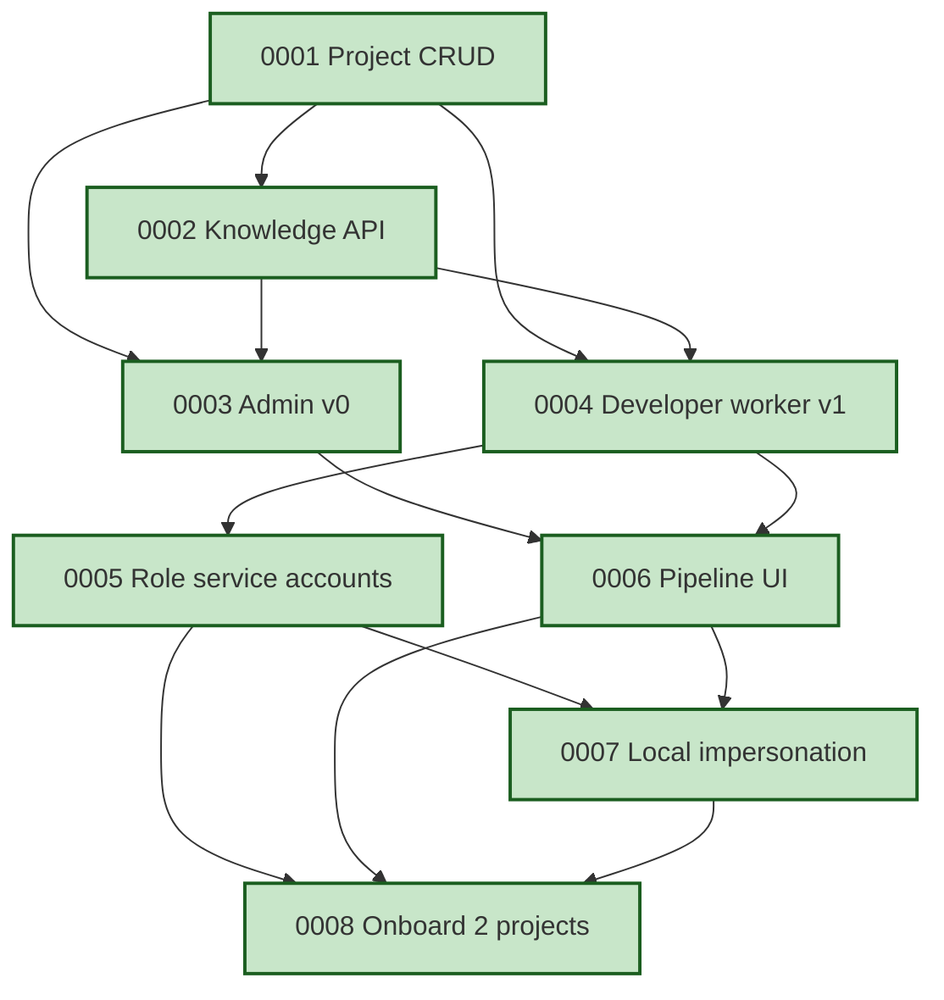

# Roadmap

> Human-readable progress view over [`registry.yaml`](./registry.yaml) and
> the acceptance-criteria checkboxes in each spec file. Grouped by phase
> and traced to the design that justifies each item.
>
> **Phase** reflects sequencing, not a calendar. A spec moves forward
> only when its prerequisites are `active`.

**All current specs trace to design [`0004 — Clean rebuild: coder-core + coder-admin`](../designs/wip/0001-generalize-coder-from-vibetrade.md).**
Updating a spec's acceptance-criteria checkboxes is what moves its
progress bar here — keep the two in sync when you edit.

Last updated: 2026-04-10 (spec 0008 shipped — all specs complete)

---

## Progress summary

| Phase | Specs | AC done | AC total | Progress |
|---|---|---|---|---|
| Shipped | 8 | 51 | 51 | `██████████` 100% |
| **Total** | **8** | **51** | **51** | `██████████` **100%** |

---

## Shipped

> Specs that have hit 100% AC and been promoted from `wip/` to `active/`.

### [0001 — Multi-tenant project CRUD](./active/0001-multi-tenant-project-crud.md)

`project_id` is a first-class dimension on every call. Create, list,
fetch, archive, structured per-request logging carrying `project_id`,
per-project API keys with rotate.

- **Status:** active
- **Progress:** `██████████` 6 / 6 AC ✅

### [0002 — Knowledge repo read API](./active/0002-knowledge-repo-read-api.md)

Single authoritative `GET` surface for a project's knowledge artifacts
with parsed frontmatter and resolvable cross-links.

- **Status:** active
- **Progress:** `██████████` 7 / 7 AC ✅
- **What shipped:** typed routes `GET /v1/projects/{id}/knowledge/{type}`
  and `GET /v1/projects/{id}/knowledge/{type}/{id}` returning parsed
  pydantic models, cross-link resolution with broken-link surfacing,
  in-memory TTL cache with `knowledge_cache_hit_total` metric exposed
  at `/v1/projects/{id}/knowledge/_metrics`. Bytes-passthrough relocated
  to `/knowledge/_files/{path}` as the escape hatch.

### [0003 — Admin Panel v0 (read-only)](./active/0003-admin-panel-read-only.md)

React/Vite SPA. Project switcher, project list, knowledge browser.
Zero mutations.

- **Status:** active
- **Progress:** `██████████` 6 / 6 AC ✅
- **What shipped:** `coder-admin` now has a typed API client over the
  full project + knowledge surface, per-project API-key prompt with
  `localStorage` persistence, project list (`/`) and project detail
  (`/projects/:id`) views, registry list (`/projects/:id/:type`), and
  artifact detail (`/projects/:id/:type/:artifactId`) with parsed
  frontmatter table, react-markdown body, lazy-loaded mermaid diagram
  rendering, and knowledge cross-links rewritten to in-app router
  navigation. Project switcher in the header. Vitest covers the
  cross-link rewriter, projects list + click-through, and the artifact
  page (frontmatter, mermaid placeholder, intra-app navigation, and
  the missing-API-key path).

### [0004 — Developer worker v1](./active/0004-developer-worker-v1.md)

In-process `developer` worker running `claude` against a project's
real repo clone, opening PRs and writing back outcome + logs.

- **Status:** active
- **Progress:** `██████████` 7 / 7 AC ✅
- **What shipped:** the dispatcher leases queued tasks with
  `SELECT ... FOR UPDATE SKIP LOCKED` (race-free even with concurrent
  workers), shells out to `claude` against a per-task workspace clone
  authed by a fresh GitHub-App installation token, captures the JSONL
  session transcript, and records success/failure/`timed_out`
  back onto the row. Logs emitted while the worker runs are buffered
  via a contextvar-aware logging handler and drained into a new
  `task_logs` table on completion (one transaction with the outcome
  write). New `GET /v1/projects/{id}/tasks/{task_id}/logs` endpoint
  surfaces them with `project_id`, `task_id`, and `role` on every line
  per AC5. Timeouts are a distinct `timed_out` lifecycle state with
  the per-task tempdir cleaned up via `try/finally`.

### [0005 — Per-role service accounts](./active/0005-per-role-service-accounts.md)

Every role has a dedicated GCP service account. Dispatcher fetches
per-project Anthropic keys through a broker-downscoped token instead
of a single process-wide env var.

- **Status:** active
- **Progress:** `██████████` 6 / 6 AC ✅
- **What shipped:** seven `coder-{role}@vibedevx.iam.gserviceaccount.com`
  service accounts provisioned by `coder-core/infra/terraform` with
  state in `gs://vibedevx-coder-core-tfstate`. `roles.yaml` is the
  single source of truth; both `roles.tf` (`yamldecode(file(...))`)
  and `capability_matrix.py` read it so the IAM surface and the
  human-readable `CAPABILITY_MATRIX.md` cannot drift. CI runs
  `capability_matrix.py --check` + `tofu fmt -check` + `tofu validate`
  on every PR (AC6). In `coder-core`, a new `BrokerClient` protocol
  with `LocalBroker` (HS256 JWT envelope for dev/tests) and
  `GcpBroker` (envelope + downscoped GCP access token via
  `iamcredentials.generateAccessToken` and a Credential Access
  Boundary restricted to `coder-{project_id}-{role}-` Secret Manager
  resources). New `POST /v1/projects/{id}/impersonate/{role}`
  endpoint authed with `X-Api-Key`, role-allowlisted against the
  dispatcher's `_RUNNERS`, project-claim stamped by the broker so
  ADR-0005 multi-tenant invariants hold. Dispatcher calls
  `fetch_project_anthropic_key` before building `WorkerInput` and
  hard-fails the task on a `SecretReadError` (no silent fallback to
  the process-wide key). See the spec's "What shipped / what's
  deferred" section for the integration-test and onboarding items
  tracked as follow-up work.

### [0006 — Pipeline UI in admin](./active/0006-pipeline-ui-in-admin.md)

Pipeline tab in `coder-admin`. Live task list, captured logs, status
filters. Still read-only.

- **Status:** active
- **Progress:** `██████████` 6 / 6 AC ✅
- **What shipped:** `coder-core` `GET /v1/projects/{id}/tasks` now
  accepts `?role=` and `?status=` filters (status validated against
  `TaskStatus`, 422 + `invalid_status` on garbage). The developer
  worker captures the workspace HEAD via `git rev-parse` after each
  successful run and the dispatcher persists it as `commit_sha` on
  the task row (new `0006_tasks_commit_sha` migration). `coder-admin`
  ships a typed `listTasks` / `getTask` / `getTaskLogs` client and a
  shared `StatusChip` component, plus two new routes:
  `/projects/:id/pipeline` (filtered task list with role + status
  query-param controls and 1s polling) and
  `/projects/:id/pipeline/:taskId` (per-task detail with status,
  prompt, error, result, captured logs, and a clickable GitHub commit
  link built from `project.github_org` + `task.repo` + `task.commit_sha`).
  Both pages re-use the per-project `X-Api-Key` flow, clear the stored
  key on 401, and skip polling on the needs-key screen. Vitest covers
  the list happy path, role+status URL round-trip, polling cadence,
  the failed-error inline render, the commit-link target, and the
  needs-key states.

### [0007 — Local agent impersonation](./active/0007-local-agent-impersonation.md)

Short-lived role-scoped tokens so Claude Code / Cursor can act as a
role for a project. Audit trail tied to the authorising human.

- **Status:** active
- **Progress:** `██████████` 6 / 6 AC ✅
- **What shipped:** dual auth (`X-Api-Key` + `Authorization: Bearer`)
  in `require_project_auth`, actor tracking on tasks (`actor`,
  `actor_type`, `actor_token_id` columns), `impersonation_sessions`
  table with immediate revocation (no cache), `coder` CLI with
  `impersonate` / `token` / `status` commands writing to
  `~/.config/coder/token.json`, and violet impersonation badges in
  `coder-admin` pipeline list + task detail views. 166 tests green.

### [0008 — Onboard first two projects](./active/0008-onboard-first-two-projects.md)

VibeTrade + Coder (dog-fooding) onboarded end-to-end, running in
parallel with demonstrable isolation.

- **Status:** active
- **Progress:** `██████████` 7 / 7 AC ✅
- **What shipped:** VibeTrade registered as `vibetrade` (GitHub org
  `ViberTrade`, knowledge repo `vibetrade-coder-system`). Coder
  registered as `coder` (GitHub org `coder-devx`, knowledge repo
  `coder-system`). Both run developer tasks to success against their
  own repos with per-secret IAM isolation. Impersonation works on both.
  Onboarding runbook written and followed.
- **Promotes:** design [`0004`](../designs/wip/0001-generalize-coder-from-vibetrade.md) from `wip` to `active`

---

## Dependency graph

---

## How to update this file

1. Edit the acceptance-criteria checkboxes in the relevant
   `wip/00XX-*.md` spec.
2. Update that spec's **Progress** line at the top (`N / M`).
3. Update this file's spec section AND the summary table at the top.
4. If a spec ships: move the file from `wip/` to `active/`, update
   `status:` in its frontmatter, update `folder:` and `status:` in
   `registry.yaml`, regenerate `REGISTRY.md`, and move its section
   here under a new "Shipped" heading.
5. If a spec is dropped: move to `deprecated/` with `deprecated_at`
   and `reason` per `AGENTS.md` rule 5.
