# Roadmap

> Human-readable progress view of the Coder system. `active/` holds
> subject-named logical components (the system as it is today).
> `wip/` holds numbered, roadmap-aligned work in flight. When a WIP
> ships, its content folds into `active/` and the numbered WIP file
> disappears.
>
> **Phase** reflects sequencing, not a calendar. A WIP starts only when
> its prerequisites are represented in `active/`.

**North star:** Coder manages its own development end-to-end. The human
is in an approval/override role, not a task-authoring role.

**Pipeline proven end-to-end (2026-04-13):** PM draft → spec file in repo →
pipeline run advances to `spec_approval` → ready for human approval →
chain auto-creates architect task.

**Latest:** 2026-05-12 — **Studio Phase A complete.** All six WIPs
shipped: 0075 (operator contract / `project_kind` routing / kill
workflow), 0077 (Founder role Phase A), 0079
(`coder-product-template` repo contract + Cloudflare/Cloud-Build
bootstrap), 0080 (Stripe Connect + PostHog wired into coder-core),
plus two meta-system gaps surfaced by the dispatch loop — 0076
(spec-bound architect dispatch from admin UI) and 0078 (spec_run
lifecycle auto-bootstrap). Phase 9 (operator surface coherence)
all six WIPs shipped 2026-05-09 / 2026-05-10. Per-WIP detail in
[`PHASES.md`](./PHASES.md). Per-phase Studio scope in
[`../STUDIO_ROADMAP.md`](../STUDIO_ROADMAP.md). Phase A close-out
gate per the charter: Founder calibration dogfood — twelve
idea-pipeline cycles inside Coder with the operator in the loop
until its judgment matches expectations. Phase B does not start
until that cycle is done.

---

## Active components

The system today, by logical component. Each links to its active spec
(product view) and active design (technical view) where both exist.

| Component | Spec | Design |
|---|---|---|
| Multi-tenancy | [multi-tenancy](./active/multi-tenancy.md) | (covered in [system-overview](../designs/active/system-overview.md)) |
| Knowledge API (read + write) | [knowledge-api](./active/knowledge-api.md) | [knowledge-write-api](../designs/active/knowledge-write-api.md), [knowledge-repo-model](../designs/active/knowledge-repo-model.md) |
| Admin Panel | [admin-panel](./active/admin-panel.md) | (covered in [system-overview](../designs/active/system-overview.md)) |
| Developer Worker | [developer-worker](./active/developer-worker.md) | [worker-roles](../designs/active/worker-roles.md) |
| Reviewer Worker | [reviewer-worker](./active/reviewer-worker.md) | [worker-roles](../designs/active/worker-roles.md) |
| PM Worker | [pm-worker](./active/pm-worker.md) | [pm-worker](../designs/active/pm-worker.md) |
| Architect Worker | [architect-worker](./active/architect-worker.md) | [architect-worker](../designs/active/architect-worker.md) |
| Team Manager Worker | [team-manager-worker](./active/team-manager-worker.md) | [team-manager-worker](../designs/active/team-manager-worker.md) |
| Service Accounts | [service-accounts](./active/service-accounts.md) | [worker-roles](../designs/active/worker-roles.md) |
| Impersonation | [impersonation](./active/impersonation.md) | [impersonation](../designs/active/impersonation.md) |
| Onboarding | [onboarding](./active/onboarding.md) | (covered in [system-overview](../designs/active/system-overview.md)) |
| Task Orchestration | [task-orchestration](./active/task-orchestration.md) | [worker-communication](../designs/active/worker-communication.md) |
| Continuous Deployment | [continuous-deployment](./active/continuous-deployment.md) | (covered in [system-overview](../designs/active/system-overview.md)) |
| Observability | [observability](./active/observability.md) | [observability-and-cost-tracking](../designs/active/observability-and-cost-tracking.md) |
| Branch cleanup | [branch-cleanup](./active/branch-cleanup.md) | [branch-cleanup](../designs/active/branch-cleanup.md) |
| Audit log | [audit-log](./active/audit-log.md) | [audit-log](../designs/active/audit-log.md) |
| Tenant isolation test harness | [tenant-isolation](./active/tenant-isolation.md) | [tenant-isolation](../designs/active/tenant-isolation.md) |
| Escalations & on-call routing | [escalations](./active/escalations.md) | [escalations](../designs/active/escalations.md) |
| Self-healing stuck pipelines | [self-healing](./active/self-healing.md) | [self-healing](../designs/active/self-healing.md) |

---

## In flight

Per-WIP scope, status, acceptance criteria, and ship dates live in
[`PHASES.md`](./PHASES.md). The summary table below shows phase
status; the dependency graph further down shows how WIPs and active
components connect.

The `wip/` folder is intentionally empty between phase ships —
numbered WIP files exist only while a roadmap item is actively being
drafted/designed. After ship-and-fold (AGENTS.md rule 5), the file
is deleted and the content lives under `active/`. "In flight" status
that survives the fold is tracked in PHASES.md, not as a WIP file.

---

## Phase status

The roadmap unfolds across six phases. Each row links into
[`PHASES.md`](./PHASES.md) for the per-WIP scope, status, and
acceptance criteria.

| Phase | Theme | Status |
|---|---|---|
| 3 | Scale & Reliability | complete |
| 4 | Cost & Token Efficiency | phase-1 LIVE; phase-2 ready for dispatch |
| 5 | Admin Panel v2 | complete |
| 6 | Security & Compliance | 0037 + 0039 shipped; 0038 LIVE-soaking |
| 7 | Trusted Autonomy | 0041 + 0042 shipped; 0040 stage-2 shadow; 0049 + 0050 stages 3–4 soaking |
| 8 | Knowledge Depth | 0043 + 0044 shipped; 0045–0048 in flight |
| 9 | Operator surface coherence | 0069–0074 all shipped 2026-05-09 / 2026-05-10 |
| A | Studio — Foundations and Founder | **complete** 2026-05-12 — all six WIPs shipped; close-out gate is Founder calibration dogfood (12 idea-pipeline cycles inside Coder) |
| Cross-cutting | Pre-work that unblocks the phases | see PHASES.md "Cross-cutting pre-work" |

---

## Dependency graph

```mermaid
flowchart TB
  subgraph active [Active components]
    mt[multi-tenancy]
    ka[knowledge-api]
    ap[admin-panel]
    dev[developer-worker]
    rev[reviewer-worker]
    pm[pm-worker]
    arch[architect-worker]
    tm[team-manager-worker]
    sa[service-accounts]
    imp[impersonation]
    onb[onboarding]
    to[task-orchestration]
    cd[continuous-deployment]
    obs[observability]
  end

  subgraph scale ["Phase 3 — Scale & Reliability"]
    s23["Branch GC (shipped)"]
    s24["Worker output compliance (shipped)"]
    s25["Pipeline run dashboard (shipped)"]
    s26["Transient retry (shipped)"]
    s27["Concurrent pipelines (shipped)"]
    s51["coder-core modular monolith"]
  end

  subgraph cost ["Phase 4 — Cost & Efficiency"]
    s28["Prompt caching"]
    s29["Model tier routing"]
    s30["Budget gates"]
    s31["Cost regression alerts"]
  end

  subgraph adminv2 ["Phase 5 — Admin v2"]
    s32["Live timeline"]
    s33["Diff & PR viewer"]
    s34["Knowledge editor"]
    s35["Command palette"]
  end

  subgraph sec ["Phase 6 — Security"]
    s36["Audit log"]
    s37["Secret rotation"]
    s38["Tenant isolation tests (shipped)"]
  end

  subgraph auto ["Phase 7 — Trusted Autonomy"]
    s39["Confidence auto-approve"]
    s40["Escalation & on-call (shipped)"]
    s41["Self-healing v1 (shipped)"]
  end

  subgraph know ["Phase 8 — Knowledge Depth"]
    s43["Freshness signals (shipped)"]
    s44["Write-through enforcement"]
    s45["Cold-start ingestion"]
    s46["Graph-aware retrieval"]
    s47["Template schema migration"]
    s48["Cross-project patterns"]
  end

  to --> s23
  dev --> s23
  pm --> s24
  arch --> s24
  tm --> s24
  to --> s25
  ap --> s25
  to --> s26
  dev --> s27
  to --> s27
  obs --> s27
  to --> s51
  ka --> s51
  mt --> s51
  obs --> s51

  ka --> s28
  obs --> s28
  to --> s28
  to --> s29
  obs --> s29
  obs --> s30
  s29 --> s30
  obs --> s31
  s28 --> s31

  to --> s32
  s25 --> s32
  ap --> s32
  dev --> s33
  ap --> s33
  ka --> s34
  ap --> s34
  ap --> s35

  imp --> s36
  ap --> s36
  sa --> s37
  cd --> s37
  mt --> s38
  sa --> s38
  s36 --> s38

  to --> s39
  obs --> s39
  to --> s40
  obs --> s40
  s26 --> s40
  to --> s41
  s26 --> s41
  s40 --> s41

  ka --> s43
  obs --> s43
  arch --> s43
  ka --> s44
  rev --> s44
  tm --> s44
  arch --> s44
  onb --> s45
  ka --> s45
  ka --> s46
  s43 --> s46
  ka --> s47
  s44 --> s48
  s43 --> s48

  classDef activeStyle fill:#c8e6c9,stroke:#1b5e20,stroke-width:2px
  classDef scaleStyle fill:#ffe0b2,stroke:#e65100,stroke-width:2px
  classDef costStyle fill:#fff9c4,stroke:#f57f17,stroke-width:2px
  classDef adminStyle fill:#bbdefb,stroke:#1565c0,stroke-width:2px
  classDef secStyle fill:#f8bbd0,stroke:#ad1457,stroke-width:2px
  classDef autoStyle fill:#d1c4e9,stroke:#4527a0,stroke-width:2px
  classDef knowStyle fill:#b2dfdb,stroke:#004d40,stroke-width:2px

  class mt,ka,ap,dev,rev,pm,arch,tm,sa,imp,onb,to,cd,obs,s23,s24,s25,s26,s27,s38,s40,s41 activeStyle
  class s51 scaleStyle
  class s28,s29,s30,s31 costStyle
  class s32,s33,s34,s35 adminStyle
  class s36,s37 secStyle
  class s39 autoStyle
  class s43,s44,s45,s46,s47,s48 knowStyle
```

---

---

## How to update this file

1. **Adding a WIP:** create `wip/00NN-kebab-title.md` + design counterpart
   if needed, register in both `registry.yaml`s, add an entry under the
   relevant phase here.
2. **Shipping a WIP:** merge its content into one or more subject-named
   files under `active/` (update existing and/or add new component files),
   delete the numbered WIP file, update both registries, remove its entry
   from the phase section here and add/update a row in "Active components"
   if a new component was introduced.
3. **Deprecating an active component:** move its file to `deprecated/`
   with `status: deprecated`, `deprecated_at:`, `reason:`; remove the
   "Active components" row here.

See [`../../AGENTS.md`](../../AGENTS.md) rule 5 for the canonical rule.
