# Roadmap

> Human-readable progress view. `active/` holds subject-named logical
> components (the system as it is today). `wip/` holds numbered,
> roadmap-aligned work in flight. When a WIP ships, its content merges
> into `active/` and the numbered WIP file disappears.
>
> **Phase** reflects sequencing, not a calendar. A WIP starts only when
> its prerequisites are represented in `active/`.

**North star:** Coder manages its own development end-to-end. The human
is in an approval/override role, not a task-authoring role.

**15 active components** describe the shipped system.

**Pipeline proven end-to-end (2026-04-13):** PM draft → spec file in repo →
pipeline run advances to `spec_approval` → ready for human approval →
chain auto-creates architect task.

**Next 6 months (May–Nov 2026).** Five sequenced phases, 19 planned
items: Scale & Reliability → Cost & Token Efficiency → Admin Panel v2
→ Security & Compliance → Trusted Autonomy. The through-line is:
*make the pipeline fast, cheap, visible, safe to trust with less human
intervention.*

Last updated: 2026-04-15

---

## Active components

The system today, by logical component. Each links to its active spec
(product view) and active design (technical view) where both exist.

| Component | Spec | Design |
|---|---|---|
| Multi-tenancy | [multi-tenancy](./active/multi-tenancy.md) | (covered in [system-overview](../designs/active/system-overview.md)) |
| Knowledge API (read + write) | [knowledge-api](./active/knowledge-api.md) | [knowledge-write-api](../designs/active/knowledge-write-api.md), [knowledge-repo-model](../designs/active/knowledge-repo-model.md) |
| Admin Panel | [admin-panel](./active/admin-panel.md) | (covered in [system-overview](../designs/active/system-overview.md)) |
| Developer Worker | [developer-worker](./active/developer-worker.md) | [worker-roles](../designs/active/worker-roles.md) |
| Reviewer Worker | [reviewer-worker](./active/reviewer-worker.md) | [worker-roles](../designs/active/worker-roles.md) |
| PM Worker | [pm-worker](./active/pm-worker.md) | [pm-worker](../designs/active/pm-worker.md) |
| Architect Worker | [architect-worker](./active/architect-worker.md) | [architect-worker](../designs/active/architect-worker.md) |
| Team Manager Worker | [team-manager-worker](./active/team-manager-worker.md) | [team-manager-worker](../designs/active/team-manager-worker.md) |
| Service Accounts | [service-accounts](./active/service-accounts.md) | [worker-roles](../designs/active/worker-roles.md) |
| Impersonation | [impersonation](./active/impersonation.md) | [impersonation](../designs/active/impersonation.md) |
| Onboarding | [onboarding](./active/onboarding.md) | (covered in [system-overview](../designs/active/system-overview.md)) |
| Task Orchestration | [task-orchestration](./active/task-orchestration.md) | [worker-communication](../designs/active/worker-communication.md) |
| Continuous Deployment | [continuous-deployment](./active/continuous-deployment.md) | (covered in [system-overview](../designs/active/system-overview.md)) |
| Observability | [observability](./active/observability.md) | [observability-and-cost-tracking](../designs/active/observability-and-cost-tracking.md) |
| Branch cleanup | [branch-cleanup](./active/branch-cleanup.md) | [branch-cleanup](../designs/active/branch-cleanup.md) |

---

## In flight (`wip/`)

| ID | Title | Status |
|---|---|---|
| [0024](./wip/0024-task-stage-runs-api.md) | Task Stage Runs API | in flight |

---

## Dependency graph

```mermaid
flowchart TB
  subgraph active [Active components]
    mt[multi-tenancy]
    ka[knowledge-api]
    ap[admin-panel]
    dev[developer-worker]
    rev[reviewer-worker]
    pm[pm-worker]
    arch[architect-worker]
    tm[team-manager-worker]
    sa[service-accounts]
    imp[impersonation]
    onb[onboarding]
    to[task-orchestration]
    cd[continuous-deployment]
    obs[observability]
  end

  subgraph scale ["Phase 3 — Scale & Reliability"]
    s23["Branch GC (shipped)"]
    s24["Worker output compliance"]
    s25["Pipeline run dashboard"]
    s26["Transient retry"]
    s27["Concurrent pipelines"]
  end

  subgraph cost ["Phase 4 — Cost & Efficiency"]
    s28["Prompt caching"]
    s29["Model tier routing"]
    s30["Budget gates"]
    s31["Cost regression alerts"]
  end

  subgraph adminv2 ["Phase 5 — Admin v2"]
    s32["Live timeline"]
    s33["Diff & PR viewer"]
    s34["Knowledge editor"]
    s35["Command palette"]
  end

  subgraph sec ["Phase 6 — Security"]
    s36["Audit log"]
    s37["Secret rotation"]
    s38["Tenant isolation tests"]
  end

  subgraph auto ["Phase 7 — Trusted Autonomy"]
    s39["Confidence auto-approve"]
    s40["Escalation & on-call"]
    s41["Self-healing"]
  end

  to --> s23
  dev --> s23
  pm --> s24
  arch --> s24
  tm --> s24
  to --> s25
  ap --> s25
  to --> s26
  dev --> s27
  to --> s27
  obs --> s27

  ka --> s28
  obs --> s28
  to --> s28
  to --> s29
  obs --> s29
  obs --> s30
  s29 --> s30
  obs --> s31
  s28 --> s31

  to --> s32
  s25 --> s32
  ap --> s32
  dev --> s33
  ap --> s33
  ka --> s34
  ap --> s34
  ap --> s35

  imp --> s36
  ap --> s36
  sa --> s37
  cd --> s37
  mt --> s38
  sa --> s38
  s36 --> s38

  to --> s39
  obs --> s39
  to --> s40
  obs --> s40
  s26 --> s40
  to --> s41
  s26 --> s41
  s40 --> s41

  classDef activeStyle fill:#c8e6c9,stroke:#1b5e20,stroke-width:2px
  classDef scaleStyle fill:#ffe0b2,stroke:#e65100,stroke-width:2px
  classDef costStyle fill:#fff9c4,stroke:#f57f17,stroke-width:2px
  classDef adminStyle fill:#bbdefb,stroke:#1565c0,stroke-width:2px
  classDef secStyle fill:#f8bbd0,stroke:#ad1457,stroke-width:2px
  classDef autoStyle fill:#d1c4e9,stroke:#4527a0,stroke-width:2px

  class mt,ka,ap,dev,rev,pm,arch,tm,sa,imp,onb,to,cd,obs,s23 activeStyle
  class s24,s25,s26,s27 scaleStyle
  class s28,s29,s30,s31 costStyle
  class s32,s33,s34,s35 adminStyle
  class s36,s37,s38 secStyle
  class s39,s40,s41 autoStyle
```

---

## Phase 3 — Scale & Reliability (May–Jun 2026)

> Make the pipeline robust, self-healing, and observable at scale.
> Success criteria: zero manual cleanup, <1% task loss from transient
> failures, 3+ pipelines running concurrently without queue starvation.

### 0023 — Branch cleanup GC job (shipped 2026-04-15)

Hourly job deletes stale `task/*` branches older than 24h with no open PR.
Prevents branch proliferation from failed developer tasks.

- **Status:** shipped → [`active/branch-cleanup`](./active/branch-cleanup.md) /
  [`designs/active/branch-cleanup`](../designs/active/branch-cleanup.md)
- **Extends:** `task-orchestration`, `developer-worker`, `observability`

### 0024 — Task Stage Runs API (in flight)

`GET /v1/projects/{project_id}/tasks/{task_id}/stage-runs` endpoint
returning the archived `TaskStageRunRow` rows for a task, ordered by
`recorded_at` ascending. Debugging-oriented, no admin UI.

- **Status:** wip
- **Extends:** `task-orchestration`, `observability`

### 0025 — Worker output compliance (planned)

Workers (PM, Architect, TM) must produce structured JSON output reliably.
Add output schema validation, retry on malformed output, and fallback
synthesis for all worker types.

- **Status:** planned
- **Extends:** `pm-worker`, `architect-worker`, `team-manager-worker`

### 0026 — Pipeline run dashboard (planned)

Admin panel view showing pipeline runs end-to-end: current step,
time per step, blocking gates, auto-refresh. One-click approve/reject
at each gate. (Foundation for Phase 5.)

- **Status:** planned
- **Extends:** `task-orchestration`, `admin-panel`

### 0027 — Automatic retry on transient failures (planned)

When a worker fails due to API overload (529), rate limiting (429),
or timeout, automatically retry with exponential backoff instead of
leaving the task in `failed` state.

- **Status:** planned
- **Extends:** `task-orchestration`

### 0028 — Concurrent pipeline execution & queue fairness (planned)

Dispatcher supports N concurrent workers per role with fair per-project
scheduling (no single project can starve others). Adds `worker_concurrency`
config, per-project lease quotas, and a queue-depth gauge.

- **Status:** planned
- **Extends:** `developer-worker`, `task-orchestration`, `observability`

---

## Phase 4 — Cost & Token Efficiency (Jun–Jul 2026)

> Cut per-pipeline token spend by ~50% without hurting quality. Today
> every worker re-sends the same context; every task runs on the most
> expensive model regardless of complexity. Fix both.

### 0029 — Prompt caching & shared context reuse (planned)

Use Anthropic prompt caching for stable sections (role system prompt,
project conventions, relevant knowledge slice). Share a common
"project context block" across sibling tasks in the same pipeline run.
Target: 40% reduction in input tokens for orchestrated runs.

- **Status:** planned
- **Extends:** `knowledge-api`, `observability`, `task-orchestration`

### 0030 — Model tier routing (planned)

Route simple tasks (GC jobs, trivial fixes, acceptance checks on tight
ACs) to Haiku; reserve Sonnet for design/architect/complex developer
work. Per-role default + per-task override. Measure quality regression
via reviewer approval rate.

- **Status:** planned
- **Extends:** `task-orchestration`, `observability`

### 0031 — Per-project token budgets & cost gates (planned)

Each project gets a soft/hard monthly token budget. At soft, Slack
warning and auto-downshift to cheaper models. At hard, new tasks
queue and require override. Exposes `GET /v1/projects/{id}/budget`.

- **Status:** planned
- **Extends:** `observability`

### 0032 — Prompt & cost regression alerts (planned)

Nightly job compares per-stage cost and token-per-AC against a
7-day baseline; alerts on >25% regressions with the commit range
likely responsible.

- **Status:** planned
- **Extends:** `observability`

---

## Phase 5 — Admin Panel v2: Interactive & Live (Jul–Sep 2026)

> Make the admin panel the thing you keep open all day. Today it's a
> list of rows; it should be a live view of what the system is doing,
> with every common action one keystroke away.

### 0033 — Live pipeline timeline (planned)

Replace the flat task list with a timeline view per pipeline run:
horizontal swim-lanes per role, stage durations as bars, SSE-driven
progress tick, hover for logs, click for detail.

- **Status:** planned
- **Extends:** `admin-panel`, `task-orchestration`

### 0034 — In-panel diff & PR viewer (planned)

View PR diffs, reviewer comments, and commit history directly in the
admin panel. Approve/request-changes buttons call through to `coder-core`.

- **Status:** planned
- **Extends:** `admin-panel`, `developer-worker`

### 0035 — Inline knowledge editor with approvals (planned)

Edit spec/design markdown in-browser with frontmatter form + body
editor + live preview. Approve/reject buttons adjacent.

- **Status:** planned
- **Extends:** `admin-panel`, `knowledge-api`

### 0036 — Command palette & keyboard-first navigation (planned)

`⌘K` palette: jump to project, task, spec, run; trigger common actions
(approve, retry, override); fuzzy-search knowledge. Full keyboard
navigation of tables and forms.

- **Status:** planned
- **Extends:** `admin-panel`

---

## Phase 6 — Security & Compliance (Sep–Oct 2026)

> Close the gap between "it works" and "it's safe to let a customer
> near it." Preparation for external pilots.

### 0037 — Centralized audit log service (planned)

Every mutation (approve, reject, override, retry, merge, knowledge
write, impersonation) lands in an append-only audit log with actor,
project, target, before/after, and correlation ID. Queryable by admin,
retained 1 year.

- **Status:** planned
- **Extends:** `impersonation`, `admin-panel`, `task-orchestration`

### 0038 — Automated secret rotation (planned)

Scheduled rotation of Anthropic keys, GitHub App tokens, per-project
API keys, and admin JWT secrets. Zero-downtime rollover via dual-key
windows. Runbook becomes a cron job.

- **Status:** planned
- **Extends:** `service-accounts`, `continuous-deployment`

### 0039 — Tenant isolation test harness (planned)

CI suite that provisions two projects and asserts no cross-tenant
reads/writes are possible across every endpoint, token type, and
worker path.

- **Status:** planned
- **Extends:** `multi-tenancy`, `service-accounts`

---

## Phase 7 — Trusted Autonomy (Oct–Nov 2026)

> Today three gates (spec / design / plan) require human approval
> every run. Many are low-risk rubber-stamps. Let the system earn
> auto-approval on the easy cases so humans focus on the hard ones.

### 0040 — Confidence-scored auto-approval (planned)

PM, Architect, and TM outputs include a self-reported confidence
score with justification. If score > threshold AND project opted-in
AND historical approval rate > 95% on similar artifacts, auto-approve
with a 10-minute "undo" window.

- **Status:** planned
- **Extends:** `task-orchestration`, `observability`, `pm-worker`, `architect-worker`, `team-manager-worker`

### 0041 — Escalation policies & human on-call routing (planned)

When a pipeline stalls, fails repeatedly, or exceeds SLA, route to a
human via Slack/PagerDuty with full context. Per-project on-call
rotation.

- **Status:** planned
- **Extends:** `task-orchestration`, `observability`

### 0042 — Self-healing stuck pipelines (planned)

Watchdog detects pipelines stuck in a stage beyond 3× p95 duration,
diagnoses, and auto-remediates (retry, re-dispatch, unblock). Only
pages a human when auto-remediation fails.

- **Status:** planned
- **Extends:** `task-orchestration`

---

## How to update this file

1. **Adding a WIP:** create `wip/00NN-kebab-title.md` + design counterpart
   if needed, register in both `registry.yaml`s, add an entry under the
   relevant phase here.
2. **Shipping a WIP:** merge its content into one or more subject-named
   files under `active/` (update existing and/or add new component files),
   delete the numbered WIP file, update both registries, remove its entry
   from the phase section here and add/update a row in "Active components"
   if a new component was introduced.
3. **Deprecating an active component:** move its file to `deprecated/`
   with `status: deprecated`, `deprecated_at:`, `reason:`; remove the
   "Active components" row here.

See [`../../AGENTS.md`](../../AGENTS.md) rule 5 for the canonical rule.
