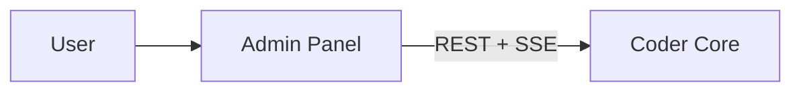

# Coder Admin Panel

## What it does

The user-facing surface for Coder. The user picks a project, watches
workers, inspects pipeline runs, debugs failures, takes over a role,
and overrides decisions.

This is the "god mode" UI from goal #7 — the place where the human
is in charge.

## Responsibilities

- **Project switcher** — every screen is scoped to a single active project.
- **Worker grid** — live status of every worker in the active project's team.
- **Pipeline view** — task list, state, logs, test environments.
- **Knowledge browser** — render the project's `coder-system` repo with
  cross-link navigation.
- **Override / drive** — pause, resume, retry, take over a role.
- **Chat** — talk to any worker (or to Core directly) over SSE.

## API surface

Browser app — consumes `coder-core` HTTP/SSE API. Does not expose its own.

## Interactions

## Operational notes

- Static assets served from a Cloud Run container (or a CDN once the load
  warrants it).
- Auth: Google OAuth, allow-listed identities mapped to project ACLs in Core.

## Open questions

- Per-project theming / isolation in the UI to prevent context bleed when
  switching projects fast?
- How much of the worker prompt / state should be exposed in the UI vs.
  reserved for the consultant role?
