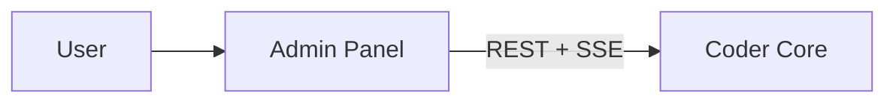

# Coder Admin Panel

## What it does

The user-facing surface for Coder. The user picks a project, watches
workers, inspects pipeline runs, debugs failures, takes over a role,
and overrides decisions.

This is the "god mode" UI from goal #7 — the place where the human
is in charge.

## Responsibilities

- **Project switcher** — every screen is scoped to a single active project.
- **Worker grid** — live status of every worker in the active project's team.
- **Pipeline view** — task list, state, logs, test environments.
- **Knowledge browser** — render the project's `coder-system` repo with
  cross-link navigation.
- **Override / drive** — pause, resume, retry, take over a role.
- **Chat** — talk to any worker (or to Core directly) over SSE.

## API surface

Browser app — consumes `coder-core` HTTP/SSE API. Does not expose its own.

## Interactions

## Operational notes

- Static assets served from a Cloud Run container running `nginx:1.27-alpine`
  on port 8080. SPA fallback to `/index.html`. `/healthz` returns `ok`.
- Auth: Google OAuth 2.0 via Google Identity Services. Admin JWT
  (HS256, `coder-core/admin` audience) stored in localStorage.
  Allowed emails configured via `ADMIN_ALLOWED_EMAILS` on `coder-core`.
- `VITE_API_BASE_URL` is **build-time** — baked into the bundle by Vite.
  Per-environment values live in `.env.development` and `.env.production`
  in the repo. Changing the API base URL requires a rebuild + redeploy.
- Cross-origin: the browser hits `coder-core` directly, so `coder-core`'s
  `CORS_ALLOWED_ORIGINS` must include this service's URL.

## Current state (2026-04-12)

Fully functional admin panel with Google OAuth login, project list,
pipeline view with real-time SSE updates, task creation and lifecycle
overrides (pause/resume/retry/reject), approve-merge, knowledge browser
with interactive acceptance-criteria checkboxes, and per-artifact
cross-link navigation. All specs through 0012 shipped.

## Open questions

- Per-project theming / isolation in the UI to prevent context bleed when
  switching projects fast?
- How much of the worker prompt / state should be exposed in the UI vs.
  reserved for the consultant role?
