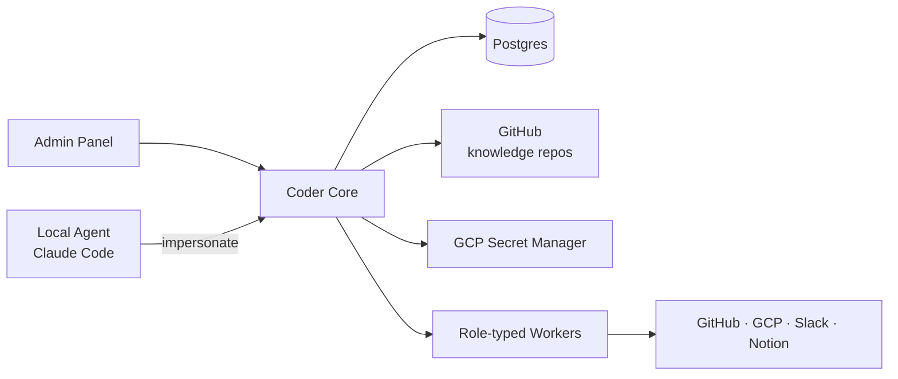

# Coder Core

## What it does

The central, **multi-tenant** orchestrator for Coder. Owns project
lifecycle, dispatches work to role-typed workers, serves knowledge repo
contents to workers and the admin panel, and mints scoped credentials for
worker actions.

Multi-tenant — but **always project-aware in context**. Every API call
carries (or implies) a `project_id`, and every response, log line, and
emitted event is scoped to that project. There is no operation that
acts across projects without an explicit fan-out.

## Responsibilities

- **Project lifecycle**: create, list, archive projects.
- **Knowledge API**: read-through layer over each project's `coder-system`
  knowledge repo. Serves files, registries, and graph queries.
- **Worker dispatch**: route tasks to role-typed workers, track state.
- **Pipeline orchestration**: enrich → execute → fix → test → ready.
- **Impersonation**: mint short-lived, role-scoped tokens for local agents.
- **Admin Panel backend**: status, override, debug surfaces.

## Current state (as of commit #4 · 2026-04-08)

- **v0.0.3** — deployed to Cloud Run. Health + projects CRUD + authenticated **knowledge API**.
- URL: <https://coder-core-8534948335.europe-west1.run.app>
- Live revision: `coder-core-00005-5xc`
- Runtime SA: `coder-core-sa@vibedevx.iam.gserviceaccount.com` — roles: `logging.logWriter`, `monitoring.metricWriter`, `cloudsql.client`, `cloudsql.instanceUser`, `secretmanager.secretAccessor` (on `GITHUB_TOKEN` only).
- Ingress: `allow-unauthenticated`. `/v1/health`, `/v1/projects` list/get/create are public. **`/v1/projects/{id}/knowledge/{path}` requires the per-project `X-Api-Key` header.**
- DB: `coder-core-db` Cloud SQL Postgres 17 (IAM auth only). Migration `0002` adds `api_key_hash` column. See [`../integrations/cloud-sql.md`](../integrations/cloud-sql.md).
- Secrets mounted: `GITHUB_TOKEN` from Secret Manager, used by the knowledge API to read GitHub.
- Seeded projects: `coder` — API key plaintext is in the user's 1Password (not recoverable from the hash).

## Walking-skeleton milestone — reached

```
curl -H "X-Api-Key: ck_..." \
  https://coder-core-8534948335.europe-west1.run.app/v1/projects/coder/knowledge/system/services/REGISTRY.md
```

...returns the actual contents of `coder-system/system/services/REGISTRY.md` from this very repo, served by `coder-core` reading from GitHub, after validating a per-project API key against a SHA-256 hash in Cloud SQL.

That's the end-to-end goal from the start of implementation.

## Planned API surface

| Method | Path | Commit | Auth | Purpose |
|---|---|---|---|---|
| GET  | `/v1/health` | **#1** ✓ | none | Liveness |
| GET  | `/v1/projects` | **#3** ✓ | none | List projects user has access to |
| POST | `/v1/projects` | **#3** ✓ | none* | Create a project and mint its API key (returned once) |
| GET  | `/v1/projects/{id}` | **#3** ✓ | none | Project detail |
| GET  | `/v1/projects/{id}/knowledge/{path}` | **#4** ✓ | `X-Api-Key` | Read project knowledge repo |
| POST | `/v1/projects/{id}/rotate-api-key` | #4+ | `X-Api-Key` | Rotate the per-project static key |
| GET  | `/v1/projects/{id}/workers` | post-#5 | `X-Api-Key` | List workers in this project's team |
| POST | `/v1/projects/{id}/tasks` | post-#5 | `X-Api-Key` | Submit a task to the pipeline |
| POST | `/v1/projects/{id}/impersonate` | post-#5 | `X-Api-Key` | Mint a token for a local agent acting as a role |
| POST | `/v1/projects/{id}/chat` | post-#5 | `X-Api-Key` | SSE — interactive agent for the project |

\* `POST /v1/projects` is unauthenticated in the walking skeleton. It will be gated by a Coder-admin token once multi-user lands.

Auth model: per-project static API key (`X-Api-Key` header, SHA-256 hash stored in the `projects` table). Keys are returned in plaintext on `POST /v1/projects` exactly once. Losing a key means rotating it. Google OAuth + short-lived impersonation tokens land post-#5.
See [ADR 0005](../adrs/0005-multi-tenant-coder-core.md).

## Data model

- **Postgres** — projects, workers, tasks, pipeline runs, audit log.
- **Per-project knowledge repos** in GitHub — read via the GitHub
  integration; cached locally per project.
- **GCP Secret Manager** — secrets are stored under per-project prefixes.

## Interactions



## Operational notes

- **Runtime SA**: `coder-core-sa@vibedevx.iam.gserviceaccount.com`. Current roles: `logging.logWriter`, `monitoring.metricWriter`, `cloudsql.client`, `cloudsql.instanceUser`. New roles are added in the commit that introduces the need — never preemptively.
- **Image registry**: `europe-west1-docker.pkg.dev/vibedevx/coder-core`.
- **Secrets storage convention**: `coder/{managed_project_id}/{secret_name}` in `vibedevx` Secret Manager.
- **Deployment**: Cloud Run, region `europe-west1`, project `vibedevx`.
- **Database**: Cloud SQL Postgres 17 (`coder-core-db` in `vibedevx`). IAM auth via the Cloud SQL Python Connector — no DB passwords in the service. See [`../integrations/cloud-sql.md`](../integrations/cloud-sql.md).
- **Runbooks**:
  - [`deploy-coder-core.md`](../runbooks/deploy-coder-core.md) — manual Cloud Run deploy (until commit #5 adds push-to-main CD).
  - [`cloud-sql-bootstrap.md`](../runbooks/cloud-sql-bootstrap.md) — how `coder-core-db` was stood up.
  - [`run-migration-coder-core.md`](../runbooks/run-migration-coder-core.md) — how to apply an alembic migration against the prod DB.

## Open questions

- Where does pipeline state live during a run — Postgres rows + state
  machine, or a real workflow engine?
- How are workers actually launched? Long-running per-role services that
  pull tasks, or short-lived job runners spawned by Core?
- Cache strategy for the GitHub-backed knowledge layer — pull-on-read,
  webhook-triggered refresh, or a periodic sync?
