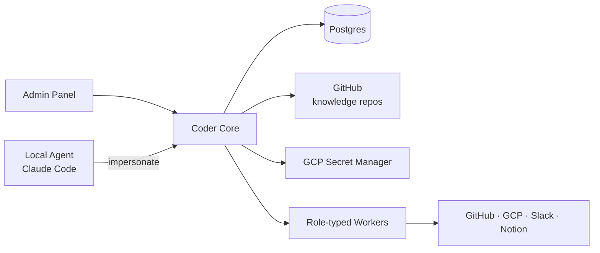

# Coder Core

## What it does

The central, **multi-tenant** orchestrator for Coder. Owns project
lifecycle, dispatches work to role-typed workers, serves knowledge repo
contents to workers and the admin panel, and mints scoped credentials for
worker actions.

Multi-tenant — but **always project-aware in context**. Every API call
carries (or implies) a `project_id`, and every response, log line, and
emitted event is scoped to that project. There is no operation that
acts across projects without an explicit fan-out.

## Responsibilities

- **Project lifecycle**: create, list, archive projects.
- **Knowledge API**: read-through layer over each project's `coder-system`
  knowledge repo. Serves files, registries, and graph queries.
- **Worker dispatch**: route tasks to role-typed workers, track state.
- **Pipeline orchestration**: enrich → execute → fix → test → ready.
- **Impersonation**: mint short-lived, role-scoped tokens for local agents.
- **Admin Panel backend**: status, override, debug surfaces.

## Current state (as of 2026-04-26)

- **v0.0.3** — deployed to Cloud Run via push-to-main with Workload
  Identity Federation. CI canary-deploys, health-checks
  `/v1/health`, runs Alembic migrations, syncs recurring jobs, then
  shifts traffic.
- URL: <https://coder-core-ql732k45va-ew.a.run.app> (also
  <https://coder-core-8534948335.europe-west1.run.app> — same service).
- Runtime SA: `coder-core-sa@vibedevx.iam.gserviceaccount.com`.
- Ingress: `allow-unauthenticated`. Public endpoints: `/v1/health`,
  `/v1/projects` list/get/create. Authenticated (per-project `X-Api-Key`
  or `Authorization: Bearer`): knowledge API, tasks, pipeline runs,
  metrics, impersonation, sessions, MCP.
- DB: `coder-core-db` Cloud SQL Postgres 17 (IAM auth only).
- Auth: GitHub App (Coder DevX, app ID 3325027) for repo access. Per-
  project Anthropic API keys in Secret Manager for worker dispatch.
  Admin JWT (Google OAuth) for admin panel operations (spec 0012).
  MCP OAuth (spec 0050) for agent-to-MCP authentication.
- Tests: **1369 passing** (route-level + service-level).
- Architecture: **modular monolith** per [design 0051](../designs/active/0051-coder-core-modular-monolith.md).
  Routers are thin adapters; workflow logic lives in feature-package
  service modules (`coder_core/tasks`, `pipelines`, `metrics`,
  `impersonation`, `projects`, `knowledge`). The dependency graph is
  enforced in CI via `import-linter` with zero `ignore_imports`
  exceptions. The `WorkerDispatcher` protocol (in
  `coder_core/contracts.py`) is the seam an out-of-process worker
  extraction would bind to.

## Walking-skeleton milestone — reached

```
curl -H "X-Api-Key: ck_..." \
  https://coder-core-8534948335.europe-west1.run.app/v1/projects/coder/knowledge/system/services/REGISTRY.md
```

...returns the actual contents of `coder-system/system/services/REGISTRY.md` from this very repo, served by `coder-core` reading from GitHub, after validating a per-project API key against a SHA-256 hash in Cloud SQL.

That's the end-to-end goal from the start of implementation.

## API surface

| Method | Path | Auth | Purpose |
|---|---|---|---|
| GET  | `/v1/health` | none | Liveness |
| GET  | `/v1/projects` | none | List non-archived projects |
| POST | `/v1/projects` | none* | Create project, mint API key (returned once) |
| GET  | `/v1/projects/{id}` | none | Project detail |
| POST | `/v1/projects/{id}/archive` | `X-Api-Key` | Soft-archive a project |
| POST | `/v1/projects/{id}/rotate-api-key` | `X-Api-Key` | Rotate API key (old key invalidated immediately) |
| GET  | `/v1/projects/{id}/knowledge/{type}` | `X-Api-Key` / Bearer | List registry entries for an artifact type |
| GET  | `/v1/projects/{id}/knowledge/{type}/{artifact_id}` | `X-Api-Key` / Bearer | Fetch artifact with frontmatter + cross-links |
| GET  | `/v1/projects/{id}/knowledge/_files/{path}` | `X-Api-Key` / Bearer | Raw file passthrough from knowledge repo |
| GET  | `/v1/projects/{id}/knowledge/_metrics` | `X-Api-Key` | Cache hit/miss counters |
| POST | `/v1/projects/{id}/tasks` | `X-Api-Key` / Bearer | Enqueue a task |
| GET  | `/v1/projects/{id}/tasks` | `X-Api-Key` / Bearer | List tasks (filterable by `?role=` `?status=`) |
| GET  | `/v1/projects/{id}/tasks/{task_id}` | `X-Api-Key` / Bearer | Task detail |
| GET  | `/v1/projects/{id}/tasks/{task_id}/logs` | `X-Api-Key` / Bearer | Task logs |
| POST | `/v1/projects/{id}/impersonate/{role}` | `X-Api-Key` | Mint role-scoped bearer token |
| GET  | `/v1/projects/{id}/sessions` | `X-Api-Key` | List impersonation sessions |
| POST | `/v1/projects/{id}/sessions/{token_id}/revoke` | `X-Api-Key` | Revoke a session |
| POST | `/v1/admin/login` | none | Exchange Google ID token for admin JWT |
| GET  | `/v1/admin/me` | Admin JWT | Current admin email |
| POST | `/v1/admin/sse-ticket` | Admin JWT | Mint single-use SSE ticket |
| POST | `/v1/projects/{id}/tasks/{task_id}/override` | `X-Api-Key` / Admin JWT | Pause/resume/retry/reject task |
| POST | `/v1/projects/{id}/tasks/{task_id}/merge` | `X-Api-Key` / Admin JWT | Squash-merge task PR |
| PATCH | `/v1/projects/{id}/knowledge/{type}/{artifact_id}/checkboxes` | `X-Api-Key` / Admin JWT | Toggle AC checkboxes |
| GET  | `/v1/projects/{id}/pipeline/events` | SSE ticket / Admin JWT | SSE stream of pipeline events |

\* `POST /v1/projects` is unauthenticated while single-user.

Auth model: three token types, all project-scoped:

1. **Per-project API key** (`X-Api-Key` header, SHA-256 hash in the
   `projects` table) — for scripts and the impersonate endpoint.
2. **Impersonation JWT** (`Authorization: Bearer`) — short-lived,
   role-scoped, minted via `/v1/projects/{id}/impersonate/{role}`.
3. **Admin JWT** (`Authorization: Bearer`, audience `coder-core/admin`)
   — minted via Google OAuth at `/v1/admin/login`. Cross-project access
   for admin panel operations. See spec 0012.

See [ADR 0005](../adrs/0005-multi-tenant-coder-core.md).

## Data model

- **Postgres** — projects, workers, tasks, pipeline runs, audit log.
- **Per-project knowledge repos** in GitHub — read via the GitHub
  integration; cached locally per project.
- **GCP Secret Manager** — secrets are stored under per-project prefixes.

## Interactions



## Operational notes

- **Runtime SA**: `coder-core-sa@vibedevx.iam.gserviceaccount.com`. Current roles: `logging.logWriter`, `monitoring.metricWriter`, `cloudsql.client`, `cloudsql.instanceUser`. New roles are added in the commit that introduces the need — never preemptively.
- **Image registry**: `europe-west1-docker.pkg.dev/vibedevx/coder-core`.
- **Secrets storage convention**: `coder/{managed_project_id}/{secret_name}` in `vibedevx` Secret Manager.
- **Deployment**: Cloud Run, region `europe-west1`, project `vibedevx`.
- **Database**: Cloud SQL Postgres 17 (`coder-core-db` in `vibedevx`). IAM auth via the Cloud SQL Python Connector — no DB passwords in the service. See [`../integrations/cloud-sql.md`](../integrations/cloud-sql.md).
- **Runbooks**:
  - [`deploy-coder-core.md`](../runbooks/deploy-coder-core.md) — manual Cloud Run deploy (until commit #5 adds push-to-main CD).
  - [`cloud-sql-bootstrap.md`](../runbooks/cloud-sql-bootstrap.md) — how `coder-core-db` was stood up.
  - [`run-migration-coder-core.md`](../runbooks/run-migration-coder-core.md) — how to apply an alembic migration against the prod DB.

## Open questions (resolved)

- **Pipeline state:** Postgres rows with a state machine
  (`queued → running → succeeded / failed / timed_out`). No external
  workflow engine — `asyncio.create_task` dispatches workers in-process.
- **Worker launch:** in-process modules inside coder-core. The
  dispatcher leases tasks with `SELECT ... FOR UPDATE SKIP LOCKED` and
  shells out to `claude`. Services kick the dispatcher through the
  `WorkerDispatcher` protocol (per design 0051) so a future extraction
  to per-role Cloud Run jobs is an implementation swap rather than a
  rewrite. The decision to keep workers in-process is recorded in
  the *Extraction decision* section of design 0051.
- **Orphan recovery:** a background reaper runs inside every instance
  and re-queues tasks stuck at `status='running'` past the worker
  timeout (default: 1500 s threshold, 60 s scan interval, 3-reap cap).
  Needed because Cloud Run replaces/drains instances mid-dispatch and
  kills their in-flight `asyncio.create_task` background work. See
  [ADR 0011](../adrs/0011-orphan-dispatch-reaper.md). The planned
  structural fix is Cloud Tasks; the reaper is the near-term safety net.
- **Knowledge cache:** pull-on-read with a 60-second in-memory TTL cache.
  `_metrics` endpoint exposes hit/miss counters. Owned by
  `coder_core.knowledge`; HTTP, MCP, and write workflows all share the
  same instance via `get_knowledge_service()`.
