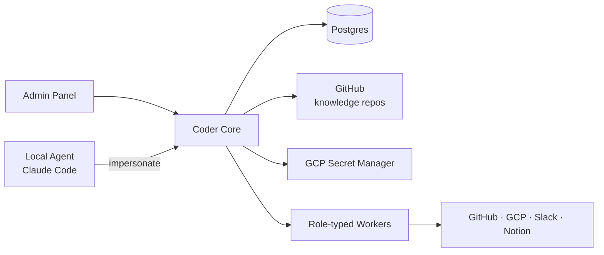

# Coder Core

## What it does

The central, **multi-tenant** orchestrator for Coder. Owns project
lifecycle, dispatches work to role-typed workers, serves knowledge repo
contents to workers and the admin panel, and mints scoped credentials for
worker actions.

Multi-tenant — but **always project-aware in context**. Every API call
carries (or implies) a `project_id`, and every response, log line, and
emitted event is scoped to that project. There is no operation that
acts across projects without an explicit fan-out.

## Responsibilities

- **Project lifecycle**: create, list, archive projects.
- **Knowledge API**: read-through layer over each project's `coder-system`
  knowledge repo. Serves files, registries, and graph queries.
- **Worker dispatch**: route tasks to role-typed workers, track state.
- **Pipeline orchestration**: enrich → execute → fix → test → ready.
- **Impersonation**: mint short-lived, role-scoped tokens for local agents.
- **Admin Panel backend**: status, override, debug surfaces.

## API surface (sketch)

| Method | Path | Purpose |
|---|---|---|
| GET    | `/v1/projects` | List projects user has access to |
| POST   | `/v1/projects` | Create a project |
| GET    | `/v1/projects/{id}` | Project detail |
| GET    | `/v1/projects/{id}/knowledge/*` | Read project knowledge repo |
| GET    | `/v1/projects/{id}/workers` | List workers in this project's team |
| POST   | `/v1/projects/{id}/tasks` | Submit a task to the pipeline |
| POST   | `/v1/projects/{id}/impersonate` | Mint a token for a local agent acting as a role |
| POST   | `/v1/projects/{id}/chat` | SSE — interactive agent for the project |
| GET    | `/v1/health` | Liveness |

Auth: per-project ACL. Every request is checked against the requesting
identity's allowed projects + role.

## Data model

- **Postgres** — projects, workers, tasks, pipeline runs, audit log.
- **Per-project knowledge repos** in GitHub — read via the GitHub
  integration; cached locally per project.
- **GCP Secret Manager** — secrets are stored under per-project prefixes.

## Interactions

## Operational notes

- Service account: `coder-core@{gcp-project}.iam.gserviceaccount.com`
  with **minimum** roles needed to broker access. Each role-worker has
  its own service account (see [ADR 0006](../adrs/0006-per-role-service-accounts.md)).
- Secrets storage convention: `coder/{project_id}/{secret_name}`.
- Deployment: container image, Cloud Run, region `europe-west1` (default).

## Open questions

- Where does pipeline state live during a run — Postgres rows + state
  machine, or a real workflow engine?
- How are workers actually launched? Long-running per-role services that
  pull tasks, or short-lived job runners spawned by Core?
- Cache strategy for the GitHub-backed knowledge layer — pull-on-read,
  webhook-triggered refresh, or a periodic sync?
